 
# Backtracking Algorithm in Artificial Intelligence

## Abstract

In this article, we discuss in detail a fundamental algorithm in artificial intelligence called backtracking and answer the following questions:

* What is the n-rooks (rook polynomial) problem?
* What is the n-queens problem?
* What is the backtracking algorithm?
* How can we solve the n-rooks problem using the backtracking approach?
* How can we solve the n-queens problem using the backtracking approach?
* How can we print an array as a tree structure in PHP?

## The n-Queens and n-Rooks Problem

One of the fundamental goals in artificial intelligence is to model our problems with mathematics and solve them using appropriate algorithms. Backtracking refers to a particular type of algorithm where we can find solutions to a mathematical problem by exploring and backtracking (undoing) steps. To explain this concept, I will use two well-known examples.

I propose two questions:


**Question 1:**
Difficulty Level: Medium to Hard

* We want to place n rooks on an n×n chessboard in such a way that they do not attack each other, meaning none of them can capture another one. For each input n, print all the possible answers as a matrix...

**For n = 1: Only one answer should be printed:**

```
1
```

**For n = 2: Two answers should be printed:**

```
10
01

01
10
```

**For n = 3: Six answers should be printed:**

```
100
010
001

001
010
100

010
001
100

001
100
010

010
100
001

100
001
010
```

Note 1: We represent our chessboard as binary square matrices where 1s represent the rooks and 0s represent empty cells.

Note 2: Keep in mind that a rook can only move in its row, column, and attack diagonals.
_______________________________________________

And the second question, which in truth is a more complex version of the first question:


**Question 2:**
Difficulty Level: Medium to Hard

I want to extend the example of the n-rooks problem to a better and more comprehensive puzzle.

* We want to place n queens on an n×n chessboard in such a way that they do not attack each other, meaning none of them can capture another one. For each input n, print all the possible answers as a matrix...

**For n = 1: Only one answer should be printed:**

```
1
```

**For n = 2: No answers should be printed!**

The problem does not have a solution for n = 2.

**For n = 3: No answers should be printed!!**

The problem does not have a solution for n = 3.

**For n = 4: Two answers should be printed:**

```
0010
1000
0001
0100

0100
0001
1000
0010
```

**For n = 5: Ten answers should be printed:**

```
00010
01000
00001
00100
10000

01000
00010
10000
00100
00001

10000
00100
00001
01000
00010

10000
00010
01000
00001
00100

00001
00100
10000
00010
01000

00100
10000
00010
01000
00001

00100
00001
01000
00010
10000

00001
01000
00010
10000
00100

01000
00001
00100
10000
00010

00010
10000
00100
00001
01000
```

**And here are the visual representations of these ten answers (n = 5) for better comprehending:**


(Note: I don't remember the source of the image.)


Note 1: We represent our chessboard as binary square matrices where 1s represent the queens and 0s represent empty cells.

Note 2: Keep in mind that a queen can move in its row, column, and diagonals to attack.


## What is the Backtracking Algorithm?


Well, now it's time to answer these questions that we've presented. But before that, I'll explain a few necessary concepts:


The n-queens problem is one of the challenging problems for mathematicians and has led them to seek optimal solutions. However, since the problem may be confusing for beginners, I decided to start with a simpler version, which is the n-rooks problem. It serves as a simplified version of the n-queens problem. Remember, programmers and algorithm designers primarily focus on the n-queens problem.

Scientists and academic professors commonly discuss the n-queens problem along with other simple problems to establish a connection between algorithm science and artificial intelligence, aiming to explain artificial intelligence algorithms through them.

There are infinite approaches to solving the n-queens problem as well as the n-rooks problem. These include solutions derived from algorithm science and artificial intelligence, mathematical and matrix-based solutions, and the solutions that have not been discovered yet...


* Backtracking Algorithm
    * Monte Carlo Algorithm
* Constraint Satisfaction Problem (CSP) Algorithm
* Heuristic Algorithm
* Hill Climbing Algorithm
* Local Search Algorithm
* Genetic Algorithm
* And other algorithms that are not mentioned...

My goal here is to solve this problem using the Backtracking algorithm.

There are two reasons why I chose this approach (backtracking):

1. This approach utilizes the decision tree structure. It uses modeling through tree structures, allowing me to introduce trees to some extent.
2. This approach is based on the "trial and error" method, which is the first solution that comes to mind for all humans.

_______________________________________________

### Trees: An Indispensable Concept in Computer Science

Before talking about backtracking algorithm, I want to highlight the importance of trees:

Trees are indispensable elements in computer science. The concept of trees is extremely important – anyone entering the field of computer science eventually needs to learn about them.

Here are some notable uses of trees in computer science:


- Many hard disk formats utilize trees for partition configuration and file organization.
    - For example, the ext file format employs a structure called an `inode` which essentially represents a tree structure.
- File storage and directory configuration worldwide are modeled using trees. The main directory (root directory) serves as the parent directory, with others becoming its children. Each directory can have its own children, and so on. If you're using a Unix-like system, you can visualize the tree structure by using the `tree` command.
    - Directory configurations in Linux or any other operating system are universally based on trees. You might be familiar with the term "parent directory", which refers to the node in a tree.
- The fastest databases in the world, and I emphasize the word "fastest," are built on tree structures. Here are a few examples:
    - The MySQL database uses the B-tree.
    - MongoDB uses the B+ tree.
    - The PostgreSQL database uses B+ trees for efficient data indexing and storage.
    - Storing data in a self-balancing tree like the B+ tree significantly enhances the speed of access, search, read, write (inculding insertion and deletion) operations. Som basically the speed of CRUD operations is powered by tree structures. Using mathematical formulas, it can be proven that even in the worst-case scenario, we can perform the access I/O with logarithmic complexity. For instance, given 1 billion stored data entries, we can locate specific data with fewer than 20 comparisons and seek operations! (Ever wondered how Instagram manages to switch between billions of posts and users?!)
- Social media platforms and social networks, such as Telegram, Instagram, and Facebook, are established on graph structures (a more general form of a tree).
- Search engines employ trees to store indexed documents.
- The legendary UNIX operating system is built upon a tree structure.
    - Following the previous point, the entire Linux system is entirety tree-based.
    - User access management in Linux is modeled with trees (you've heard of root access, right? Well, root means the tree root node).
    - The handling of system processes in Unix-based systems like Linux is also based on a tree structure. Don't believe it? Try the `pstree` command to visualize the process tree of your operating system.
    - Managing threads in operating systems is also accomplished using trees.
    - Approximately 90% of the world's operating systems are Linux-based, thus making use of tree structures.
    - Other UNIX-based systems also rely on tree-based architectures.
- Network elements are modeled with graphs.
- Trees are employed in a significant proportion of dynamic arrays.
- HTML is structured based on a tree hierarchy.
- HTML/XML parsing relies on tree structures.
- There's a concept in web science called the Document Object Model (DOM), which models web pages as trees.
- Trees play a fundamental role in the design of compilers, interpreters, and programming languages.
- Trees have a wide-ranging role in artificial intelligence, which we'll talk a bit more about it.
- Many network routing algorithms operate on trees.
- The hierarchical structure of the Domain Name System (DNS) is based on a tree. (have you heard of root DNS servers?).
- Version control systems (VCS) like Git operate on a tree structure to effectively manage their branches.
- ...

Well, I won't say anything more about the advantages of trees because if I continue, we won't reach the end of our article...
Also, I mentioned something called the B+ tree, which may be the subject of a separate article in the future.

So, trees are indeed something important...

_______________________________________________


Alright, alright... Let's solve the n-rooks problem:

The backtracking algorithm says:

**"Hello mate:3
Do you want to model a difficult math problem with me? Do you want to transform your solution into a standardized one? Model the problem and its solution using a tree."**

So what does this mean?

Imagine you ask someone who is unfamiliar with mathematics and algorithms to arrange 8 rooks on a chessboard in a way that they don't attack each other:
This person starts placing the first rook, then the second one and continues... then when they reach the 5th rook, they realize that the position they chose allows the 3rd rook to be attacked... There's no cell left to place the rook safely... 
So they **go back** - retrace the steps - and change the positions of the 4th and 3rd rooks. They keep doing this until they finally find one of the possible solutions and present it to you.
Unintentionally, this person used the backtracking algorithm.

**Note**: Our goal in this article is not to find the first possible solution. The goal is to find all possible solutions.

In the backtracking algorithm, we create a "decision tree" and model our problem on that tree:
Before I show you the tree for a few initial scenarios, let me provide a brief explanation of the tree's structure using some illustrations. This way, you won't get confused when I mention terms like - node - root - parent - child - leaf - depth - sibling... However, it's important to note that describing trees comprehensively would require an extensive explanation, perhaps even exceeding a hundred books!

### What is a tree? (Simple Explanation)


Explanation:

**Definition of a Tree**: A tree is a graph that does not have any cycles.

* Similar to trees in a garden, every tree must have exactly one root - we don't have a tree without a root. Even a tree with a single node becomes its own root (though it is also considered a leaf - explained later).
* **Edge**: Read about edge definitions in graphs; they are more relevant there. In a tree, edges connect the nodes together. Nothing major.
* **Node/Vertex**: We call the circles where we write values as nodes or vertices^_^ Read about the special definitions of graphs to learn more about them.
* **Leaf**: A node that does not have any children is called a leaf.
* **Parent**: A node that has children is the parent for its children.
* **Child**: A node that directly originates from another node is called a child of that node.
* **Sibling**: Nodes that share the same parent are called siblings.
* **Depth**: Depth... I think it refers to the number of edges traversed from the root to reach that particular node. But I've also shown it in the diagram... You'll easily understand what depth means.

**Important Note**: I won't provide further explanations about trees. To learn about trees, it is necessary to study graphs. So, read graphs from discrete mathematics.

_______________________________________________


### Solving n-rooks problem and n-queens problem using the backtracking approach


Okay, let's model the problem using a tree (Decision-tree) and the backtracking approach:

For n = 1, what do we have?
We have a chessboard with only one square:


```
1
```

So constructing its tree is not difficult:
We place a rook on the chessboard at the cell in [0,0], then we check if the placement okay or not. If it is okay, we are done. If not, we backtrack and try again.
It's ok so we keep up^_^


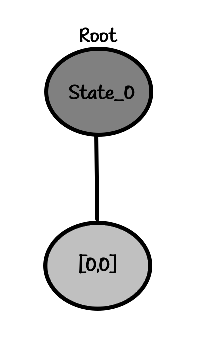
```
"root"
State_0
    └── [0,0]
```

Look at the root, which state did I choose? State 0 - which means S0, which means the starting point, which means when we haven't placed anything yet. You can write it in another way if you want.

_______________________________________________


For n = 2, it becomes a bit more interesting.
Look chessboard and decision-tree my pretties:


```
00
00
```

```
"root"
State_0
```

**Very important note**: In the question I mentioned, there is an implicit point that there is no difference between different rooks or queens. The first rook is considered the same as the second rook, meaning we don't distinguish between them. In the code I provided, you can specify whether there should be a distinction between the pieces or not. Ahm let's explain a bit more: The assumption we made is that, considering these:


```
10
02
```

```
20
01
```

In the two cases above, where in the picture, the blue rook [1] is the first one we placed and the red rook [2] is the second one, in the question, we assumed that there is no difference between them and both represent the same **single answer** below:


```
10
01
```

But we should consider a more general case where we differentiate between the rooks. Because the solutions in this case are more complete and include the solutions in the "indifferent" part as well.

Now let's solve it using backtracking:
We place the first rook in cell [0,0]:


```
10
00
```

The decision tree so far looks like this:


```
root
└── [0,0]
```

Now it's time to place the second rook. According to the order, we placed the first one in [0,0], so we place the second one in [0,1]. So we have:


```
11
00
```

The decision tree becomes like this:


```
root
└── [0,0]
    └── [0,1]
```

And now... we check if it is okay. We see that it is not okay! The rooks are attacking each other. So we backtrack and take a step back (we call it backtracking). We remove the piece we placed and go back to its parent node in the tree and place the next child node - it was not our solution!


```
10
00
```

And the decision tree becomes this again:


```
root
└── [0,0]
```

Just because I deleted the node in the figure, it doesn't mean I should delete it in the code too. It depends on how the programmer implements it; they might say that I want to keep the visited nodes if they don't have a solution so that I know I visited them later... or they might implement a whole different approach...
Anyway, I'll show you the complete tree later; Right now le'ts focus on the algorithm.

Alright, according to the order, we place the next rook at position [1,0], so we have:

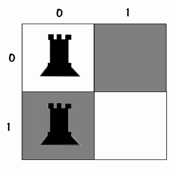
```
10
10
```

Decision tree:

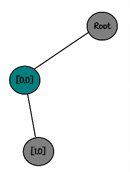
```
root
└── [0,0]
    └── [1,0]
```

But... they can attack each other :(
Backtracking again...


```
10
00
```

And it the tree again:


```
root
└── [0,0]
```

Now it's time to place the rook at position [1,1]:


```
10
01✅
```

And here is the decision tree:


```
root
└── [0,0]
    └── [1,1]✅
```


We check, this is one of the possible solutions, so wooohoooo :)
We can print it or save it, whatever we want to do, let's move on to the next step.

We backtrack until the board is empty:


```
00
00
```

And the tree:


```
root
```

_______________________________________________

**I'll say it again!** It's not like we delete the nodes! I do it this way because I'm explaining it hierarchically, so it doesn't get messy and confusing.
- Let's move on.

We placed the first rook in the previous step at [0,0], this time we place it at [0,1] according to the order:


```
01
00
```

And the tree:


```
root
└── [0,1]
```


I'll quickly go through the steps until the end:

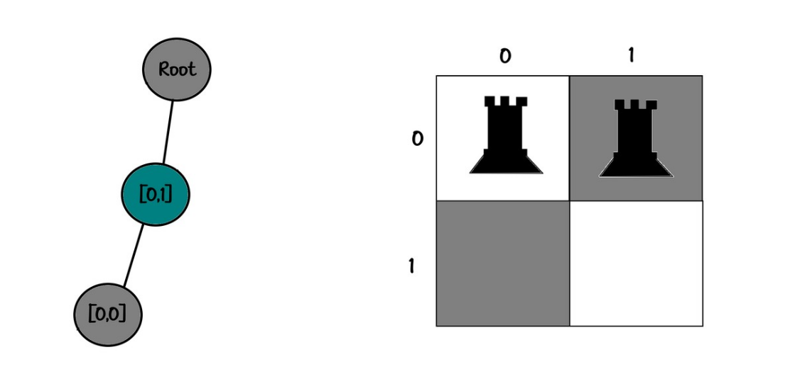
```
Board:
11
00

Tree:
root
└── [0,1]
    └── [0,0]
```

_______________________________________________


```
Board:
01
10✅

Tree:
root
└── [0,1]
    └── [1,0]✅
```

_______________________________________________


```
Board:
01
01

Tree:
root
└── [0,1]
    └── [1,1]
```

_______________________________________________


```
Board:
00
00

Tree:
root
```

_______________________________________________

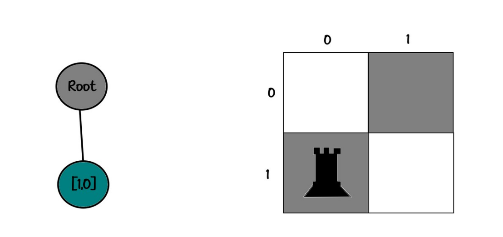
```
Board:
00
10

Tree:
root
└── [1,0]
```

_______________________________________________


```
Board:
10
10

Tree:
root
└── [1,0]
    └── [0,0]
```

_______________________________________________

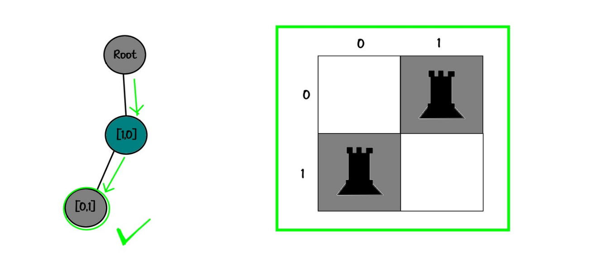
```
Board:
01
10✅

Tree:
root
└── [1,0]
    └── [0,1]✅
```

_______________________________________________


```
Board:
00
11

Tree:
root
└── [1,0]
    └── [1,1]
```

_______________________________________________


```
Board:
00
00

Tree:
root
```

_______________________________________________

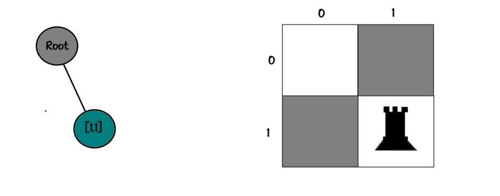
```
Board:
00
01

Tree:
root
└── [1,1]
```

_______________________________________________

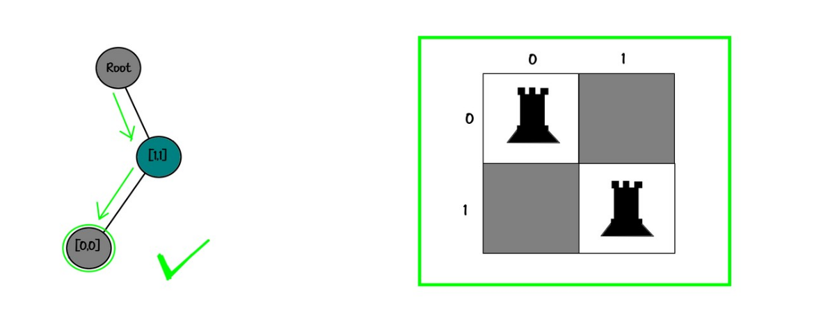
```
Board:
10
01✅

Tree:
root
└── [1,1]
    └── [0,0]✅
```
_______________________________________________


```
Board:
01
01

Tree:
root
└── [1,1]
    └── [0,1]
```

_______________________________________________

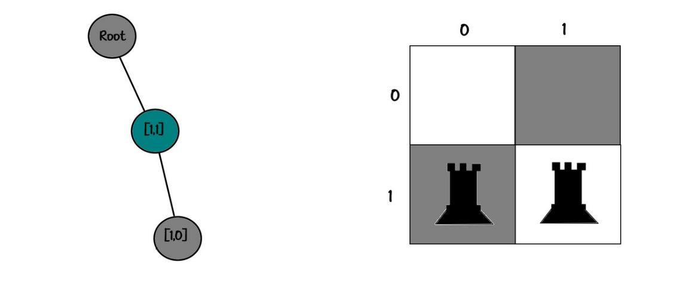
```
Board:
00
11

Tree:
root
└── [1,1]
    └── [1,0]
```

And that's it :)
We found all possible solutions, 4 solutions (with differences):

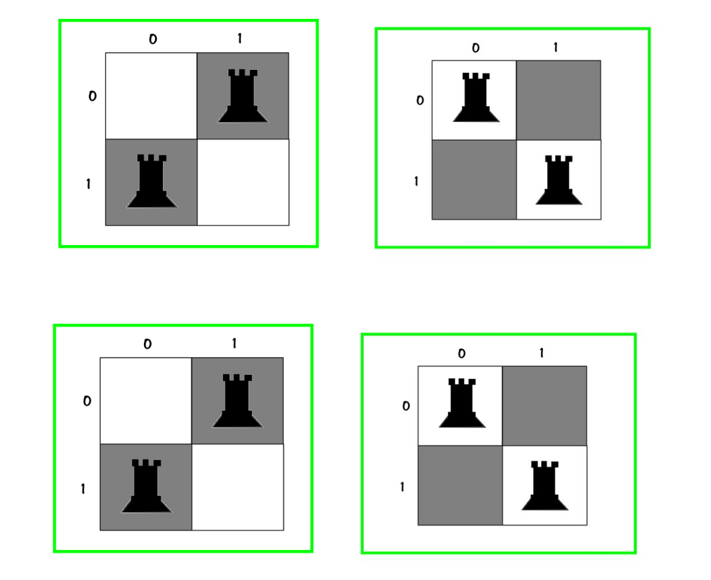
```
10
02✅

01
20✅

20
01✅

02
10✅
```

And if we don't distinguish between the rooks, we got only:


```
10
01✅

01
10✅
```

_______________________________________________


Okay, now it's time to visualize the decision tree for 2-rooks problem. It's important to observe the tree!

If we distinguish between rooks (which the computer always does and you need to configure it in a way that your output is filtered):
• The first time we have 4 choices
• The second time we have 3 choices (because we can't put one rook on top of another... haha 😋)

In total, gives use 12 different possibilities, as I explained one by one.


```
"root"
├── [0,0]
│   ├── [0,1]
│   ├── [1,0]
│   └── [1,1]✅
├── [0,1]
│   ├── [0,0]
│   ├── [1,0]✅
│   └── [1,1]
├── [1,0]
│   ├── [0,0]
│   ├── [0,1]✅
│   └── [1,1]
└── [1,1]
    ├── [0,0]✅
    ├── [0,1]
    └── [1,0]
```

well, well, well... 

That was backtracking algorithm and detailed explanations...
But,
But,...
A programmer needs to consider many things... They always need to write the most optimized code, what we did before was to put a rook in a specific cell, for example:


```
00
01
```

To block the second rook, only the cell below was not allowed:

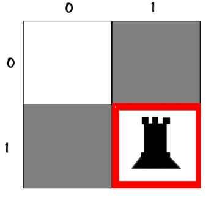
```
00
0X
```

And we considered the other cells as allowed, and put a rook in them and check...

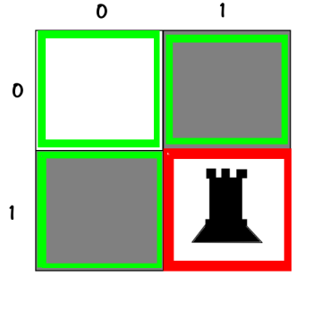
```
VV
VX
```

But is this the right thing to do?
No, ofcourse not!

When we put the first rook here:


```
00
01
```

This lil-rooky can attack in its own row and column (horizontal and vertical direction) – therefore:

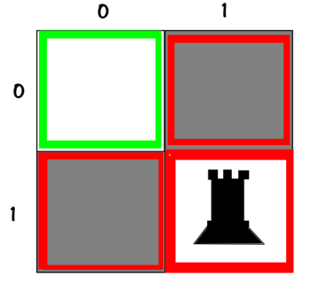
```
VX
XX
```

Checking the red cells (X's) is useless and pointless ^_^
With these considerations, I extend and re-create the decision tree like this:

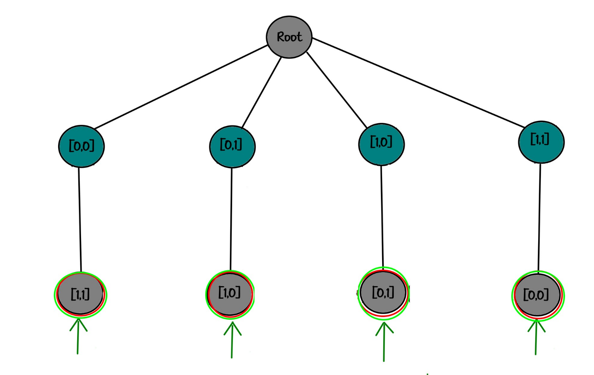
```
"root"
├── [0,0]
│   └── [1,1]✅
├── [0,1]
│   └── [1,0]✅
├── [1,0]
│   └── [0,1]✅
└── [1,1]
    └── [0,0]✅
```

Yup...
It's done :)
If you didn't understand, pause for a moment and try to draw the tree on paper for yourself with the new consideration (about row and column of a rook).
+ I tell ya in secret that it seems our problem's answers for n rooks (and later n queens) are always at the n-th depth of our tree... shhhh, don't tell anyone:3

Okay, now with this new consideration, I draw and analyze the decision tree for n = 1, 2, and 3:

For n = 1, we have:


```
"root"
└── [0,0]✅
```

For n = 2, we have:


```
"root"
├── [0,0]
│   └── [1,1]✅
├── [0,1]
│   └── [1,0]✅
├── [1,0]
│   └── [0,1]✅
└── [1,1]
    └── [0,0]✅
```

For n = 3, we have:

I'm tired from drawing so many graphical trees... Although I doubt anyone will read these!
But instead, inspired by the `tree` command in Linux, I wrote a sexy function that visualizes the tree under the terminal:

```
.
└── "root"
    ├── [0,0]
    │   ├── [1,1]
    │   │   └── [2,2]
    │   ├── [1,2]
    │   │   └── [2,1]
    │   ├── [2,1]
    │   │   └── [1,2]
    │   └── [2,2]
    │       └── [1,1]
    ├── [0,1]
    │   ├── [1,0]
    │   │   └── [2,2]
    │   ├── [1,2]
    │   │   └── [2,0]
    │   ├── [2,0]
    │   │   └── [1,2]
    │   └── [2,2]
    │       └── [1,0]
    ├── [0,2]
    │   ├── [1,0]
    │   │   └── [2,1]
    │   ├── [1,1]
    │   │   └── [2,0]
    │   ├── [2,0]
    │   │   └── [1,1]
    │   └── [2,1]
    │       └── [1,0]
    ├── [1,0]
    │   ├── [0,1]
    │   │   └── [2,2]
    │   ├── [0,2]
    │   │   └── [2,1]
    │   ├── [2,1]
    │   │   └── [0,2]
    │   └── [2,2]
    │       └── [0,1]
    ├── [1,1]
    │   ├── [0,0]
    │   │   └── [2,2]
    │   ├── [0,2]
    │   │   └── [2,0]
    │   ├── [2,0]
    │   │   └── [0,2]
    │   └── [2,2]
    │       └── [0,0]
    ├── [1,2]
    │   ├── [0,0]
    │   │   └── [2,1]
    │   ├── [0,1]
    │   │   └── [2,0]
    │   ├── [2,0]
    │   │   └── [0,1]
    │   └── [2,1]
    │       └── [0,0]
    ├── [2,0]
    │   ├── [0,1]
    │   │   └── [1,2]
    │   ├── [0,2]
    │   │   └── [1,1]
    │   ├── [1,1]
    │   │   └── [0,2]
    │   └── [1,2]
    │       └── [0,1]
    ├── [2,1]
    │   ├── [0,0]
    │   │   └── [1,2]
    │   ├── [0,2]
    │   │   └── [1,0]
    │   ├── [1,0]
    │   │   └── [0,2]
    │   └── [1,2]
    │       └── [0,0]
    └── [2,2]
        ├── [0,0]
        │   └── [1,1]
        ├── [0,1]
        │   └── [1,0]
        ├── [1,0]
        │   └── [0,1]
        └── [1,1]
            └── [0,0]
```

_______________________________________________


And it's done :)
By the way, before you do anything:
Writing this function can be a good exercise to test your programming skills.

**Exercise 1:** Write a function that takes a multi-dimensional array and visualizes it as a tree under terminal (like the `tree` or `pstree` commands).

Writing all the classes and functions for n_rook and n_queen took me a whole day, but writing this function to visualize the tree took me 3 days! I'm so rusy I guess... but it was challenging to write it without looking at the source code! You should try it too.

[I will send you the function I wrote at the end of the article]

Now let's move on to some important explanations:
Since PHP is my favorite language, I included a PHP code that I implemented the node as a class and the tree data structure (as a class), using nodes. 
Oh, I forgot to mention, in computer science, a tree is a "Data Structure" like a heap or hash-table or linked-list or stack, etc. (I hope we talk about these in other articles).
Then I used the tree and found all possible solutions using a extended backtracking approach and stored them in the mentioned tree.
This code has an educational aspect. I wanted you to see the generated decision tree. Otherwise, if someone wants to solve this problem properly:

- Firstly, they probably won't use backtracking.
- Secondly, if they do use backtracking, they definitely won't use PHP.
- Thirdly, if they do use php, they won't store the tree in RAM at all! They can't store it! I will prove later that it's impossible! They just perform the algorithm and directly print the result in output buffer.

When it comes to trees, all other languages step back and make way for languages like C and C++. Not because they are older and deserve respect, no :))
It's because they have `pointers`...
Pointers in C-like languages [including c++] are one of the major reason these languages survived so long. It's a very powerful feature... so powerful that along with being object-oriented like C++, allows you to implement your data structure in bitwise form, meaning in the peak of optimization.

I will definitely discuss pointers in detail, in a seprate article.

I did implement a tree data structure in C++ a long time ago, but unfortunately, I don't know where it is :))

Another important point I want to mention here is that with a few changes in the program for n-rook, I also implemented the n-queen problem solver... (again, I emphasize it's not an optimized implementation, it has an educational aspect). Make sure to read it.

Another important point is that with this heavy and unoptimized code, I was able to run it on my system and find the answers fo up to 6 rooks, but it crashed and froze on 7 rooks...! (Let me skip, the story is sad!!!)
You might say to yourself, "Hmm :)) what's so special about 7 rooks that you couldn't handle them :))"
Allow me to explain!

In 7 rooks, we have a 7x7 chessboard so (assuming I optimize backtracking by not putting next rooks in same col/row ⚠️):
- We can place the first rook in 49 squares
- We can place the second rook in 36 squares
- We can place the third rook in 25 squares
- We can place the fourth rook in 16 squares
- We can place the fifth rook in 9 squares
- We can place the sixth rook in 4 squares
- We can place the seventh rook in only one square.

Finally, our tree has 1x4x9x16x25x36x49 leaves, which is 25401600 leaves!!!
Well, that means in the seventh depth, we have exactly 25401600 nodes!
Similarly, in the sixth depth, we also have 25401600 nodes (why? Think about it...)
In the fifth depth, we have 1x4x9x16x25x36 leaves, which is 518400 nodes.
In the fourth depth, we have 1x4x9x16x25 leaves, which is 14,400 nodes.
In the third depth, we have 1x4x9x16 leaves, which is 576 nodes.
In the second depth, we have 1x4x9 leaves, which is 36 nodes.
In the first depth, we have 1x4 leaves, which is 4 nodes.
And finally, in the zeroth depth, which is the root, we naturally have only one node.
So for 7 rooks, our tree has a total of:
25401600 +
25401600 +
518400 +
14400 +
576 +
36 +
4 +
1
nodes.

which is 51336617 nodes..., let's say around 50 million nodes :))

According to my calculations, in this class that I wrote, on average each empty node reserved about 80 bytes of memory from RAM. Let's assume it doesn't reserve more!! :))
51336617 x 80 equals 4106929360 bytes, which is 4010673 megabytes, which is 3916 gigabytes, which is approximately 4 terabytes :)) Do you have 4 terabytes of RAM?!.. I certainly don't!

S to run this, you would need a supercomputer!
And that's just the RAM usage for constructing the tree :))
If you write it in optimized C++ - like really optimizing and all that stuff - and each node becomes 15 bytes... (!!!) it would still occupy 734 gigabytes of memory!!!
So you have two options there:
1. Get a hard-disk and save your tree on it... hahaha! (But then you're runtime takes years and you won't be able to run it with 8 rooks anymore!!! (Why?!) )
2. Skip storing the tree and just traverse and print it.

In both cases, it will have a high runtime.
The n-rook problem is like this because it has many solutions, while the n-queen problem has much fewer solutions, and with this code, you can even run it with tree storage. I leave it up to you.

Don't be surprised by how much resource required by the solutions is growing large...
Everything grows exponentially in these scenarios. To help you understand exponential growth, I'm republishing an old story - please please please read it:3

_______________________________________________


**The version I heard when I was a kid:**

Chess is one of the oldest games in the world and has been invented many centuries ago. Therefore, it is not surprising if there are many tales about it. Here, we will mention one of them.

The tale says that chess originated from India. King Sheoram, who was fascinated by the clever moves and countless possibilities that one could make with chess pieces, became excited when he found out that its inventor was one of his people. He ordered the inventor, Sessa, to be brought to him so that he could personally reward him for this amazing invention. Sessa, the chess inventor, arrived in the presence of the king. The king kindly said, "I would like to reward you for this extraordinary invention." The scientist showed his respect, and the king continued, "I am so rich that I can fulfill your best wish. Now, tell me what you want and need."

Sessa remained silent.

The king encouraged him to speak and said, "Don't be shy, tell me whatever you want. I will not hesitate to fulfill your best wish."

He replied, "Your majesty's kindness is endless. But give me a chance to think about my request and convey it tomorrow."

The next day, Sessa surprised the king with his humble request. He said, "Your majesty! I want to have one grain of rice in the first square of the chessboard." The king, thinking he had misheard, asked, "Just a regular grain of rice?" Sessa replied, "Yes, your majesty. In the second square, two grains; in the third square, four grains; in the fourth square, eight grains; in the fifth square, sixteen grains; in the sixth square, thirty-two grains; and..."

The king angrily said, "That's enough! You will get the rice grains you wished for in the 64 squares of the chessboard. Each square will have twice the number of grains as the previous one. But know that your request is not worthy and deserving of my generosity." Then the king said, "Go! My servants will bring your sack of rice."

Sessa smiled and went to wait in front of the palace door. During lunchtime, the king remembered Sessa and asked if the inventor had received his humble reward, and they answered him, "Your majesty, Your command is obeyed. Your mathematicians are busy calculating to see how much rice he should receive." The king frowned because he was not used to such delay and procrastination in executing his orders. The night before going to bed, he asked again if Sessa's sack of rice had been given to him, but they said, "O king! Your mathematicians are always at work, and they hope to finish their calculations before sunrise."

The king angrily said, "Why are they calculating so much? The reward for Sessa should be given to him until the last grain of rice. I will not give any more orders about this!" In the morning, they informed the king that the head mathematician of the palace had requested an visit. The king accepted him. Before the mathematician could speak, the king said, "I want to know if the humble reward that Sessa requested has been given to him." The old mathematician replied, "The reason I came so early in the morning is this. We have tried our best to calculate Sessa's rice, and the amount is very astonishing." The king interrupted his speech with impatience and said, "However astonishing it may be, my royal granaries can handle it. The reward promised to him must be delivered!"

The mathematician said, "Satisfaction and fulfilling Sessa's wish is beyond your power. In all your royal granaries, there is not enough rice for the amount Sessa requested. In fact, the world has never seen such an amount of rice. If you want to keep your promise, you must order all the lands of the world to be turned into rice farms, all the seas and oceans to dry up, and all the ice and snow in distant poles to melt. And then, if all these vast lands and territories are cultivated with rice, it might be possible to give Sessa the amount of wheat he requested as a reward."

The king, who was listening attentively to the mathematician's words, thought for a moment and said thoughtfully, "What is that big number?"

The mathematician replied, "The number is 18,446,744,073,709,551,615."

-=-=-=-=-=-=-=-=-=-=-=-=-=-=-=-=-=-=-=-=-=-=-=-=

This number is calculated by getting the sum of the following numbers, which form a geometric progression:
2^64, 2^63, 2^62, ..., 2^2, 2^1, 2^0

Using the formula for the sum of a geometric progression, we get:

(2^64-1)/(2-1) = 18446744073709551615 

With calculations, it is estimated that an average cubic meter of rice contains 15,000,000 rice grains. Therefore, the reward requested by the chess inventor would require a storage facility of 1,200,000,000 cubic meters or 1,200 kilometers. If we choose a storage facility with a height of 4 meters and a width of 10 meters, it would be 30,000,000 kilometers long or eighty times the distance from Earth to the Moon.

This tale has been mentioned in various sources, and I cannot make sure which one is the original source. If you know, please let me know.

-=-=-=-=-=-=-=-=-=-=-=-=-=-=-=-=-=-=-=-=-=-=-=-=

But here is another version, That I could find on web, written by David Blatner in the book "Spectrums: Our Mind-boggling Universe From Infinitesimal to Infinity" and qouted by Robert Krulwich in "npr.org".

**That Old Rice-Grains-On-The-Chessboard Con, With a New Twist**

Once upon a time, says the science writer David Blatner, there was this con man who made chessboards for high-end clients — in this case, a king.

The craftsman was good; his chessboards were better than beautiful. The king, he knew, loved chess. So he hatched a plan to trick the king into handing over an enormous fortune. His plan? He figured, "This king is not too good at math."


*Source: Robert Krulwich/[NPR](https://www.npr.org/sections/krulwich/2012/09/15/160879929/that-old-rice-grains-on-the-chessboard-con-with-a-new-twist) 
*
So when the craftsman presented his chessboard at court, he told the king,

"Your Highness, I don't want money for this. Or jewels. All I want is a little rice."

"Hmm," thought the king, who was a con man himself. "I've got rice. How much rice?"

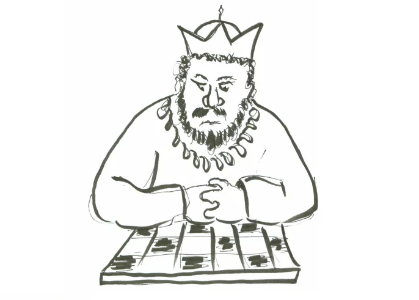
*Source: Robert Krulwich/[NPR](https://www.npr.org/sections/krulwich/2012/09/15/160879929/that-old-rice-grains-on-the-chessboard-con-with-a-new-twist) 
*
"All I want," said the craftsman, "is for you to put a single grain of rice on the first square, two grains on the second, four on the third, eight on the fourth, and so on and so on and so on, for the full 64 squares."

"I can do that," said the king, not thinking. And he ordered his granary to pay the man for the chessboard.

Well, that turned out to be more than a little difficult. The first few squares on the board cost the king one grain, then two, then four ... by the end of the first row, he was up to 128 grains.

In the second row, things got out of hand. By the 21st square he owed over a million grains; by the 41st, it was over a trillion grains of rice — more rice than he, his subjects or any king anywhere could afford.

He'd been had.

Or had he?


*Source: Robert Krulwich/[NPR](https://www.npr.org/sections/krulwich/2012/09/15/160879929/that-old-rice-grains-on-the-chessboard-con-with-a-new-twist) 
*
He was, after all, a king. He knew a thing or two about negotiating.

"I will pay you," he told the craftsman. "But before you receive the money, just to be sure you are getting what you asked for, I'd like you to count each and every grain I give you."

"Oh, that won't be necessary," said the craftsman.

"Oh, it is necessary," said the king. "I wouldn't want to cheat you."

It takes one second to count a grain of rice. To count the number of grains he'd been promised, it would have taken the craftsman a half-trillion years, about 42 times the age of our universe, to complete his count. The king wouldn't pay till the count was done. The craftsman quickly realized the count would never be done. His con was counterconned.

The moral here? Kings may forget their math some of the time, but they rarely forget math all of the time. That's why they're kings.

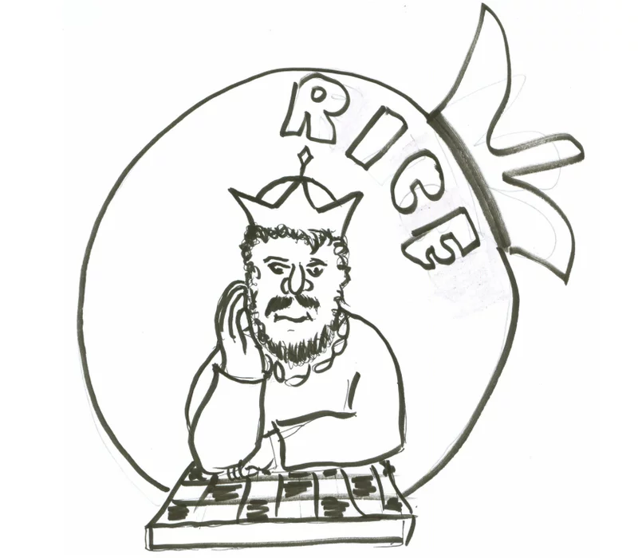
*Source: Robert Krulwich/[NPR](https://www.npr.org/sections/krulwich/2012/09/15/160879929/that-old-rice-grains-on-the-chessboard-con-with-a-new-twist) 
*
David Blatner includes this old tale — told briefly — in his new book, Spectrums: Our Mind-boggling Universe From Infinitesimal to Infinity. It's a book about scaling, variety and all the things we cannot see, hear, feel, count, intuit or understand. It's a celebration of mystery and mischief.

Source: https://www.npr.org/sections/krulwich/2012/09/15/160879929/that-old-rice-grains-on-the-chessboard-con-with-a-new-twist

_______________________________________________

Bloody hell ha?!

That, was exponential growth, I shall write an article about it:3

Jokes aside, I would like to mention an important moral point about chess and its logic:
Chess was invented at a time when kings were declaring wars and expanding their kingdoms (like they don't do that anymore ×_×). Therefore, the logic behind it is that the power of the king and queen is higher than the others,  and the value of their lives is millions of times greater than the life of an innocent soldier... :/
It's good to learn about backtracking algorithm or learning programming skill using trees, but if you believe that the no-good logic of chess applies to real life as well, and the life is nothing but a war between a few kings, where soldiers should get sacrificed in order to keep the king and queen safe from checkmate, in that case, you haven't learned anything.
The value of all people is equal, and life is not a game of chess.

_______________________________________________

As I mentioned before, in the source code, I also provided a solution to the n-queens problem and wrote a function for it. The approach is exactly the same as the n-rooks problem with a little modification.
Since I love you, I will give you a little explanation of the approach, to prevent leaving anything unexplained:
Previously, when we wanted to solve the n-rooks problem, let's say for n=4:
We would place the first rook in a square like [2,2]:


```
0000
0000
00R0
0000
```

Then in which squares would it attcak?

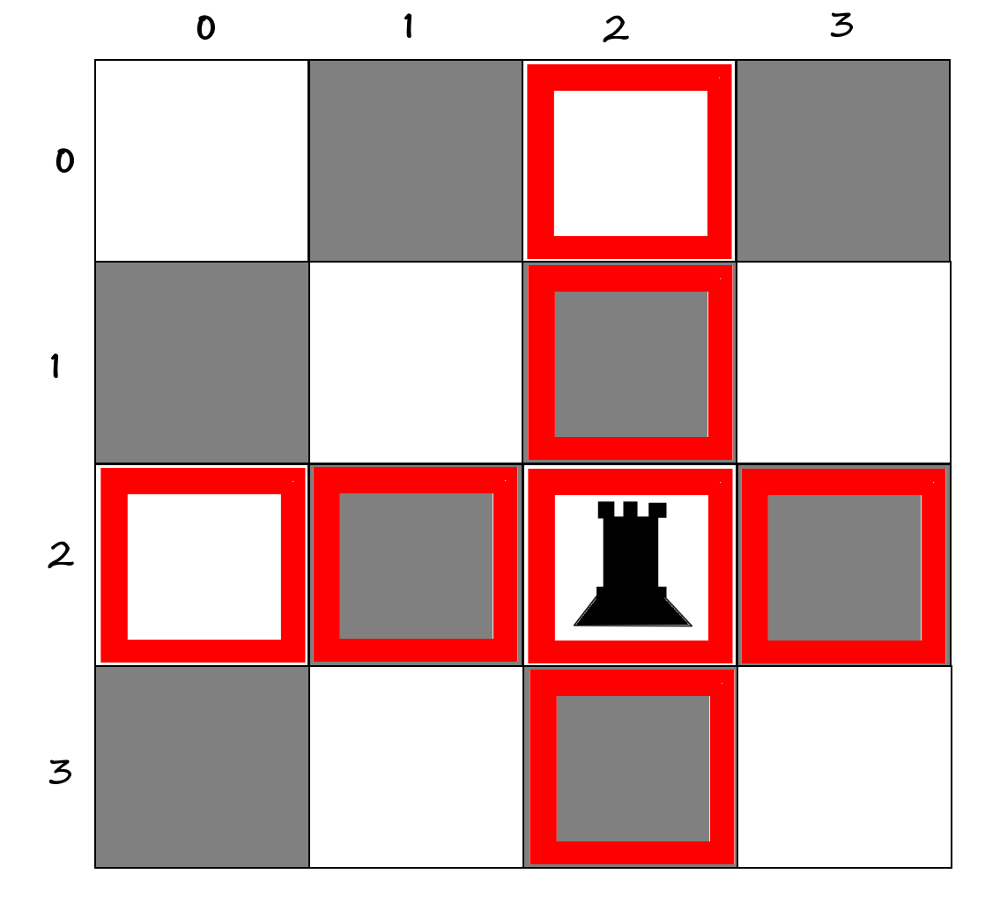
```
00X0
00X0
XXRX
00X0
```

In these squares that I marked in red [Xs], we couldn't place any more rooks.

It's obvious so far.

But imagine now in the same 4x4 board, we want to solve the n-queens problem:

Let's say we would place the first queen in a square like [2,2]:

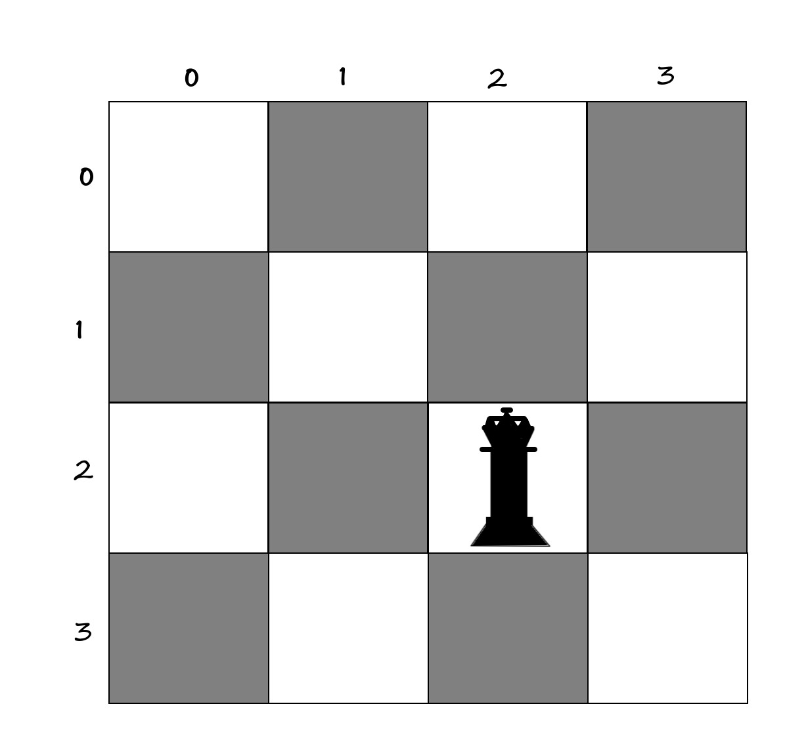
```
0000
0000
00Q0
0000
```

Now, let's see which squares it can attack, in other words, which squares become unusable:


```
X0X0
0XXX
XXQX
0XXX
```

I hope you understand how it works. If you didn't understand, please consider the following figure:


```
Z0X0
0ZXZ
XXQX
0ZXZ
```

1- The square where the queen is placed cannot be occupied by another queen. (Blue - Q)
2- The queen can attack squares in its vertical and horizontal lines (its own row and column), therefor no other queens can be placed over there. (Reds - X)
3- It can attack squares in its main and secondary diagonals, therefor no queens can be placed over there. (Pinks - Z)

So, our code for the n-queens problem has a difference compared to the n-rooks problem when these pink squares (Zs) are added.
I will run the program for you in two scenarios: when the solution is based on distinguishing between different pieces and when it's not, so you can see the difference.

Regarding the code, there is one more thing I want to mention. In the case where we don't distinguish between the pieces, as a feature to help you learn something, I printed some additional information for you to see if the created matrix (chessboard) **is symmetric with respect to the main diagonal or not**. What does it mean for a matrix to be symmetric with respect to the main diagonal!? I will explain.

In the context of matrices, in square matrices, if the i (row number) for an element is equal to the j (its column number) for that element, That element is considered to be on the main diagonal.

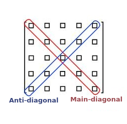
```
X000Z
0X0Z0
00Y00
0Z0X0
Z000X

X = Main diagonal
Z = Antidiagonal
```
And correspondingly, the other diagonal of the matrix is called the secondary diagonal or "Antidiagonal".
It's very simple...
Now, let's see if the created matrix is symmetric with respect to the main diagonal or not....
What I mean is, does each element on one side of the main diagonal have its counterpart on the other side or not,
For example:

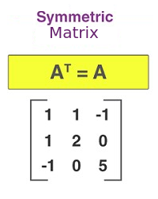
```
Symmetric Matrix:

1   1   -1
1   2   0
-1  0   5

A_T = A
```

It is symmetric with respect to the main diagonal. Why? Pay attention:


```
1   1   -1
1   2   0
-1  0   5
```

But the following matrix is not symmetric:

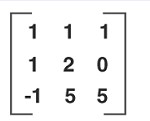
```
1   1   1
1   2   0
-1  0   5
```

It is clear that a matrix that is symmetric with respect to the main diagonal is simply called "symmetric matrix".

If I want to look a bit more observative at our question regarding the topic of symmetric matrices, a chessboard is symmetric if whether we look at the chessboard from the perspective of the player in white or the player in black, we see the same placement of peices. I will show you an example with a figure.
I will print the word "symmetric" above any matrix that is symmetric (only in the scenario where we didn't apply for distinction, otherwise it doesn't make sense {Why? - If you can answer this, it means you understood the topic.}). For example, if you run the program for 4 queens, you will see that out of the 24 generated solutions, 10 of them are symmetric. For example, one of those symmetric solutions is:


```
_______
**symmetric**
0 0 0 1 
0 1 0 0 
0 0 1 0 
1 0 0 0 
_______
```
Now pay attention, see that it is symmetric with respect to the main diagonal.


```
0 0 0 1 
0 1 0 0 
0 0 1 0 
1 0 0 0 
```

Now, let's see the exact same case on a chessboard:

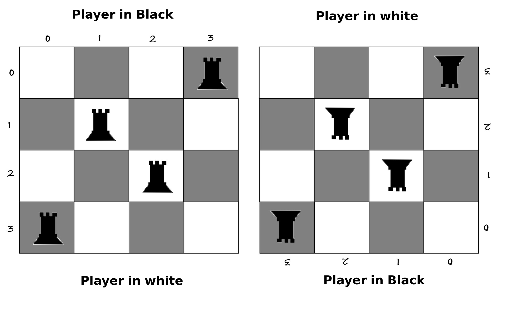
```
White
0 0 0 1 
0 1 0 0 
0 0 1 0 
1 0 0 0
Black


Black
0 0 0 1 
0 1 0 0 
0 0 1 0 
1 0 0 0
White
```


I rotated the exact same image 180 degrees so you can understand what I mean.
So, these symmetric cases are also indicated by the program.
_______________________________________________


Well well well,...
We're kinda exhausted, aren't we?!😅
These explanations were just a glimpse of the backtracking algorithm context.

Now let me explain how to run the code and show you the output of the first three parts as an ending outro to this long and sexy question that teaches thousands of things within itself:

To run the code, just run `back_tracking.php`. In the code, I called both the n-queens function and the n-rooks function twice. The first time, it solves the problem with "indifference" (the condition of our question), and the second time, it applies "distinguishing" and "difference".

[I have attached the source code at the end of the article.]


I will execute the code for:

- 1 rook - indifferent
- 1 rook - distinguish
- 1 queen - indifferent
- 1 queen - distinguish
- 2 rooks - indifferent
- 2 rooks - distinguish
- 2 queens - indifferent
- 2 queens - distinguish
- 3 rooks - indifferent
- 3 rooks - distinguish
- 3 queens - indifferent
- 3 queens - distinguish
And because I love you guys so much, I will also execute for:
- 4 rooks - indifferent
- 4 rooks - distinguish
- 4 queens - indifferent
- 4 queens - distinguish

_______________________________________________


For the n-rooks problem with n = 1 (indifferent):
Call the function like this:

```
n_rooks( 1 );
```

And the result of this part:

```
behrad@TadavomnisT:~/Desktop$ php back_tracking.php 

** 1 ROOKS ** (no distinguish between rooks)
Building empty matrix...
Building decision tree...
Printing decision tree :
.
└── "root"
    └── [0,0]

Printing all possible solutions :
**symmetric**
1 
_
Number of answers : 1
Number of symmetric answers : 1
___________________________________
behrad@TadavomnisT:~/Desktop$ 
```
_______________________________________________

For the n-rooks problem with n = 1 (distinguish):
Call the function like this:

```
n_rooks( 1 , true ); //distinguish between rooks
```

And the result of this part:

```
behrad@TadavomnisT:~/Desktop$ php back_tracking.php 

** 1 ROOKS ** (distinguishing between rooks)
Building empty matrix...
Building decision tree...
Printing decision tree :
.
└── "root"
    └── [0,0]

Printing all possible solutions :
1 
_
Number of answers : 1
___________________________________
behrad@TadavomnisT:~/Desktop$ 
```

_______________________________________________

For the n-rooks problem with n = 1 (indifferent):
Call the function like this:

```
n_queens( 1 );
```

And the result of this part:

```
behrad@TadavomnisT:~/Desktop$ php back_tracking.php 

** 1 QUEENS ** (no distinguish between queens)
Building empty matrix...
Building decision tree...
Printing decision tree :
.
└── "root"
    └── [0,0]

Printing all possible solutions :
**symmetric**
1 
_
Number of answers : 1
Number of symmetric answers : 1
___________________________________
behrad@TadavomnisT:~/Desktop$ 
```
_______________________________________________


For the n-queens problem with n = 1 (distinguish):
Call the function like this:

```
n_queens( 1 , true ); //distinguish between queens
```

And the result of this part:

```
behrad@TadavomnisT:~/Desktop$ php back_tracking.php 

** 1 QUEENS ** (distinguishing between queens)
Building empty matrix...
Building decision tree...
Printing decision tree :
.
└── "root"
    └── [0,0]

Printing all possible solutions :
1 
_
Number of answers : 1
___________________________________
behrad@TadavomnisT:~/Desktop$ 
```
_______________________________________________

For the n-rooks problem with n = 2 (indifferent):
Call the function like this:

```
n_rooks( 2 );
```

And the result of this part:

```
behrad@TadavomnisT:~/Desktop$ php back_tracking.php 

** 2 ROOKS ** (no distinguish between rooks)
Building empty matrix...
Building decision tree...
Printing decision tree :
.
└── "root"
    ├── [0,0]
    │   └── [1,1]
    ├── [0,1]
    │   └── [1,0]
    ├── [1,0]
    │   └── [0,1]
    └── [1,1]
        └── [0,0]

Printing all possible solutions :
**symmetric**
1 0 
0 1 
___
**symmetric**
0 1 
1 0 
___
Number of answers : 2
Number of symmetric answers : 2
___________________________________
behrad@TadavomnisT:~/Desktop$ 
```
_______________________________________________

For the n-rooks problem with n = 2 (distinguish):
Call the function like this:

```
n_rooks( 2 , true ); //distinguish between rooks
```

And the result of this part:

```
behrad@TadavomnisT:~/Desktop$ php back_tracking.php 

** 2 ROOKS ** (distinguishing between rooks)
Building empty matrix...
Building decision tree...
Printing decision tree :
.
└── "root"
    ├── [0,0]
    │   └── [1,1]
    ├── [0,1]
    │   └── [1,0]
    ├── [1,0]
    │   └── [0,1]
    └── [1,1]
        └── [0,0]

Printing all possible solutions :
1 0 
0 2 
___
0 1 
2 0 
___
0 2 
1 0 
___
2 0 
0 1 
___
Number of answers : 4
___________________________________
behrad@TadavomnisT:~/Desktop$ 
```
_______________________________________________

For the n-queens problem with n = 2 (indifferent):
Call the function like this:

```
n_queens( 2 );
```

And the result of this part:

```
behrad@TadavomnisT:~/Desktop$ php back_tracking.php 

** 2 QUEENS ** (no distinguish between queens)
Building empty matrix...
Building decision tree...
Printing decision tree :
.
└── "root"
    ├── [0,0]
    ├── [0,1]
    ├── [1,0]
    └── [1,1]

Printing all possible solutions :
Number of answers : 0
Number of symmetric answers : 0
___________________________________
behrad@TadavomnisT:~/Desktop$  
```

For the n-queens problem with n = 2 (distinguish):
Call the function like this:

```
n_queens( 2 , true ); //distinguish between queens
```

And the result of this part:

```
behrad@TadavomnisT:~/Desktop$ php back_tracking.php 

** 2 QUEENS ** (distinguishing between queens)
Building empty matrix...
Building decision tree...
Printing decision tree :
.
└── "root"
    ├── [0,0]
    ├── [0,1]
    ├── [1,0]
    └── [1,1]

Printing all possible solutions :
Number of answers : 0
___________________________________
behrad@TadavomnisT:~/Desktop$ 
```
_______________________________________________

For the n-rooks problem with n = 3 (indifferent):
Call the function like this:

```
n_rooks( 3 );
```

And the result of this part:

```
behrad@TadavomnisT:~/Desktop$ php back_tracking.php 

** 3 ROOKS ** (no distinguish between rooks)
Building empty matrix...
Building decision tree...
Printing decision tree :
.
└── "root"
    ├── [0,0]
    │   ├── [1,1]
    │   │   └── [2,2]
    │   ├── [1,2]
    │   │   └── [2,1]
    │   ├── [2,1]
    │   │   └── [1,2]
    │   └── [2,2]
    │       └── [1,1]
    ├── [0,1]
    │   ├── [1,0]
    │   │   └── [2,2]
    │   ├── [1,2]
    │   │   └── [2,0]
    │   ├── [2,0]
    │   │   └── [1,2]
    │   └── [2,2]
    │       └── [1,0]
    ├── [0,2]
    │   ├── [1,0]
    │   │   └── [2,1]
    │   ├── [1,1]
    │   │   └── [2,0]
    │   ├── [2,0]
    │   │   └── [1,1]
    │   └── [2,1]
    │       └── [1,0]
    ├── [1,0]
    │   ├── [0,1]
    │   │   └── [2,2]
    │   ├── [0,2]
    │   │   └── [2,1]
    │   ├── [2,1]
    │   │   └── [0,2]
    │   └── [2,2]
    │       └── [0,1]
    ├── [1,1]
    │   ├── [0,0]
    │   │   └── [2,2]
    │   ├── [0,2]
    │   │   └── [2,0]
    │   ├── [2,0]
    │   │   └── [0,2]
    │   └── [2,2]
    │       └── [0,0]
    ├── [1,2]
    │   ├── [0,0]
    │   │   └── [2,1]
    │   ├── [0,1]
    │   │   └── [2,0]
    │   ├── [2,0]
    │   │   └── [0,1]
    │   └── [2,1]
    │       └── [0,0]
    ├── [2,0]
    │   ├── [0,1]
    │   │   └── [1,2]
    │   ├── [0,2]
    │   │   └── [1,1]
    │   ├── [1,1]
    │   │   └── [0,2]
    │   └── [1,2]
    │       └── [0,1]
    ├── [2,1]
    │   ├── [0,0]
    │   │   └── [1,2]
    │   ├── [0,2]
    │   │   └── [1,0]
    │   ├── [1,0]
    │   │   └── [0,2]
    │   └── [1,2]
    │       └── [0,0]
    └── [2,2]
        ├── [0,0]
        │   └── [1,1]
        ├── [0,1]
        │   └── [1,0]
        ├── [1,0]
        │   └── [0,1]
        └── [1,1]
            └── [0,0]

Printing all possible solutions :
**symmetric**
1 0 0 
0 1 0 
0 0 1 
_____
**symmetric**
1 0 0 
0 0 1 
0 1 0 
_____
**symmetric**
0 1 0 
1 0 0 
0 0 1 
_____
0 1 0 
0 0 1 
1 0 0 
_____
0 0 1 
1 0 0 
0 1 0 
_____
**symmetric**
0 0 1 
0 1 0 
1 0 0 
_____
Number of answers : 6
Number of symmetric answers : 4
___________________________________
behrad@TadavomnisT:~/Desktop$ 
```
_______________________________________________

For the n-rooks problem with n = 3 (distinguish):
Call the function like this:

```
n_rooks( 3 , true ); //distinguish between rooks
```

And the result of this part:

```
behrad@TadavomnisT:~/Desktop$ php back_tracking.php 

** 3 ROOKS ** (distinguishing between rooks)
Building empty matrix...
Building decision tree...
Printing decision tree :
.
└── "root"
    ├── [0,0]
    │   ├── [1,1]
    │   │   └── [2,2]
    │   ├── [1,2]
    │   │   └── [2,1]
    │   ├── [2,1]
    │   │   └── [1,2]
    │   └── [2,2]
    │       └── [1,1]
    ├── [0,1]
    │   ├── [1,0]
    │   │   └── [2,2]
    │   ├── [1,2]
    │   │   └── [2,0]
    │   ├── [2,0]
    │   │   └── [1,2]
    │   └── [2,2]
    │       └── [1,0]
    ├── [0,2]
    │   ├── [1,0]
    │   │   └── [2,1]
    │   ├── [1,1]
    │   │   └── [2,0]
    │   ├── [2,0]
    │   │   └── [1,1]
    │   └── [2,1]
    │       └── [1,0]
    ├── [1,0]
    │   ├── [0,1]
    │   │   └── [2,2]
    │   ├── [0,2]
    │   │   └── [2,1]
    │   ├── [2,1]
    │   │   └── [0,2]
    │   └── [2,2]
    │       └── [0,1]
    ├── [1,1]
    │   ├── [0,0]
    │   │   └── [2,2]
    │   ├── [0,2]
    │   │   └── [2,0]
    │   ├── [2,0]
    │   │   └── [0,2]
    │   └── [2,2]
    │       └── [0,0]
    ├── [1,2]
    │   ├── [0,0]
    │   │   └── [2,1]
    │   ├── [0,1]
    │   │   └── [2,0]
    │   ├── [2,0]
    │   │   └── [0,1]
    │   └── [2,1]
    │       └── [0,0]
    ├── [2,0]
    │   ├── [0,1]
    │   │   └── [1,2]
    │   ├── [0,2]
    │   │   └── [1,1]
    │   ├── [1,1]
    │   │   └── [0,2]
    │   └── [1,2]
    │       └── [0,1]
    ├── [2,1]
    │   ├── [0,0]
    │   │   └── [1,2]
    │   ├── [0,2]
    │   │   └── [1,0]
    │   ├── [1,0]
    │   │   └── [0,2]
    │   └── [1,2]
    │       └── [0,0]
    └── [2,2]
        ├── [0,0]
        │   └── [1,1]
        ├── [0,1]
        │   └── [1,0]
        ├── [1,0]
        │   └── [0,1]
        └── [1,1]
            └── [0,0]

Printing all possible solutions :
1 0 0 
0 2 0 
0 0 3 
_____
1 0 0 
0 0 2 
0 3 0 
_____
1 0 0 
0 0 3 
0 2 0 
_____
1 0 0 
0 3 0 
0 0 2 
_____
0 1 0 
2 0 0 
0 0 3 
_____
0 1 0 
0 0 2 
3 0 0 
_____
0 1 0 
0 0 3 
2 0 0 
_____
0 1 0 
3 0 0 
0 0 2 
_____
0 0 1 
2 0 0 
0 3 0 
_____
0 0 1 
0 2 0 
3 0 0 
_____
0 0 1 
0 3 0 
2 0 0 
_____
0 0 1 
3 0 0 
0 2 0 
_____
0 2 0 
1 0 0 
0 0 3 
_____
0 0 2 
1 0 0 
0 3 0 
_____
0 0 3 
1 0 0 
0 2 0 
_____
0 3 0 
1 0 0 
0 0 2 
_____
2 0 0 
0 1 0 
0 0 3 
_____
0 0 2 
0 1 0 
3 0 0 
_____
0 0 3 
0 1 0 
2 0 0 
_____
3 0 0 
0 1 0 
0 0 2 
_____
2 0 0 
0 0 1 
0 3 0 
_____
0 2 0 
0 0 1 
3 0 0 
_____
0 3 0 
0 0 1 
2 0 0 
_____
3 0 0 
0 0 1 
0 2 0 
_____
0 2 0 
0 0 3 
1 0 0 
_____
0 0 2 
0 3 0 
1 0 0 
_____
0 0 3 
0 2 0 
1 0 0 
_____
0 3 0 
0 0 2 
1 0 0 
_____
2 0 0 
0 0 3 
0 1 0 
_____
0 0 2 
3 0 0 
0 1 0 
_____
0 0 3 
2 0 0 
0 1 0 
_____
3 0 0 
0 0 2 
0 1 0 
_____
2 0 0 
0 3 0 
0 0 1 
_____
0 2 0 
3 0 0 
0 0 1 
_____
0 3 0 
2 0 0 
0 0 1 
_____
3 0 0 
0 2 0 
0 0 1 
_____
Number of answers : 36
___________________________________
behrad@TadavomnisT:~/Desktop$ 
```
_______________________________________________

For the n-queens problem with n = 3 (indifferent):
Call the function like this:

```
n_queens( 3 );
```

And the result of this part:

```
behrad@TadavomnisT:~/Desktop$ php back_tracking.php 

** 3 QUEENS ** (no distinguish between queens)
Building empty matrix...
Building decision tree...
Printing decision tree :
.
└── "root"
    ├── [0,0]
    │   ├── [1,2]
    │   └── [2,1]
    ├── [0,1]
    │   ├── [2,0]
    │   └── [2,2]
    ├── [0,2]
    │   ├── [1,0]
    │   └── [2,1]
    ├── [1,0]
    │   ├── [0,2]
    │   └── [2,2]
    ├── [1,1]
    ├── [1,2]
    │   ├── [0,0]
    │   └── [2,0]
    ├── [2,0]
    │   ├── [0,1]
    │   └── [1,2]
    ├── [2,1]
    │   ├── [0,0]
    │   └── [0,2]
    └── [2,2]
        ├── [0,1]
        └── [1,0]

Printing all possible solutions :
Number of answers : 0
Number of symmetric answers : 0
___________________________________
behrad@TadavomnisT:~/Desktop$ 
```
_______________________________________________

For the n-queens problem with n = 3 (distinguish):
Call the function like this:

```
n_queens( 3 , true ); //distinguish between queens
```

And the result of this part:

```
behrad@TadavomnisT:~/Desktop$ php back_tracking.php 

** 3 QUEENS ** (distinguishing between queens)
Building empty matrix...
Building decision tree...
Printing decision tree :
.
└── "root"
    ├── [0,0]
    │   ├── [1,2]
    │   └── [2,1]
    ├── [0,1]
    │   ├── [2,0]
    │   └── [2,2]
    ├── [0,2]
    │   ├── [1,0]
    │   └── [2,1]
    ├── [1,0]
    │   ├── [0,2]
    │   └── [2,2]
    ├── [1,1]
    ├── [1,2]
    │   ├── [0,0]
    │   └── [2,0]
    ├── [2,0]
    │   ├── [0,1]
    │   └── [1,2]
    ├── [2,1]
    │   ├── [0,0]
    │   └── [0,2]
    └── [2,2]
        ├── [0,1]
        └── [1,0]

Printing all possible solutions :
Number of answers : 0
___________________________________
behrad@TadavomnisT:~/Desktop$ 
```
_______________________________________________

For the n-rooks problem with n = 4 (indifferent):
Call the function like this:

```
n_rooks( 4 );
```

And the result of this part:

```
behrad@TadavomnisT:~/Desktop$ php back_tracking.php 

** 4 ROOKS ** (no distinguish between rooks)
Building empty matrix...
Building decision tree...
Printing decision tree :
.
└── "root"
    ├── [0,0]
    │   ├── [1,1]
    │   │   ├── [2,2]
    │   │   │   └── [3,3]
    │   │   ├── [2,3]
    │   │   │   └── [3,2]
    │   │   ├── [3,2]
    │   │   │   └── [2,3]
    │   │   └── [3,3]
    │   │       └── [2,2]
    │   ├── [1,2]
    │   │   ├── [2,1]
    │   │   │   └── [3,3]
    │   │   ├── [2,3]
    │   │   │   └── [3,1]
    │   │   ├── [3,1]
    │   │   │   └── [2,3]
    │   │   └── [3,3]
    │   │       └── [2,1]
    │   ├── [1,3]
    │   │   ├── [2,1]
    │   │   │   └── [3,2]
    │   │   ├── [2,2]
    │   │   │   └── [3,1]
    │   │   ├── [3,1]
    │   │   │   └── [2,2]
    │   │   └── [3,2]
    │   │       └── [2,1]
    │   ├── [2,1]
    │   │   ├── [1,2]
    │   │   │   └── [3,3]
    │   │   ├── [1,3]
    │   │   │   └── [3,2]
    │   │   ├── [3,2]
    │   │   │   └── [1,3]
    │   │   └── [3,3]
    │   │       └── [1,2]
    │   ├── [2,2]
    │   │   ├── [1,1]
    │   │   │   └── [3,3]
    │   │   ├── [1,3]
    │   │   │   └── [3,1]
    │   │   ├── [3,1]
    │   │   │   └── [1,3]
    │   │   └── [3,3]
    │   │       └── [1,1]
    │   ├── [2,3]
    │   │   ├── [1,1]
    │   │   │   └── [3,2]
    │   │   ├── [1,2]
    │   │   │   └── [3,1]
    │   │   ├── [3,1]
    │   │   │   └── [1,2]
    │   │   └── [3,2]
    │   │       └── [1,1]
    │   ├── [3,1]
    │   │   ├── [1,2]
    │   │   │   └── [2,3]
    │   │   ├── [1,3]
    │   │   │   └── [2,2]
    │   │   ├── [2,2]
    │   │   │   └── [1,3]
    │   │   └── [2,3]
    │   │       └── [1,2]
    │   ├── [3,2]
    │   │   ├── [1,1]
    │   │   │   └── [2,3]
    │   │   ├── [1,3]
    │   │   │   └── [2,1]
    │   │   ├── [2,1]
    │   │   │   └── [1,3]
    │   │   └── [2,3]
    │   │       └── [1,1]
    │   └── [3,3]
    │       ├── [1,1]
    │       │   └── [2,2]
    │       ├── [1,2]
    │       │   └── [2,1]
    │       ├── [2,1]
    │       │   └── [1,2]
    │       └── [2,2]
    │           └── [1,1]
    ├── [0,1]
    │   ├── [1,0]
    │   │   ├── [2,2]
    │   │   │   └── [3,3]
    │   │   ├── [2,3]
    │   │   │   └── [3,2]
    │   │   ├── [3,2]
    │   │   │   └── [2,3]
    │   │   └── [3,3]
    │   │       └── [2,2]
    │   ├── [1,2]
    │   │   ├── [2,0]
    │   │   │   └── [3,3]
    │   │   ├── [2,3]
    │   │   │   └── [3,0]
    │   │   ├── [3,0]
    │   │   │   └── [2,3]
    │   │   └── [3,3]
    │   │       └── [2,0]
    │   ├── [1,3]
    │   │   ├── [2,0]
    │   │   │   └── [3,2]
    │   │   ├── [2,2]
    │   │   │   └── [3,0]
    │   │   ├── [3,0]
    │   │   │   └── [2,2]
    │   │   └── [3,2]
    │   │       └── [2,0]
    │   ├── [2,0]
    │   │   ├── [1,2]
    │   │   │   └── [3,3]
    │   │   ├── [1,3]
    │   │   │   └── [3,2]
    │   │   ├── [3,2]
    │   │   │   └── [1,3]
    │   │   └── [3,3]
    │   │       └── [1,2]
    │   ├── [2,2]
    │   │   ├── [1,0]
    │   │   │   └── [3,3]
    │   │   ├── [1,3]
    │   │   │   └── [3,0]
    │   │   ├── [3,0]
    │   │   │   └── [1,3]
    │   │   └── [3,3]
    │   │       └── [1,0]
    │   ├── [2,3]
    │   │   ├── [1,0]
    │   │   │   └── [3,2]
    │   │   ├── [1,2]
    │   │   │   └── [3,0]
    │   │   ├── [3,0]
    │   │   │   └── [1,2]
    │   │   └── [3,2]
    │   │       └── [1,0]
    │   ├── [3,0]
    │   │   ├── [1,2]
    │   │   │   └── [2,3]
    │   │   ├── [1,3]
    │   │   │   └── [2,2]
    │   │   ├── [2,2]
    │   │   │   └── [1,3]
    │   │   └── [2,3]
    │   │       └── [1,2]
    │   ├── [3,2]
    │   │   ├── [1,0]
    │   │   │   └── [2,3]
    │   │   ├── [1,3]
    │   │   │   └── [2,0]
    │   │   ├── [2,0]
    │   │   │   └── [1,3]
    │   │   └── [2,3]
    │   │       └── [1,0]
    │   └── [3,3]
    │       ├── [1,0]
    │       │   └── [2,2]
    │       ├── [1,2]
    │       │   └── [2,0]
    │       ├── [2,0]
    │       │   └── [1,2]
    │       └── [2,2]
    │           └── [1,0]
    ├── [0,2]
    │   ├── [1,0]
    │   │   ├── [2,1]
    │   │   │   └── [3,3]
    │   │   ├── [2,3]
    │   │   │   └── [3,1]
    │   │   ├── [3,1]
    │   │   │   └── [2,3]
    │   │   └── [3,3]
    │   │       └── [2,1]
    │   ├── [1,1]
    │   │   ├── [2,0]
    │   │   │   └── [3,3]
    │   │   ├── [2,3]
    │   │   │   └── [3,0]
    │   │   ├── [3,0]
    │   │   │   └── [2,3]
    │   │   └── [3,3]
    │   │       └── [2,0]
    │   ├── [1,3]
    │   │   ├── [2,0]
    │   │   │   └── [3,1]
    │   │   ├── [2,1]
    │   │   │   └── [3,0]
    │   │   ├── [3,0]
    │   │   │   └── [2,1]
    │   │   └── [3,1]
    │   │       └── [2,0]
    │   ├── [2,0]
    │   │   ├── [1,1]
    │   │   │   └── [3,3]
    │   │   ├── [1,3]
    │   │   │   └── [3,1]
    │   │   ├── [3,1]
    │   │   │   └── [1,3]
    │   │   └── [3,3]
    │   │       └── [1,1]
    │   ├── [2,1]
    │   │   ├── [1,0]
    │   │   │   └── [3,3]
    │   │   ├── [1,3]
    │   │   │   └── [3,0]
    │   │   ├── [3,0]
    │   │   │   └── [1,3]
    │   │   └── [3,3]
    │   │       └── [1,0]
    │   ├── [2,3]
    │   │   ├── [1,0]
    │   │   │   └── [3,1]
    │   │   ├── [1,1]
    │   │   │   └── [3,0]
    │   │   ├── [3,0]
    │   │   │   └── [1,1]
    │   │   └── [3,1]
    │   │       └── [1,0]
    │   ├── [3,0]
    │   │   ├── [1,1]
    │   │   │   └── [2,3]
    │   │   ├── [1,3]
    │   │   │   └── [2,1]
    │   │   ├── [2,1]
    │   │   │   └── [1,3]
    │   │   └── [2,3]
    │   │       └── [1,1]
    │   ├── [3,1]
    │   │   ├── [1,0]
    │   │   │   └── [2,3]
    │   │   ├── [1,3]
    │   │   │   └── [2,0]
    │   │   ├── [2,0]
    │   │   │   └── [1,3]
    │   │   └── [2,3]
    │   │       └── [1,0]
    │   └── [3,3]
    │       ├── [1,0]
    │       │   └── [2,1]
    │       ├── [1,1]
    │       │   └── [2,0]
    │       ├── [2,0]
    │       │   └── [1,1]
    │       └── [2,1]
    │           └── [1,0]
    ├── [0,3]
    │   ├── [1,0]
    │   │   ├── [2,1]
    │   │   │   └── [3,2]
    │   │   ├── [2,2]
    │   │   │   └── [3,1]
    │   │   ├── [3,1]
    │   │   │   └── [2,2]
    │   │   └── [3,2]
    │   │       └── [2,1]
    │   ├── [1,1]
    │   │   ├── [2,0]
    │   │   │   └── [3,2]
    │   │   ├── [2,2]
    │   │   │   └── [3,0]
    │   │   ├── [3,0]
    │   │   │   └── [2,2]
    │   │   └── [3,2]
    │   │       └── [2,0]
    │   ├── [1,2]
    │   │   ├── [2,0]
    │   │   │   └── [3,1]
    │   │   ├── [2,1]
    │   │   │   └── [3,0]
    │   │   ├── [3,0]
    │   │   │   └── [2,1]
    │   │   └── [3,1]
    │   │       └── [2,0]
    │   ├── [2,0]
    │   │   ├── [1,1]
    │   │   │   └── [3,2]
    │   │   ├── [1,2]
    │   │   │   └── [3,1]
    │   │   ├── [3,1]
    │   │   │   └── [1,2]
    │   │   └── [3,2]
    │   │       └── [1,1]
    │   ├── [2,1]
    │   │   ├── [1,0]
    │   │   │   └── [3,2]
    │   │   ├── [1,2]
    │   │   │   └── [3,0]
    │   │   ├── [3,0]
    │   │   │   └── [1,2]
    │   │   └── [3,2]
    │   │       └── [1,0]
    │   ├── [2,2]
    │   │   ├── [1,0]
    │   │   │   └── [3,1]
    │   │   ├── [1,1]
    │   │   │   └── [3,0]
    │   │   ├── [3,0]
    │   │   │   └── [1,1]
    │   │   └── [3,1]
    │   │       └── [1,0]
    │   ├── [3,0]
    │   │   ├── [1,1]
    │   │   │   └── [2,2]
    │   │   ├── [1,2]
    │   │   │   └── [2,1]
    │   │   ├── [2,1]
    │   │   │   └── [1,2]
    │   │   └── [2,2]
    │   │       └── [1,1]
    │   ├── [3,1]
    │   │   ├── [1,0]
    │   │   │   └── [2,2]
    │   │   ├── [1,2]
    │   │   │   └── [2,0]
    │   │   ├── [2,0]
    │   │   │   └── [1,2]
    │   │   └── [2,2]
    │   │       └── [1,0]
    │   └── [3,2]
    │       ├── [1,0]
    │       │   └── [2,1]
    │       ├── [1,1]
    │       │   └── [2,0]
    │       ├── [2,0]
    │       │   └── [1,1]
    │       └── [2,1]
    │           └── [1,0]
    ├── [1,0]
    │   ├── [0,1]
    │   │   ├── [2,2]
    │   │   │   └── [3,3]
    │   │   ├── [2,3]
    │   │   │   └── [3,2]
    │   │   ├── [3,2]
    │   │   │   └── [2,3]
    │   │   └── [3,3]
    │   │       └── [2,2]
    │   ├── [0,2]
    │   │   ├── [2,1]
    │   │   │   └── [3,3]
    │   │   ├── [2,3]
    │   │   │   └── [3,1]
    │   │   ├── [3,1]
    │   │   │   └── [2,3]
    │   │   └── [3,3]
    │   │       └── [2,1]
    │   ├── [0,3]
    │   │   ├── [2,1]
    │   │   │   └── [3,2]
    │   │   ├── [2,2]
    │   │   │   └── [3,1]
    │   │   ├── [3,1]
    │   │   │   └── [2,2]
    │   │   └── [3,2]
    │   │       └── [2,1]
    │   ├── [2,1]
    │   │   ├── [0,2]
    │   │   │   └── [3,3]
    │   │   ├── [0,3]
    │   │   │   └── [3,2]
    │   │   ├── [3,2]
    │   │   │   └── [0,3]
    │   │   └── [3,3]
    │   │       └── [0,2]
    │   ├── [2,2]
    │   │   ├── [0,1]
    │   │   │   └── [3,3]
    │   │   ├── [0,3]
    │   │   │   └── [3,1]
    │   │   ├── [3,1]
    │   │   │   └── [0,3]
    │   │   └── [3,3]
    │   │       └── [0,1]
    │   ├── [2,3]
    │   │   ├── [0,1]
    │   │   │   └── [3,2]
    │   │   ├── [0,2]
    │   │   │   └── [3,1]
    │   │   ├── [3,1]
    │   │   │   └── [0,2]
    │   │   └── [3,2]
    │   │       └── [0,1]
    │   ├── [3,1]
    │   │   ├── [0,2]
    │   │   │   └── [2,3]
    │   │   ├── [0,3]
    │   │   │   └── [2,2]
    │   │   ├── [2,2]
    │   │   │   └── [0,3]
    │   │   └── [2,3]
    │   │       └── [0,2]
    │   ├── [3,2]
    │   │   ├── [0,1]
    │   │   │   └── [2,3]
    │   │   ├── [0,3]
    │   │   │   └── [2,1]
    │   │   ├── [2,1]
    │   │   │   └── [0,3]
    │   │   └── [2,3]
    │   │       └── [0,1]
    │   └── [3,3]
    │       ├── [0,1]
    │       │   └── [2,2]
    │       ├── [0,2]
    │       │   └── [2,1]
    │       ├── [2,1]
    │       │   └── [0,2]
    │       └── [2,2]
    │           └── [0,1]
    ├── [1,1]
    │   ├── [0,0]
    │   │   ├── [2,2]
    │   │   │   └── [3,3]
    │   │   ├── [2,3]
    │   │   │   └── [3,2]
    │   │   ├── [3,2]
    │   │   │   └── [2,3]
    │   │   └── [3,3]
    │   │       └── [2,2]
    │   ├── [0,2]
    │   │   ├── [2,0]
    │   │   │   └── [3,3]
    │   │   ├── [2,3]
    │   │   │   └── [3,0]
    │   │   ├── [3,0]
    │   │   │   └── [2,3]
    │   │   └── [3,3]
    │   │       └── [2,0]
    │   ├── [0,3]
    │   │   ├── [2,0]
    │   │   │   └── [3,2]
    │   │   ├── [2,2]
    │   │   │   └── [3,0]
    │   │   ├── [3,0]
    │   │   │   └── [2,2]
    │   │   └── [3,2]
    │   │       └── [2,0]
    │   ├── [2,0]
    │   │   ├── [0,2]
    │   │   │   └── [3,3]
    │   │   ├── [0,3]
    │   │   │   └── [3,2]
    │   │   ├── [3,2]
    │   │   │   └── [0,3]
    │   │   └── [3,3]
    │   │       └── [0,2]
    │   ├── [2,2]
    │   │   ├── [0,0]
    │   │   │   └── [3,3]
    │   │   ├── [0,3]
    │   │   │   └── [3,0]
    │   │   ├── [3,0]
    │   │   │   └── [0,3]
    │   │   └── [3,3]
    │   │       └── [0,0]
    │   ├── [2,3]
    │   │   ├── [0,0]
    │   │   │   └── [3,2]
    │   │   ├── [0,2]
    │   │   │   └── [3,0]
    │   │   ├── [3,0]
    │   │   │   └── [0,2]
    │   │   └── [3,2]
    │   │       └── [0,0]
    │   ├── [3,0]
    │   │   ├── [0,2]
    │   │   │   └── [2,3]
    │   │   ├── [0,3]
    │   │   │   └── [2,2]
    │   │   ├── [2,2]
    │   │   │   └── [0,3]
    │   │   └── [2,3]
    │   │       └── [0,2]
    │   ├── [3,2]
    │   │   ├── [0,0]
    │   │   │   └── [2,3]
    │   │   ├── [0,3]
    │   │   │   └── [2,0]
    │   │   ├── [2,0]
    │   │   │   └── [0,3]
    │   │   └── [2,3]
    │   │       └── [0,0]
    │   └── [3,3]
    │       ├── [0,0]
    │       │   └── [2,2]
    │       ├── [0,2]
    │       │   └── [2,0]
    │       ├── [2,0]
    │       │   └── [0,2]
    │       └── [2,2]
    │           └── [0,0]
    ├── [1,2]
    │   ├── [0,0]
    │   │   ├── [2,1]
    │   │   │   └── [3,3]
    │   │   ├── [2,3]
    │   │   │   └── [3,1]
    │   │   ├── [3,1]
    │   │   │   └── [2,3]
    │   │   └── [3,3]
    │   │       └── [2,1]
    │   ├── [0,1]
    │   │   ├── [2,0]
    │   │   │   └── [3,3]
    │   │   ├── [2,3]
    │   │   │   └── [3,0]
    │   │   ├── [3,0]
    │   │   │   └── [2,3]
    │   │   └── [3,3]
    │   │       └── [2,0]
    │   ├── [0,3]
    │   │   ├── [2,0]
    │   │   │   └── [3,1]
    │   │   ├── [2,1]
    │   │   │   └── [3,0]
    │   │   ├── [3,0]
    │   │   │   └── [2,1]
    │   │   └── [3,1]
    │   │       └── [2,0]
    │   ├── [2,0]
    │   │   ├── [0,1]
    │   │   │   └── [3,3]
    │   │   ├── [0,3]
    │   │   │   └── [3,1]
    │   │   ├── [3,1]
    │   │   │   └── [0,3]
    │   │   └── [3,3]
    │   │       └── [0,1]
    │   ├── [2,1]
    │   │   ├── [0,0]
    │   │   │   └── [3,3]
    │   │   ├── [0,3]
    │   │   │   └── [3,0]
    │   │   ├── [3,0]
    │   │   │   └── [0,3]
    │   │   └── [3,3]
    │   │       └── [0,0]
    │   ├── [2,3]
    │   │   ├── [0,0]
    │   │   │   └── [3,1]
    │   │   ├── [0,1]
    │   │   │   └── [3,0]
    │   │   ├── [3,0]
    │   │   │   └── [0,1]
    │   │   └── [3,1]
    │   │       └── [0,0]
    │   ├── [3,0]
    │   │   ├── [0,1]
    │   │   │   └── [2,3]
    │   │   ├── [0,3]
    │   │   │   └── [2,1]
    │   │   ├── [2,1]
    │   │   │   └── [0,3]
    │   │   └── [2,3]
    │   │       └── [0,1]
    │   ├── [3,1]
    │   │   ├── [0,0]
    │   │   │   └── [2,3]
    │   │   ├── [0,3]
    │   │   │   └── [2,0]
    │   │   ├── [2,0]
    │   │   │   └── [0,3]
    │   │   └── [2,3]
    │   │       └── [0,0]
    │   └── [3,3]
    │       ├── [0,0]
    │       │   └── [2,1]
    │       ├── [0,1]
    │       │   └── [2,0]
    │       ├── [2,0]
    │       │   └── [0,1]
    │       └── [2,1]
    │           └── [0,0]
    ├── [1,3]
    │   ├── [0,0]
    │   │   ├── [2,1]
    │   │   │   └── [3,2]
    │   │   ├── [2,2]
    │   │   │   └── [3,1]
    │   │   ├── [3,1]
    │   │   │   └── [2,2]
    │   │   └── [3,2]
    │   │       └── [2,1]
    │   ├── [0,1]
    │   │   ├── [2,0]
    │   │   │   └── [3,2]
    │   │   ├── [2,2]
    │   │   │   └── [3,0]
    │   │   ├── [3,0]
    │   │   │   └── [2,2]
    │   │   └── [3,2]
    │   │       └── [2,0]
    │   ├── [0,2]
    │   │   ├── [2,0]
    │   │   │   └── [3,1]
    │   │   ├── [2,1]
    │   │   │   └── [3,0]
    │   │   ├── [3,0]
    │   │   │   └── [2,1]
    │   │   └── [3,1]
    │   │       └── [2,0]
    │   ├── [2,0]
    │   │   ├── [0,1]
    │   │   │   └── [3,2]
    │   │   ├── [0,2]
    │   │   │   └── [3,1]
    │   │   ├── [3,1]
    │   │   │   └── [0,2]
    │   │   └── [3,2]
    │   │       └── [0,1]
    │   ├── [2,1]
    │   │   ├── [0,0]
    │   │   │   └── [3,2]
    │   │   ├── [0,2]
    │   │   │   └── [3,0]
    │   │   ├── [3,0]
    │   │   │   └── [0,2]
    │   │   └── [3,2]
    │   │       └── [0,0]
    │   ├── [2,2]
    │   │   ├── [0,0]
    │   │   │   └── [3,1]
    │   │   ├── [0,1]
    │   │   │   └── [3,0]
    │   │   ├── [3,0]
    │   │   │   └── [0,1]
    │   │   └── [3,1]
    │   │       └── [0,0]
    │   ├── [3,0]
    │   │   ├── [0,1]
    │   │   │   └── [2,2]
    │   │   ├── [0,2]
    │   │   │   └── [2,1]
    │   │   ├── [2,1]
    │   │   │   └── [0,2]
    │   │   └── [2,2]
    │   │       └── [0,1]
    │   ├── [3,1]
    │   │   ├── [0,0]
    │   │   │   └── [2,2]
    │   │   ├── [0,2]
    │   │   │   └── [2,0]
    │   │   ├── [2,0]
    │   │   │   └── [0,2]
    │   │   └── [2,2]
    │   │       └── [0,0]
    │   └── [3,2]
    │       ├── [0,0]
    │       │   └── [2,1]
    │       ├── [0,1]
    │       │   └── [2,0]
    │       ├── [2,0]
    │       │   └── [0,1]
    │       └── [2,1]
    │           └── [0,0]
    ├── [2,0]
    │   ├── [0,1]
    │   │   ├── [1,2]
    │   │   │   └── [3,3]
    │   │   ├── [1,3]
    │   │   │   └── [3,2]
    │   │   ├── [3,2]
    │   │   │   └── [1,3]
    │   │   └── [3,3]
    │   │       └── [1,2]
    │   ├── [0,2]
    │   │   ├── [1,1]
    │   │   │   └── [3,3]
    │   │   ├── [1,3]
    │   │   │   └── [3,1]
    │   │   ├── [3,1]
    │   │   │   └── [1,3]
    │   │   └── [3,3]
    │   │       └── [1,1]
    │   ├── [0,3]
    │   │   ├── [1,1]
    │   │   │   └── [3,2]
    │   │   ├── [1,2]
    │   │   │   └── [3,1]
    │   │   ├── [3,1]
    │   │   │   └── [1,2]
    │   │   └── [3,2]
    │   │       └── [1,1]
    │   ├── [1,1]
    │   │   ├── [0,2]
    │   │   │   └── [3,3]
    │   │   ├── [0,3]
    │   │   │   └── [3,2]
    │   │   ├── [3,2]
    │   │   │   └── [0,3]
    │   │   └── [3,3]
    │   │       └── [0,2]
    │   ├── [1,2]
    │   │   ├── [0,1]
    │   │   │   └── [3,3]
    │   │   ├── [0,3]
    │   │   │   └── [3,1]
    │   │   ├── [3,1]
    │   │   │   └── [0,3]
    │   │   └── [3,3]
    │   │       └── [0,1]
    │   ├── [1,3]
    │   │   ├── [0,1]
    │   │   │   └── [3,2]
    │   │   ├── [0,2]
    │   │   │   └── [3,1]
    │   │   ├── [3,1]
    │   │   │   └── [0,2]
    │   │   └── [3,2]
    │   │       └── [0,1]
    │   ├── [3,1]
    │   │   ├── [0,2]
    │   │   │   └── [1,3]
    │   │   ├── [0,3]
    │   │   │   └── [1,2]
    │   │   ├── [1,2]
    │   │   │   └── [0,3]
    │   │   └── [1,3]
    │   │       └── [0,2]
    │   ├── [3,2]
    │   │   ├── [0,1]
    │   │   │   └── [1,3]
    │   │   ├── [0,3]
    │   │   │   └── [1,1]
    │   │   ├── [1,1]
    │   │   │   └── [0,3]
    │   │   └── [1,3]
    │   │       └── [0,1]
    │   └── [3,3]
    │       ├── [0,1]
    │       │   └── [1,2]
    │       ├── [0,2]
    │       │   └── [1,1]
    │       ├── [1,1]
    │       │   └── [0,2]
    │       └── [1,2]
    │           └── [0,1]
    ├── [2,1]
    │   ├── [0,0]
    │   │   ├── [1,2]
    │   │   │   └── [3,3]
    │   │   ├── [1,3]
    │   │   │   └── [3,2]
    │   │   ├── [3,2]
    │   │   │   └── [1,3]
    │   │   └── [3,3]
    │   │       └── [1,2]
    │   ├── [0,2]
    │   │   ├── [1,0]
    │   │   │   └── [3,3]
    │   │   ├── [1,3]
    │   │   │   └── [3,0]
    │   │   ├── [3,0]
    │   │   │   └── [1,3]
    │   │   └── [3,3]
    │   │       └── [1,0]
    │   ├── [0,3]
    │   │   ├── [1,0]
    │   │   │   └── [3,2]
    │   │   ├── [1,2]
    │   │   │   └── [3,0]
    │   │   ├── [3,0]
    │   │   │   └── [1,2]
    │   │   └── [3,2]
    │   │       └── [1,0]
    │   ├── [1,0]
    │   │   ├── [0,2]
    │   │   │   └── [3,3]
    │   │   ├── [0,3]
    │   │   │   └── [3,2]
    │   │   ├── [3,2]
    │   │   │   └── [0,3]
    │   │   └── [3,3]
    │   │       └── [0,2]
    │   ├── [1,2]
    │   │   ├── [0,0]
    │   │   │   └── [3,3]
    │   │   ├── [0,3]
    │   │   │   └── [3,0]
    │   │   ├── [3,0]
    │   │   │   └── [0,3]
    │   │   └── [3,3]
    │   │       └── [0,0]
    │   ├── [1,3]
    │   │   ├── [0,0]
    │   │   │   └── [3,2]
    │   │   ├── [0,2]
    │   │   │   └── [3,0]
    │   │   ├── [3,0]
    │   │   │   └── [0,2]
    │   │   └── [3,2]
    │   │       └── [0,0]
    │   ├── [3,0]
    │   │   ├── [0,2]
    │   │   │   └── [1,3]
    │   │   ├── [0,3]
    │   │   │   └── [1,2]
    │   │   ├── [1,2]
    │   │   │   └── [0,3]
    │   │   └── [1,3]
    │   │       └── [0,2]
    │   ├── [3,2]
    │   │   ├── [0,0]
    │   │   │   └── [1,3]
    │   │   ├── [0,3]
    │   │   │   └── [1,0]
    │   │   ├── [1,0]
    │   │   │   └── [0,3]
    │   │   └── [1,3]
    │   │       └── [0,0]
    │   └── [3,3]
    │       ├── [0,0]
    │       │   └── [1,2]
    │       ├── [0,2]
    │       │   └── [1,0]
    │       ├── [1,0]
    │       │   └── [0,2]
    │       └── [1,2]
    │           └── [0,0]
    ├── [2,2]
    │   ├── [0,0]
    │   │   ├── [1,1]
    │   │   │   └── [3,3]
    │   │   ├── [1,3]
    │   │   │   └── [3,1]
    │   │   ├── [3,1]
    │   │   │   └── [1,3]
    │   │   └── [3,3]
    │   │       └── [1,1]
    │   ├── [0,1]
    │   │   ├── [1,0]
    │   │   │   └── [3,3]
    │   │   ├── [1,3]
    │   │   │   └── [3,0]
    │   │   ├── [3,0]
    │   │   │   └── [1,3]
    │   │   └── [3,3]
    │   │       └── [1,0]
    │   ├── [0,3]
    │   │   ├── [1,0]
    │   │   │   └── [3,1]
    │   │   ├── [1,1]
    │   │   │   └── [3,0]
    │   │   ├── [3,0]
    │   │   │   └── [1,1]
    │   │   └── [3,1]
    │   │       └── [1,0]
    │   ├── [1,0]
    │   │   ├── [0,1]
    │   │   │   └── [3,3]
    │   │   ├── [0,3]
    │   │   │   └── [3,1]
    │   │   ├── [3,1]
    │   │   │   └── [0,3]
    │   │   └── [3,3]
    │   │       └── [0,1]
    │   ├── [1,1]
    │   │   ├── [0,0]
    │   │   │   └── [3,3]
    │   │   ├── [0,3]
    │   │   │   └── [3,0]
    │   │   ├── [3,0]
    │   │   │   └── [0,3]
    │   │   └── [3,3]
    │   │       └── [0,0]
    │   ├── [1,3]
    │   │   ├── [0,0]
    │   │   │   └── [3,1]
    │   │   ├── [0,1]
    │   │   │   └── [3,0]
    │   │   ├── [3,0]
    │   │   │   └── [0,1]
    │   │   └── [3,1]
    │   │       └── [0,0]
    │   ├── [3,0]
    │   │   ├── [0,1]
    │   │   │   └── [1,3]
    │   │   ├── [0,3]
    │   │   │   └── [1,1]
    │   │   ├── [1,1]
    │   │   │   └── [0,3]
    │   │   └── [1,3]
    │   │       └── [0,1]
    │   ├── [3,1]
    │   │   ├── [0,0]
    │   │   │   └── [1,3]
    │   │   ├── [0,3]
    │   │   │   └── [1,0]
    │   │   ├── [1,0]
    │   │   │   └── [0,3]
    │   │   └── [1,3]
    │   │       └── [0,0]
    │   └── [3,3]
    │       ├── [0,0]
    │       │   └── [1,1]
    │       ├── [0,1]
    │       │   └── [1,0]
    │       ├── [1,0]
    │       │   └── [0,1]
    │       └── [1,1]
    │           └── [0,0]
    ├── [2,3]
    │   ├── [0,0]
    │   │   ├── [1,1]
    │   │   │   └── [3,2]
    │   │   ├── [1,2]
    │   │   │   └── [3,1]
    │   │   ├── [3,1]
    │   │   │   └── [1,2]
    │   │   └── [3,2]
    │   │       └── [1,1]
    │   ├── [0,1]
    │   │   ├── [1,0]
    │   │   │   └── [3,2]
    │   │   ├── [1,2]
    │   │   │   └── [3,0]
    │   │   ├── [3,0]
    │   │   │   └── [1,2]
    │   │   └── [3,2]
    │   │       └── [1,0]
    │   ├── [0,2]
    │   │   ├── [1,0]
    │   │   │   └── [3,1]
    │   │   ├── [1,1]
    │   │   │   └── [3,0]
    │   │   ├── [3,0]
    │   │   │   └── [1,1]
    │   │   └── [3,1]
    │   │       └── [1,0]
    │   ├── [1,0]
    │   │   ├── [0,1]
    │   │   │   └── [3,2]
    │   │   ├── [0,2]
    │   │   │   └── [3,1]
    │   │   ├── [3,1]
    │   │   │   └── [0,2]
    │   │   └── [3,2]
    │   │       └── [0,1]
    │   ├── [1,1]
    │   │   ├── [0,0]
    │   │   │   └── [3,2]
    │   │   ├── [0,2]
    │   │   │   └── [3,0]
    │   │   ├── [3,0]
    │   │   │   └── [0,2]
    │   │   └── [3,2]
    │   │       └── [0,0]
    │   ├── [1,2]
    │   │   ├── [0,0]
    │   │   │   └── [3,1]
    │   │   ├── [0,1]
    │   │   │   └── [3,0]
    │   │   ├── [3,0]
    │   │   │   └── [0,1]
    │   │   └── [3,1]
    │   │       └── [0,0]
    │   ├── [3,0]
    │   │   ├── [0,1]
    │   │   │   └── [1,2]
    │   │   ├── [0,2]
    │   │   │   └── [1,1]
    │   │   ├── [1,1]
    │   │   │   └── [0,2]
    │   │   └── [1,2]
    │   │       └── [0,1]
    │   ├── [3,1]
    │   │   ├── [0,0]
    │   │   │   └── [1,2]
    │   │   ├── [0,2]
    │   │   │   └── [1,0]
    │   │   ├── [1,0]
    │   │   │   └── [0,2]
    │   │   └── [1,2]
    │   │       └── [0,0]
    │   └── [3,2]
    │       ├── [0,0]
    │       │   └── [1,1]
    │       ├── [0,1]
    │       │   └── [1,0]
    │       ├── [1,0]
    │       │   └── [0,1]
    │       └── [1,1]
    │           └── [0,0]
    ├── [3,0]
    │   ├── [0,1]
    │   │   ├── [1,2]
    │   │   │   └── [2,3]
    │   │   ├── [1,3]
    │   │   │   └── [2,2]
    │   │   ├── [2,2]
    │   │   │   └── [1,3]
    │   │   └── [2,3]
    │   │       └── [1,2]
    │   ├── [0,2]
    │   │   ├── [1,1]
    │   │   │   └── [2,3]
    │   │   ├── [1,3]
    │   │   │   └── [2,1]
    │   │   ├── [2,1]
    │   │   │   └── [1,3]
    │   │   └── [2,3]
    │   │       └── [1,1]
    │   ├── [0,3]
    │   │   ├── [1,1]
    │   │   │   └── [2,2]
    │   │   ├── [1,2]
    │   │   │   └── [2,1]
    │   │   ├── [2,1]
    │   │   │   └── [1,2]
    │   │   └── [2,2]
    │   │       └── [1,1]
    │   ├── [1,1]
    │   │   ├── [0,2]
    │   │   │   └── [2,3]
    │   │   ├── [0,3]
    │   │   │   └── [2,2]
    │   │   ├── [2,2]
    │   │   │   └── [0,3]
    │   │   └── [2,3]
    │   │       └── [0,2]
    │   ├── [1,2]
    │   │   ├── [0,1]
    │   │   │   └── [2,3]
    │   │   ├── [0,3]
    │   │   │   └── [2,1]
    │   │   ├── [2,1]
    │   │   │   └── [0,3]
    │   │   └── [2,3]
    │   │       └── [0,1]
    │   ├── [1,3]
    │   │   ├── [0,1]
    │   │   │   └── [2,2]
    │   │   ├── [0,2]
    │   │   │   └── [2,1]
    │   │   ├── [2,1]
    │   │   │   └── [0,2]
    │   │   └── [2,2]
    │   │       └── [0,1]
    │   ├── [2,1]
    │   │   ├── [0,2]
    │   │   │   └── [1,3]
    │   │   ├── [0,3]
    │   │   │   └── [1,2]
    │   │   ├── [1,2]
    │   │   │   └── [0,3]
    │   │   └── [1,3]
    │   │       └── [0,2]
    │   ├── [2,2]
    │   │   ├── [0,1]
    │   │   │   └── [1,3]
    │   │   ├── [0,3]
    │   │   │   └── [1,1]
    │   │   ├── [1,1]
    │   │   │   └── [0,3]
    │   │   └── [1,3]
    │   │       └── [0,1]
    │   └── [2,3]
    │       ├── [0,1]
    │       │   └── [1,2]
    │       ├── [0,2]
    │       │   └── [1,1]
    │       ├── [1,1]
    │       │   └── [0,2]
    │       └── [1,2]
    │           └── [0,1]
    ├── [3,1]
    │   ├── [0,0]
    │   │   ├── [1,2]
    │   │   │   └── [2,3]
    │   │   ├── [1,3]
    │   │   │   └── [2,2]
    │   │   ├── [2,2]
    │   │   │   └── [1,3]
    │   │   └── [2,3]
    │   │       └── [1,2]
    │   ├── [0,2]
    │   │   ├── [1,0]
    │   │   │   └── [2,3]
    │   │   ├── [1,3]
    │   │   │   └── [2,0]
    │   │   ├── [2,0]
    │   │   │   └── [1,3]
    │   │   └── [2,3]
    │   │       └── [1,0]
    │   ├── [0,3]
    │   │   ├── [1,0]
    │   │   │   └── [2,2]
    │   │   ├── [1,2]
    │   │   │   └── [2,0]
    │   │   ├── [2,0]
    │   │   │   └── [1,2]
    │   │   └── [2,2]
    │   │       └── [1,0]
    │   ├── [1,0]
    │   │   ├── [0,2]
    │   │   │   └── [2,3]
    │   │   ├── [0,3]
    │   │   │   └── [2,2]
    │   │   ├── [2,2]
    │   │   │   └── [0,3]
    │   │   └── [2,3]
    │   │       └── [0,2]
    │   ├── [1,2]
    │   │   ├── [0,0]
    │   │   │   └── [2,3]
    │   │   ├── [0,3]
    │   │   │   └── [2,0]
    │   │   ├── [2,0]
    │   │   │   └── [0,3]
    │   │   └── [2,3]
    │   │       └── [0,0]
    │   ├── [1,3]
    │   │   ├── [0,0]
    │   │   │   └── [2,2]
    │   │   ├── [0,2]
    │   │   │   └── [2,0]
    │   │   ├── [2,0]
    │   │   │   └── [0,2]
    │   │   └── [2,2]
    │   │       └── [0,0]
    │   ├── [2,0]
    │   │   ├── [0,2]
    │   │   │   └── [1,3]
    │   │   ├── [0,3]
    │   │   │   └── [1,2]
    │   │   ├── [1,2]
    │   │   │   └── [0,3]
    │   │   └── [1,3]
    │   │       └── [0,2]
    │   ├── [2,2]
    │   │   ├── [0,0]
    │   │   │   └── [1,3]
    │   │   ├── [0,3]
    │   │   │   └── [1,0]
    │   │   ├── [1,0]
    │   │   │   └── [0,3]
    │   │   └── [1,3]
    │   │       └── [0,0]
    │   └── [2,3]
    │       ├── [0,0]
    │       │   └── [1,2]
    │       ├── [0,2]
    │       │   └── [1,0]
    │       ├── [1,0]
    │       │   └── [0,2]
    │       └── [1,2]
    │           └── [0,0]
    ├── [3,2]
    │   ├── [0,0]
    │   │   ├── [1,1]
    │   │   │   └── [2,3]
    │   │   ├── [1,3]
    │   │   │   └── [2,1]
    │   │   ├── [2,1]
    │   │   │   └── [1,3]
    │   │   └── [2,3]
    │   │       └── [1,1]
    │   ├── [0,1]
    │   │   ├── [1,0]
    │   │   │   └── [2,3]
    │   │   ├── [1,3]
    │   │   │   └── [2,0]
    │   │   ├── [2,0]
    │   │   │   └── [1,3]
    │   │   └── [2,3]
    │   │       └── [1,0]
    │   ├── [0,3]
    │   │   ├── [1,0]
    │   │   │   └── [2,1]
    │   │   ├── [1,1]
    │   │   │   └── [2,0]
    │   │   ├── [2,0]
    │   │   │   └── [1,1]
    │   │   └── [2,1]
    │   │       └── [1,0]
    │   ├── [1,0]
    │   │   ├── [0,1]
    │   │   │   └── [2,3]
    │   │   ├── [0,3]
    │   │   │   └── [2,1]
    │   │   ├── [2,1]
    │   │   │   └── [0,3]
    │   │   └── [2,3]
    │   │       └── [0,1]
    │   ├── [1,1]
    │   │   ├── [0,0]
    │   │   │   └── [2,3]
    │   │   ├── [0,3]
    │   │   │   └── [2,0]
    │   │   ├── [2,0]
    │   │   │   └── [0,3]
    │   │   └── [2,3]
    │   │       └── [0,0]
    │   ├── [1,3]
    │   │   ├── [0,0]
    │   │   │   └── [2,1]
    │   │   ├── [0,1]
    │   │   │   └── [2,0]
    │   │   ├── [2,0]
    │   │   │   └── [0,1]
    │   │   └── [2,1]
    │   │       └── [0,0]
    │   ├── [2,0]
    │   │   ├── [0,1]
    │   │   │   └── [1,3]
    │   │   ├── [0,3]
    │   │   │   └── [1,1]
    │   │   ├── [1,1]
    │   │   │   └── [0,3]
    │   │   └── [1,3]
    │   │       └── [0,1]
    │   ├── [2,1]
    │   │   ├── [0,0]
    │   │   │   └── [1,3]
    │   │   ├── [0,3]
    │   │   │   └── [1,0]
    │   │   ├── [1,0]
    │   │   │   └── [0,3]
    │   │   └── [1,3]
    │   │       └── [0,0]
    │   └── [2,3]
    │       ├── [0,0]
    │       │   └── [1,1]
    │       ├── [0,1]
    │       │   └── [1,0]
    │       ├── [1,0]
    │       │   └── [0,1]
    │       └── [1,1]
    │           └── [0,0]
    └── [3,3]
        ├── [0,0]
        │   ├── [1,1]
        │   │   └── [2,2]
        │   ├── [1,2]
        │   │   └── [2,1]
        │   ├── [2,1]
        │   │   └── [1,2]
        │   └── [2,2]
        │       └── [1,1]
        ├── [0,1]
        │   ├── [1,0]
        │   │   └── [2,2]
        │   ├── [1,2]
        │   │   └── [2,0]
        │   ├── [2,0]
        │   │   └── [1,2]
        │   └── [2,2]
        │       └── [1,0]
        ├── [0,2]
        │   ├── [1,0]
        │   │   └── [2,1]
        │   ├── [1,1]
        │   │   └── [2,0]
        │   ├── [2,0]
        │   │   └── [1,1]
        │   └── [2,1]
        │       └── [1,0]
        ├── [1,0]
        │   ├── [0,1]
        │   │   └── [2,2]
        │   ├── [0,2]
        │   │   └── [2,1]
        │   ├── [2,1]
        │   │   └── [0,2]
        │   └── [2,2]
        │       └── [0,1]
        ├── [1,1]
        │   ├── [0,0]
        │   │   └── [2,2]
        │   ├── [0,2]
        │   │   └── [2,0]
        │   ├── [2,0]
        │   │   └── [0,2]
        │   └── [2,2]
        │       └── [0,0]
        ├── [1,2]
        │   ├── [0,0]
        │   │   └── [2,1]
        │   ├── [0,1]
        │   │   └── [2,0]
        │   ├── [2,0]
        │   │   └── [0,1]
        │   └── [2,1]
        │       └── [0,0]
        ├── [2,0]
        │   ├── [0,1]
        │   │   └── [1,2]
        │   ├── [0,2]
        │   │   └── [1,1]
        │   ├── [1,1]
        │   │   └── [0,2]
        │   └── [1,2]
        │       └── [0,1]
        ├── [2,1]
        │   ├── [0,0]
        │   │   └── [1,2]
        │   ├── [0,2]
        │   │   └── [1,0]
        │   ├── [1,0]
        │   │   └── [0,2]
        │   └── [1,2]
        │       └── [0,0]
        └── [2,2]
            ├── [0,0]
            │   └── [1,1]
            ├── [0,1]
            │   └── [1,0]
            ├── [1,0]
            │   └── [0,1]
            └── [1,1]
                └── [0,0]

Printing all possible solutions :
**symmetric**
1 0 0 0 
0 1 0 0 
0 0 1 0 
0 0 0 1 
_______
**symmetric**
1 0 0 0 
0 1 0 0 
0 0 0 1 
0 0 1 0 
_______
**symmetric**
1 0 0 0 
0 0 1 0 
0 1 0 0 
0 0 0 1 
_______
1 0 0 0 
0 0 1 0 
0 0 0 1 
0 1 0 0 
_______
1 0 0 0 
0 0 0 1 
0 1 0 0 
0 0 1 0 
_______
**symmetric**
1 0 0 0 
0 0 0 1 
0 0 1 0 
0 1 0 0 
_______
**symmetric**
0 1 0 0 
1 0 0 0 
0 0 1 0 
0 0 0 1 
_______
**symmetric**
0 1 0 0 
1 0 0 0 
0 0 0 1 
0 0 1 0 
_______
0 1 0 0 
0 0 1 0 
1 0 0 0 
0 0 0 1 
_______
0 1 0 0 
0 0 1 0 
0 0 0 1 
1 0 0 0 
_______
0 1 0 0 
0 0 0 1 
1 0 0 0 
0 0 1 0 
_______
0 1 0 0 
0 0 0 1 
0 0 1 0 
1 0 0 0 
_______
0 0 1 0 
1 0 0 0 
0 1 0 0 
0 0 0 1 
_______
0 0 1 0 
1 0 0 0 
0 0 0 1 
0 1 0 0 
_______
**symmetric**
0 0 1 0 
0 1 0 0 
1 0 0 0 
0 0 0 1 
_______
0 0 1 0 
0 1 0 0 
0 0 0 1 
1 0 0 0 
_______
**symmetric**
0 0 1 0 
0 0 0 1 
1 0 0 0 
0 1 0 0 
_______
0 0 1 0 
0 0 0 1 
0 1 0 0 
1 0 0 0 
_______
0 0 0 1 
1 0 0 0 
0 1 0 0 
0 0 1 0 
_______
0 0 0 1 
1 0 0 0 
0 0 1 0 
0 1 0 0 
_______
0 0 0 1 
0 1 0 0 
1 0 0 0 
0 0 1 0 
_______
**symmetric**
0 0 0 1 
0 1 0 0 
0 0 1 0 
1 0 0 0 
_______
0 0 0 1 
0 0 1 0 
1 0 0 0 
0 1 0 0 
_______
**symmetric**
0 0 0 1 
0 0 1 0 
0 1 0 0 
1 0 0 0 
_______
Number of answers : 24
Number of symmetric answers : 10
___________________________________
behrad@TadavomnisT:~/Desktop$ 
```
_______________________________________________

For the n-rooks problem with n = 4 (distinguish):
Call the function like this:

```
n_rooks( 4 , true ); //distinguish between rooks
```

And the result of this part:

```
behrad@TadavomnisT:~/Desktop$ php back_tracking.php 

** 4 ROOKS ** (distinguishing between rooks)
Building empty matrix...
Building decision tree...
Printing decision tree :
.
└── "root"
    ├── [0,0]
    │   ├── [1,1]
    │   │   ├── [2,2]
    │   │   │   └── [3,3]
    │   │   ├── [2,3]
    │   │   │   └── [3,2]
    │   │   ├── [3,2]
    │   │   │   └── [2,3]
    │   │   └── [3,3]
    │   │       └── [2,2]
    │   ├── [1,2]
    │   │   ├── [2,1]
    │   │   │   └── [3,3]
    │   │   ├── [2,3]
    │   │   │   └── [3,1]
    │   │   ├── [3,1]
    │   │   │   └── [2,3]
    │   │   └── [3,3]
    │   │       └── [2,1]
    │   ├── [1,3]
    │   │   ├── [2,1]
    │   │   │   └── [3,2]
    │   │   ├── [2,2]
    │   │   │   └── [3,1]
    │   │   ├── [3,1]
    │   │   │   └── [2,2]
    │   │   └── [3,2]
    │   │       └── [2,1]
    │   ├── [2,1]
    │   │   ├── [1,2]
    │   │   │   └── [3,3]
    │   │   ├── [1,3]
    │   │   │   └── [3,2]
    │   │   ├── [3,2]
    │   │   │   └── [1,3]
    │   │   └── [3,3]
    │   │       └── [1,2]
    │   ├── [2,2]
    │   │   ├── [1,1]
    │   │   │   └── [3,3]
    │   │   ├── [1,3]
    │   │   │   └── [3,1]
    │   │   ├── [3,1]
    │   │   │   └── [1,3]
    │   │   └── [3,3]
    │   │       └── [1,1]
    │   ├── [2,3]
    │   │   ├── [1,1]
    │   │   │   └── [3,2]
    │   │   ├── [1,2]
    │   │   │   └── [3,1]
    │   │   ├── [3,1]
    │   │   │   └── [1,2]
    │   │   └── [3,2]
    │   │       └── [1,1]
    │   ├── [3,1]
    │   │   ├── [1,2]
    │   │   │   └── [2,3]
    │   │   ├── [1,3]
    │   │   │   └── [2,2]
    │   │   ├── [2,2]
    │   │   │   └── [1,3]
    │   │   └── [2,3]
    │   │       └── [1,2]
    │   ├── [3,2]
    │   │   ├── [1,1]
    │   │   │   └── [2,3]
    │   │   ├── [1,3]
    │   │   │   └── [2,1]
    │   │   ├── [2,1]
    │   │   │   └── [1,3]
    │   │   └── [2,3]
    │   │       └── [1,1]
    │   └── [3,3]
    │       ├── [1,1]
    │       │   └── [2,2]
    │       ├── [1,2]
    │       │   └── [2,1]
    │       ├── [2,1]
    │       │   └── [1,2]
    │       └── [2,2]
    │           └── [1,1]
    ├── [0,1]
    │   ├── [1,0]
    │   │   ├── [2,2]
    │   │   │   └── [3,3]
    │   │   ├── [2,3]
    │   │   │   └── [3,2]
    │   │   ├── [3,2]
    │   │   │   └── [2,3]
    │   │   └── [3,3]
    │   │       └── [2,2]
    │   ├── [1,2]
    │   │   ├── [2,0]
    │   │   │   └── [3,3]
    │   │   ├── [2,3]
    │   │   │   └── [3,0]
    │   │   ├── [3,0]
    │   │   │   └── [2,3]
    │   │   └── [3,3]
    │   │       └── [2,0]
    │   ├── [1,3]
    │   │   ├── [2,0]
    │   │   │   └── [3,2]
    │   │   ├── [2,2]
    │   │   │   └── [3,0]
    │   │   ├── [3,0]
    │   │   │   └── [2,2]
    │   │   └── [3,2]
    │   │       └── [2,0]
    │   ├── [2,0]
    │   │   ├── [1,2]
    │   │   │   └── [3,3]
    │   │   ├── [1,3]
    │   │   │   └── [3,2]
    │   │   ├── [3,2]
    │   │   │   └── [1,3]
    │   │   └── [3,3]
    │   │       └── [1,2]
    │   ├── [2,2]
    │   │   ├── [1,0]
    │   │   │   └── [3,3]
    │   │   ├── [1,3]
    │   │   │   └── [3,0]
    │   │   ├── [3,0]
    │   │   │   └── [1,3]
    │   │   └── [3,3]
    │   │       └── [1,0]
    │   ├── [2,3]
    │   │   ├── [1,0]
    │   │   │   └── [3,2]
    │   │   ├── [1,2]
    │   │   │   └── [3,0]
    │   │   ├── [3,0]
    │   │   │   └── [1,2]
    │   │   └── [3,2]
    │   │       └── [1,0]
    │   ├── [3,0]
    │   │   ├── [1,2]
    │   │   │   └── [2,3]
    │   │   ├── [1,3]
    │   │   │   └── [2,2]
    │   │   ├── [2,2]
    │   │   │   └── [1,3]
    │   │   └── [2,3]
    │   │       └── [1,2]
    │   ├── [3,2]
    │   │   ├── [1,0]
    │   │   │   └── [2,3]
    │   │   ├── [1,3]
    │   │   │   └── [2,0]
    │   │   ├── [2,0]
    │   │   │   └── [1,3]
    │   │   └── [2,3]
    │   │       └── [1,0]
    │   └── [3,3]
    │       ├── [1,0]
    │       │   └── [2,2]
    │       ├── [1,2]
    │       │   └── [2,0]
    │       ├── [2,0]
    │       │   └── [1,2]
    │       └── [2,2]
    │           └── [1,0]
    ├── [0,2]
    │   ├── [1,0]
    │   │   ├── [2,1]
    │   │   │   └── [3,3]
    │   │   ├── [2,3]
    │   │   │   └── [3,1]
    │   │   ├── [3,1]
    │   │   │   └── [2,3]
    │   │   └── [3,3]
    │   │       └── [2,1]
    │   ├── [1,1]
    │   │   ├── [2,0]
    │   │   │   └── [3,3]
    │   │   ├── [2,3]
    │   │   │   └── [3,0]
    │   │   ├── [3,0]
    │   │   │   └── [2,3]
    │   │   └── [3,3]
    │   │       └── [2,0]
    │   ├── [1,3]
    │   │   ├── [2,0]
    │   │   │   └── [3,1]
    │   │   ├── [2,1]
    │   │   │   └── [3,0]
    │   │   ├── [3,0]
    │   │   │   └── [2,1]
    │   │   └── [3,1]
    │   │       └── [2,0]
    │   ├── [2,0]
    │   │   ├── [1,1]
    │   │   │   └── [3,3]
    │   │   ├── [1,3]
    │   │   │   └── [3,1]
    │   │   ├── [3,1]
    │   │   │   └── [1,3]
    │   │   └── [3,3]
    │   │       └── [1,1]
    │   ├── [2,1]
    │   │   ├── [1,0]
    │   │   │   └── [3,3]
    │   │   ├── [1,3]
    │   │   │   └── [3,0]
    │   │   ├── [3,0]
    │   │   │   └── [1,3]
    │   │   └── [3,3]
    │   │       └── [1,0]
    │   ├── [2,3]
    │   │   ├── [1,0]
    │   │   │   └── [3,1]
    │   │   ├── [1,1]
    │   │   │   └── [3,0]
    │   │   ├── [3,0]
    │   │   │   └── [1,1]
    │   │   └── [3,1]
    │   │       └── [1,0]
    │   ├── [3,0]
    │   │   ├── [1,1]
    │   │   │   └── [2,3]
    │   │   ├── [1,3]
    │   │   │   └── [2,1]
    │   │   ├── [2,1]
    │   │   │   └── [1,3]
    │   │   └── [2,3]
    │   │       └── [1,1]
    │   ├── [3,1]
    │   │   ├── [1,0]
    │   │   │   └── [2,3]
    │   │   ├── [1,3]
    │   │   │   └── [2,0]
    │   │   ├── [2,0]
    │   │   │   └── [1,3]
    │   │   └── [2,3]
    │   │       └── [1,0]
    │   └── [3,3]
    │       ├── [1,0]
    │       │   └── [2,1]
    │       ├── [1,1]
    │       │   └── [2,0]
    │       ├── [2,0]
    │       │   └── [1,1]
    │       └── [2,1]
    │           └── [1,0]
    ├── [0,3]
    │   ├── [1,0]
    │   │   ├── [2,1]
    │   │   │   └── [3,2]
    │   │   ├── [2,2]
    │   │   │   └── [3,1]
    │   │   ├── [3,1]
    │   │   │   └── [2,2]
    │   │   └── [3,2]
    │   │       └── [2,1]
    │   ├── [1,1]
    │   │   ├── [2,0]
    │   │   │   └── [3,2]
    │   │   ├── [2,2]
    │   │   │   └── [3,0]
    │   │   ├── [3,0]
    │   │   │   └── [2,2]
    │   │   └── [3,2]
    │   │       └── [2,0]
    │   ├── [1,2]
    │   │   ├── [2,0]
    │   │   │   └── [3,1]
    │   │   ├── [2,1]
    │   │   │   └── [3,0]
    │   │   ├── [3,0]
    │   │   │   └── [2,1]
    │   │   └── [3,1]
    │   │       └── [2,0]
    │   ├── [2,0]
    │   │   ├── [1,1]
    │   │   │   └── [3,2]
    │   │   ├── [1,2]
    │   │   │   └── [3,1]
    │   │   ├── [3,1]
    │   │   │   └── [1,2]
    │   │   └── [3,2]
    │   │       └── [1,1]
    │   ├── [2,1]
    │   │   ├── [1,0]
    │   │   │   └── [3,2]
    │   │   ├── [1,2]
    │   │   │   └── [3,0]
    │   │   ├── [3,0]
    │   │   │   └── [1,2]
    │   │   └── [3,2]
    │   │       └── [1,0]
    │   ├── [2,2]
    │   │   ├── [1,0]
    │   │   │   └── [3,1]
    │   │   ├── [1,1]
    │   │   │   └── [3,0]
    │   │   ├── [3,0]
    │   │   │   └── [1,1]
    │   │   └── [3,1]
    │   │       └── [1,0]
    │   ├── [3,0]
    │   │   ├── [1,1]
    │   │   │   └── [2,2]
    │   │   ├── [1,2]
    │   │   │   └── [2,1]
    │   │   ├── [2,1]
    │   │   │   └── [1,2]
    │   │   └── [2,2]
    │   │       └── [1,1]
    │   ├── [3,1]
    │   │   ├── [1,0]
    │   │   │   └── [2,2]
    │   │   ├── [1,2]
    │   │   │   └── [2,0]
    │   │   ├── [2,0]
    │   │   │   └── [1,2]
    │   │   └── [2,2]
    │   │       └── [1,0]
    │   └── [3,2]
    │       ├── [1,0]
    │       │   └── [2,1]
    │       ├── [1,1]
    │       │   └── [2,0]
    │       ├── [2,0]
    │       │   └── [1,1]
    │       └── [2,1]
    │           └── [1,0]
    ├── [1,0]
    │   ├── [0,1]
    │   │   ├── [2,2]
    │   │   │   └── [3,3]
    │   │   ├── [2,3]
    │   │   │   └── [3,2]
    │   │   ├── [3,2]
    │   │   │   └── [2,3]
    │   │   └── [3,3]
    │   │       └── [2,2]
    │   ├── [0,2]
    │   │   ├── [2,1]
    │   │   │   └── [3,3]
    │   │   ├── [2,3]
    │   │   │   └── [3,1]
    │   │   ├── [3,1]
    │   │   │   └── [2,3]
    │   │   └── [3,3]
    │   │       └── [2,1]
    │   ├── [0,3]
    │   │   ├── [2,1]
    │   │   │   └── [3,2]
    │   │   ├── [2,2]
    │   │   │   └── [3,1]
    │   │   ├── [3,1]
    │   │   │   └── [2,2]
    │   │   └── [3,2]
    │   │       └── [2,1]
    │   ├── [2,1]
    │   │   ├── [0,2]
    │   │   │   └── [3,3]
    │   │   ├── [0,3]
    │   │   │   └── [3,2]
    │   │   ├── [3,2]
    │   │   │   └── [0,3]
    │   │   └── [3,3]
    │   │       └── [0,2]
    │   ├── [2,2]
    │   │   ├── [0,1]
    │   │   │   └── [3,3]
    │   │   ├── [0,3]
    │   │   │   └── [3,1]
    │   │   ├── [3,1]
    │   │   │   └── [0,3]
    │   │   └── [3,3]
    │   │       └── [0,1]
    │   ├── [2,3]
    │   │   ├── [0,1]
    │   │   │   └── [3,2]
    │   │   ├── [0,2]
    │   │   │   └── [3,1]
    │   │   ├── [3,1]
    │   │   │   └── [0,2]
    │   │   └── [3,2]
    │   │       └── [0,1]
    │   ├── [3,1]
    │   │   ├── [0,2]
    │   │   │   └── [2,3]
    │   │   ├── [0,3]
    │   │   │   └── [2,2]
    │   │   ├── [2,2]
    │   │   │   └── [0,3]
    │   │   └── [2,3]
    │   │       └── [0,2]
    │   ├── [3,2]
    │   │   ├── [0,1]
    │   │   │   └── [2,3]
    │   │   ├── [0,3]
    │   │   │   └── [2,1]
    │   │   ├── [2,1]
    │   │   │   └── [0,3]
    │   │   └── [2,3]
    │   │       └── [0,1]
    │   └── [3,3]
    │       ├── [0,1]
    │       │   └── [2,2]
    │       ├── [0,2]
    │       │   └── [2,1]
    │       ├── [2,1]
    │       │   └── [0,2]
    │       └── [2,2]
    │           └── [0,1]
    ├── [1,1]
    │   ├── [0,0]
    │   │   ├── [2,2]
    │   │   │   └── [3,3]
    │   │   ├── [2,3]
    │   │   │   └── [3,2]
    │   │   ├── [3,2]
    │   │   │   └── [2,3]
    │   │   └── [3,3]
    │   │       └── [2,2]
    │   ├── [0,2]
    │   │   ├── [2,0]
    │   │   │   └── [3,3]
    │   │   ├── [2,3]
    │   │   │   └── [3,0]
    │   │   ├── [3,0]
    │   │   │   └── [2,3]
    │   │   └── [3,3]
    │   │       └── [2,0]
    │   ├── [0,3]
    │   │   ├── [2,0]
    │   │   │   └── [3,2]
    │   │   ├── [2,2]
    │   │   │   └── [3,0]
    │   │   ├── [3,0]
    │   │   │   └── [2,2]
    │   │   └── [3,2]
    │   │       └── [2,0]
    │   ├── [2,0]
    │   │   ├── [0,2]
    │   │   │   └── [3,3]
    │   │   ├── [0,3]
    │   │   │   └── [3,2]
    │   │   ├── [3,2]
    │   │   │   └── [0,3]
    │   │   └── [3,3]
    │   │       └── [0,2]
    │   ├── [2,2]
    │   │   ├── [0,0]
    │   │   │   └── [3,3]
    │   │   ├── [0,3]
    │   │   │   └── [3,0]
    │   │   ├── [3,0]
    │   │   │   └── [0,3]
    │   │   └── [3,3]
    │   │       └── [0,0]
    │   ├── [2,3]
    │   │   ├── [0,0]
    │   │   │   └── [3,2]
    │   │   ├── [0,2]
    │   │   │   └── [3,0]
    │   │   ├── [3,0]
    │   │   │   └── [0,2]
    │   │   └── [3,2]
    │   │       └── [0,0]
    │   ├── [3,0]
    │   │   ├── [0,2]
    │   │   │   └── [2,3]
    │   │   ├── [0,3]
    │   │   │   └── [2,2]
    │   │   ├── [2,2]
    │   │   │   └── [0,3]
    │   │   └── [2,3]
    │   │       └── [0,2]
    │   ├── [3,2]
    │   │   ├── [0,0]
    │   │   │   └── [2,3]
    │   │   ├── [0,3]
    │   │   │   └── [2,0]
    │   │   ├── [2,0]
    │   │   │   └── [0,3]
    │   │   └── [2,3]
    │   │       └── [0,0]
    │   └── [3,3]
    │       ├── [0,0]
    │       │   └── [2,2]
    │       ├── [0,2]
    │       │   └── [2,0]
    │       ├── [2,0]
    │       │   └── [0,2]
    │       └── [2,2]
    │           └── [0,0]
    ├── [1,2]
    │   ├── [0,0]
    │   │   ├── [2,1]
    │   │   │   └── [3,3]
    │   │   ├── [2,3]
    │   │   │   └── [3,1]
    │   │   ├── [3,1]
    │   │   │   └── [2,3]
    │   │   └── [3,3]
    │   │       └── [2,1]
    │   ├── [0,1]
    │   │   ├── [2,0]
    │   │   │   └── [3,3]
    │   │   ├── [2,3]
    │   │   │   └── [3,0]
    │   │   ├── [3,0]
    │   │   │   └── [2,3]
    │   │   └── [3,3]
    │   │       └── [2,0]
    │   ├── [0,3]
    │   │   ├── [2,0]
    │   │   │   └── [3,1]
    │   │   ├── [2,1]
    │   │   │   └── [3,0]
    │   │   ├── [3,0]
    │   │   │   └── [2,1]
    │   │   └── [3,1]
    │   │       └── [2,0]
    │   ├── [2,0]
    │   │   ├── [0,1]
    │   │   │   └── [3,3]
    │   │   ├── [0,3]
    │   │   │   └── [3,1]
    │   │   ├── [3,1]
    │   │   │   └── [0,3]
    │   │   └── [3,3]
    │   │       └── [0,1]
    │   ├── [2,1]
    │   │   ├── [0,0]
    │   │   │   └── [3,3]
    │   │   ├── [0,3]
    │   │   │   └── [3,0]
    │   │   ├── [3,0]
    │   │   │   └── [0,3]
    │   │   └── [3,3]
    │   │       └── [0,0]
    │   ├── [2,3]
    │   │   ├── [0,0]
    │   │   │   └── [3,1]
    │   │   ├── [0,1]
    │   │   │   └── [3,0]
    │   │   ├── [3,0]
    │   │   │   └── [0,1]
    │   │   └── [3,1]
    │   │       └── [0,0]
    │   ├── [3,0]
    │   │   ├── [0,1]
    │   │   │   └── [2,3]
    │   │   ├── [0,3]
    │   │   │   └── [2,1]
    │   │   ├── [2,1]
    │   │   │   └── [0,3]
    │   │   └── [2,3]
    │   │       └── [0,1]
    │   ├── [3,1]
    │   │   ├── [0,0]
    │   │   │   └── [2,3]
    │   │   ├── [0,3]
    │   │   │   └── [2,0]
    │   │   ├── [2,0]
    │   │   │   └── [0,3]
    │   │   └── [2,3]
    │   │       └── [0,0]
    │   └── [3,3]
    │       ├── [0,0]
    │       │   └── [2,1]
    │       ├── [0,1]
    │       │   └── [2,0]
    │       ├── [2,0]
    │       │   └── [0,1]
    │       └── [2,1]
    │           └── [0,0]
    ├── [1,3]
    │   ├── [0,0]
    │   │   ├── [2,1]
    │   │   │   └── [3,2]
    │   │   ├── [2,2]
    │   │   │   └── [3,1]
    │   │   ├── [3,1]
    │   │   │   └── [2,2]
    │   │   └── [3,2]
    │   │       └── [2,1]
    │   ├── [0,1]
    │   │   ├── [2,0]
    │   │   │   └── [3,2]
    │   │   ├── [2,2]
    │   │   │   └── [3,0]
    │   │   ├── [3,0]
    │   │   │   └── [2,2]
    │   │   └── [3,2]
    │   │       └── [2,0]
    │   ├── [0,2]
    │   │   ├── [2,0]
    │   │   │   └── [3,1]
    │   │   ├── [2,1]
    │   │   │   └── [3,0]
    │   │   ├── [3,0]
    │   │   │   └── [2,1]
    │   │   └── [3,1]
    │   │       └── [2,0]
    │   ├── [2,0]
    │   │   ├── [0,1]
    │   │   │   └── [3,2]
    │   │   ├── [0,2]
    │   │   │   └── [3,1]
    │   │   ├── [3,1]
    │   │   │   └── [0,2]
    │   │   └── [3,2]
    │   │       └── [0,1]
    │   ├── [2,1]
    │   │   ├── [0,0]
    │   │   │   └── [3,2]
    │   │   ├── [0,2]
    │   │   │   └── [3,0]
    │   │   ├── [3,0]
    │   │   │   └── [0,2]
    │   │   └── [3,2]
    │   │       └── [0,0]
    │   ├── [2,2]
    │   │   ├── [0,0]
    │   │   │   └── [3,1]
    │   │   ├── [0,1]
    │   │   │   └── [3,0]
    │   │   ├── [3,0]
    │   │   │   └── [0,1]
    │   │   └── [3,1]
    │   │       └── [0,0]
    │   ├── [3,0]
    │   │   ├── [0,1]
    │   │   │   └── [2,2]
    │   │   ├── [0,2]
    │   │   │   └── [2,1]
    │   │   ├── [2,1]
    │   │   │   └── [0,2]
    │   │   └── [2,2]
    │   │       └── [0,1]
    │   ├── [3,1]
    │   │   ├── [0,0]
    │   │   │   └── [2,2]
    │   │   ├── [0,2]
    │   │   │   └── [2,0]
    │   │   ├── [2,0]
    │   │   │   └── [0,2]
    │   │   └── [2,2]
    │   │       └── [0,0]
    │   └── [3,2]
    │       ├── [0,0]
    │       │   └── [2,1]
    │       ├── [0,1]
    │       │   └── [2,0]
    │       ├── [2,0]
    │       │   └── [0,1]
    │       └── [2,1]
    │           └── [0,0]
    ├── [2,0]
    │   ├── [0,1]
    │   │   ├── [1,2]
    │   │   │   └── [3,3]
    │   │   ├── [1,3]
    │   │   │   └── [3,2]
    │   │   ├── [3,2]
    │   │   │   └── [1,3]
    │   │   └── [3,3]
    │   │       └── [1,2]
    │   ├── [0,2]
    │   │   ├── [1,1]
    │   │   │   └── [3,3]
    │   │   ├── [1,3]
    │   │   │   └── [3,1]
    │   │   ├── [3,1]
    │   │   │   └── [1,3]
    │   │   └── [3,3]
    │   │       └── [1,1]
    │   ├── [0,3]
    │   │   ├── [1,1]
    │   │   │   └── [3,2]
    │   │   ├── [1,2]
    │   │   │   └── [3,1]
    │   │   ├── [3,1]
    │   │   │   └── [1,2]
    │   │   └── [3,2]
    │   │       └── [1,1]
    │   ├── [1,1]
    │   │   ├── [0,2]
    │   │   │   └── [3,3]
    │   │   ├── [0,3]
    │   │   │   └── [3,2]
    │   │   ├── [3,2]
    │   │   │   └── [0,3]
    │   │   └── [3,3]
    │   │       └── [0,2]
    │   ├── [1,2]
    │   │   ├── [0,1]
    │   │   │   └── [3,3]
    │   │   ├── [0,3]
    │   │   │   └── [3,1]
    │   │   ├── [3,1]
    │   │   │   └── [0,3]
    │   │   └── [3,3]
    │   │       └── [0,1]
    │   ├── [1,3]
    │   │   ├── [0,1]
    │   │   │   └── [3,2]
    │   │   ├── [0,2]
    │   │   │   └── [3,1]
    │   │   ├── [3,1]
    │   │   │   └── [0,2]
    │   │   └── [3,2]
    │   │       └── [0,1]
    │   ├── [3,1]
    │   │   ├── [0,2]
    │   │   │   └── [1,3]
    │   │   ├── [0,3]
    │   │   │   └── [1,2]
    │   │   ├── [1,2]
    │   │   │   └── [0,3]
    │   │   └── [1,3]
    │   │       └── [0,2]
    │   ├── [3,2]
    │   │   ├── [0,1]
    │   │   │   └── [1,3]
    │   │   ├── [0,3]
    │   │   │   └── [1,1]
    │   │   ├── [1,1]
    │   │   │   └── [0,3]
    │   │   └── [1,3]
    │   │       └── [0,1]
    │   └── [3,3]
    │       ├── [0,1]
    │       │   └── [1,2]
    │       ├── [0,2]
    │       │   └── [1,1]
    │       ├── [1,1]
    │       │   └── [0,2]
    │       └── [1,2]
    │           └── [0,1]
    ├── [2,1]
    │   ├── [0,0]
    │   │   ├── [1,2]
    │   │   │   └── [3,3]
    │   │   ├── [1,3]
    │   │   │   └── [3,2]
    │   │   ├── [3,2]
    │   │   │   └── [1,3]
    │   │   └── [3,3]
    │   │       └── [1,2]
    │   ├── [0,2]
    │   │   ├── [1,0]
    │   │   │   └── [3,3]
    │   │   ├── [1,3]
    │   │   │   └── [3,0]
    │   │   ├── [3,0]
    │   │   │   └── [1,3]
    │   │   └── [3,3]
    │   │       └── [1,0]
    │   ├── [0,3]
    │   │   ├── [1,0]
    │   │   │   └── [3,2]
    │   │   ├── [1,2]
    │   │   │   └── [3,0]
    │   │   ├── [3,0]
    │   │   │   └── [1,2]
    │   │   └── [3,2]
    │   │       └── [1,0]
    │   ├── [1,0]
    │   │   ├── [0,2]
    │   │   │   └── [3,3]
    │   │   ├── [0,3]
    │   │   │   └── [3,2]
    │   │   ├── [3,2]
    │   │   │   └── [0,3]
    │   │   └── [3,3]
    │   │       └── [0,2]
    │   ├── [1,2]
    │   │   ├── [0,0]
    │   │   │   └── [3,3]
    │   │   ├── [0,3]
    │   │   │   └── [3,0]
    │   │   ├── [3,0]
    │   │   │   └── [0,3]
    │   │   └── [3,3]
    │   │       └── [0,0]
    │   ├── [1,3]
    │   │   ├── [0,0]
    │   │   │   └── [3,2]
    │   │   ├── [0,2]
    │   │   │   └── [3,0]
    │   │   ├── [3,0]
    │   │   │   └── [0,2]
    │   │   └── [3,2]
    │   │       └── [0,0]
    │   ├── [3,0]
    │   │   ├── [0,2]
    │   │   │   └── [1,3]
    │   │   ├── [0,3]
    │   │   │   └── [1,2]
    │   │   ├── [1,2]
    │   │   │   └── [0,3]
    │   │   └── [1,3]
    │   │       └── [0,2]
    │   ├── [3,2]
    │   │   ├── [0,0]
    │   │   │   └── [1,3]
    │   │   ├── [0,3]
    │   │   │   └── [1,0]
    │   │   ├── [1,0]
    │   │   │   └── [0,3]
    │   │   └── [1,3]
    │   │       └── [0,0]
    │   └── [3,3]
    │       ├── [0,0]
    │       │   └── [1,2]
    │       ├── [0,2]
    │       │   └── [1,0]
    │       ├── [1,0]
    │       │   └── [0,2]
    │       └── [1,2]
    │           └── [0,0]
    ├── [2,2]
    │   ├── [0,0]
    │   │   ├── [1,1]
    │   │   │   └── [3,3]
    │   │   ├── [1,3]
    │   │   │   └── [3,1]
    │   │   ├── [3,1]
    │   │   │   └── [1,3]
    │   │   └── [3,3]
    │   │       └── [1,1]
    │   ├── [0,1]
    │   │   ├── [1,0]
    │   │   │   └── [3,3]
    │   │   ├── [1,3]
    │   │   │   └── [3,0]
    │   │   ├── [3,0]
    │   │   │   └── [1,3]
    │   │   └── [3,3]
    │   │       └── [1,0]
    │   ├── [0,3]
    │   │   ├── [1,0]
    │   │   │   └── [3,1]
    │   │   ├── [1,1]
    │   │   │   └── [3,0]
    │   │   ├── [3,0]
    │   │   │   └── [1,1]
    │   │   └── [3,1]
    │   │       └── [1,0]
    │   ├── [1,0]
    │   │   ├── [0,1]
    │   │   │   └── [3,3]
    │   │   ├── [0,3]
    │   │   │   └── [3,1]
    │   │   ├── [3,1]
    │   │   │   └── [0,3]
    │   │   └── [3,3]
    │   │       └── [0,1]
    │   ├── [1,1]
    │   │   ├── [0,0]
    │   │   │   └── [3,3]
    │   │   ├── [0,3]
    │   │   │   └── [3,0]
    │   │   ├── [3,0]
    │   │   │   └── [0,3]
    │   │   └── [3,3]
    │   │       └── [0,0]
    │   ├── [1,3]
    │   │   ├── [0,0]
    │   │   │   └── [3,1]
    │   │   ├── [0,1]
    │   │   │   └── [3,0]
    │   │   ├── [3,0]
    │   │   │   └── [0,1]
    │   │   └── [3,1]
    │   │       └── [0,0]
    │   ├── [3,0]
    │   │   ├── [0,1]
    │   │   │   └── [1,3]
    │   │   ├── [0,3]
    │   │   │   └── [1,1]
    │   │   ├── [1,1]
    │   │   │   └── [0,3]
    │   │   └── [1,3]
    │   │       └── [0,1]
    │   ├── [3,1]
    │   │   ├── [0,0]
    │   │   │   └── [1,3]
    │   │   ├── [0,3]
    │   │   │   └── [1,0]
    │   │   ├── [1,0]
    │   │   │   └── [0,3]
    │   │   └── [1,3]
    │   │       └── [0,0]
    │   └── [3,3]
    │       ├── [0,0]
    │       │   └── [1,1]
    │       ├── [0,1]
    │       │   └── [1,0]
    │       ├── [1,0]
    │       │   └── [0,1]
    │       └── [1,1]
    │           └── [0,0]
    ├── [2,3]
    │   ├── [0,0]
    │   │   ├── [1,1]
    │   │   │   └── [3,2]
    │   │   ├── [1,2]
    │   │   │   └── [3,1]
    │   │   ├── [3,1]
    │   │   │   └── [1,2]
    │   │   └── [3,2]
    │   │       └── [1,1]
    │   ├── [0,1]
    │   │   ├── [1,0]
    │   │   │   └── [3,2]
    │   │   ├── [1,2]
    │   │   │   └── [3,0]
    │   │   ├── [3,0]
    │   │   │   └── [1,2]
    │   │   └── [3,2]
    │   │       └── [1,0]
    │   ├── [0,2]
    │   │   ├── [1,0]
    │   │   │   └── [3,1]
    │   │   ├── [1,1]
    │   │   │   └── [3,0]
    │   │   ├── [3,0]
    │   │   │   └── [1,1]
    │   │   └── [3,1]
    │   │       └── [1,0]
    │   ├── [1,0]
    │   │   ├── [0,1]
    │   │   │   └── [3,2]
    │   │   ├── [0,2]
    │   │   │   └── [3,1]
    │   │   ├── [3,1]
    │   │   │   └── [0,2]
    │   │   └── [3,2]
    │   │       └── [0,1]
    │   ├── [1,1]
    │   │   ├── [0,0]
    │   │   │   └── [3,2]
    │   │   ├── [0,2]
    │   │   │   └── [3,0]
    │   │   ├── [3,0]
    │   │   │   └── [0,2]
    │   │   └── [3,2]
    │   │       └── [0,0]
    │   ├── [1,2]
    │   │   ├── [0,0]
    │   │   │   └── [3,1]
    │   │   ├── [0,1]
    │   │   │   └── [3,0]
    │   │   ├── [3,0]
    │   │   │   └── [0,1]
    │   │   └── [3,1]
    │   │       └── [0,0]
    │   ├── [3,0]
    │   │   ├── [0,1]
    │   │   │   └── [1,2]
    │   │   ├── [0,2]
    │   │   │   └── [1,1]
    │   │   ├── [1,1]
    │   │   │   └── [0,2]
    │   │   └── [1,2]
    │   │       └── [0,1]
    │   ├── [3,1]
    │   │   ├── [0,0]
    │   │   │   └── [1,2]
    │   │   ├── [0,2]
    │   │   │   └── [1,0]
    │   │   ├── [1,0]
    │   │   │   └── [0,2]
    │   │   └── [1,2]
    │   │       └── [0,0]
    │   └── [3,2]
    │       ├── [0,0]
    │       │   └── [1,1]
    │       ├── [0,1]
    │       │   └── [1,0]
    │       ├── [1,0]
    │       │   └── [0,1]
    │       └── [1,1]
    │           └── [0,0]
    ├── [3,0]
    │   ├── [0,1]
    │   │   ├── [1,2]
    │   │   │   └── [2,3]
    │   │   ├── [1,3]
    │   │   │   └── [2,2]
    │   │   ├── [2,2]
    │   │   │   └── [1,3]
    │   │   └── [2,3]
    │   │       └── [1,2]
    │   ├── [0,2]
    │   │   ├── [1,1]
    │   │   │   └── [2,3]
    │   │   ├── [1,3]
    │   │   │   └── [2,1]
    │   │   ├── [2,1]
    │   │   │   └── [1,3]
    │   │   └── [2,3]
    │   │       └── [1,1]
    │   ├── [0,3]
    │   │   ├── [1,1]
    │   │   │   └── [2,2]
    │   │   ├── [1,2]
    │   │   │   └── [2,1]
    │   │   ├── [2,1]
    │   │   │   └── [1,2]
    │   │   └── [2,2]
    │   │       └── [1,1]
    │   ├── [1,1]
    │   │   ├── [0,2]
    │   │   │   └── [2,3]
    │   │   ├── [0,3]
    │   │   │   └── [2,2]
    │   │   ├── [2,2]
    │   │   │   └── [0,3]
    │   │   └── [2,3]
    │   │       └── [0,2]
    │   ├── [1,2]
    │   │   ├── [0,1]
    │   │   │   └── [2,3]
    │   │   ├── [0,3]
    │   │   │   └── [2,1]
    │   │   ├── [2,1]
    │   │   │   └── [0,3]
    │   │   └── [2,3]
    │   │       └── [0,1]
    │   ├── [1,3]
    │   │   ├── [0,1]
    │   │   │   └── [2,2]
    │   │   ├── [0,2]
    │   │   │   └── [2,1]
    │   │   ├── [2,1]
    │   │   │   └── [0,2]
    │   │   └── [2,2]
    │   │       └── [0,1]
    │   ├── [2,1]
    │   │   ├── [0,2]
    │   │   │   └── [1,3]
    │   │   ├── [0,3]
    │   │   │   └── [1,2]
    │   │   ├── [1,2]
    │   │   │   └── [0,3]
    │   │   └── [1,3]
    │   │       └── [0,2]
    │   ├── [2,2]
    │   │   ├── [0,1]
    │   │   │   └── [1,3]
    │   │   ├── [0,3]
    │   │   │   └── [1,1]
    │   │   ├── [1,1]
    │   │   │   └── [0,3]
    │   │   └── [1,3]
    │   │       └── [0,1]
    │   └── [2,3]
    │       ├── [0,1]
    │       │   └── [1,2]
    │       ├── [0,2]
    │       │   └── [1,1]
    │       ├── [1,1]
    │       │   └── [0,2]
    │       └── [1,2]
    │           └── [0,1]
    ├── [3,1]
    │   ├── [0,0]
    │   │   ├── [1,2]
    │   │   │   └── [2,3]
    │   │   ├── [1,3]
    │   │   │   └── [2,2]
    │   │   ├── [2,2]
    │   │   │   └── [1,3]
    │   │   └── [2,3]
    │   │       └── [1,2]
    │   ├── [0,2]
    │   │   ├── [1,0]
    │   │   │   └── [2,3]
    │   │   ├── [1,3]
    │   │   │   └── [2,0]
    │   │   ├── [2,0]
    │   │   │   └── [1,3]
    │   │   └── [2,3]
    │   │       └── [1,0]
    │   ├── [0,3]
    │   │   ├── [1,0]
    │   │   │   └── [2,2]
    │   │   ├── [1,2]
    │   │   │   └── [2,0]
    │   │   ├── [2,0]
    │   │   │   └── [1,2]
    │   │   └── [2,2]
    │   │       └── [1,0]
    │   ├── [1,0]
    │   │   ├── [0,2]
    │   │   │   └── [2,3]
    │   │   ├── [0,3]
    │   │   │   └── [2,2]
    │   │   ├── [2,2]
    │   │   │   └── [0,3]
    │   │   └── [2,3]
    │   │       └── [0,2]
    │   ├── [1,2]
    │   │   ├── [0,0]
    │   │   │   └── [2,3]
    │   │   ├── [0,3]
    │   │   │   └── [2,0]
    │   │   ├── [2,0]
    │   │   │   └── [0,3]
    │   │   └── [2,3]
    │   │       └── [0,0]
    │   ├── [1,3]
    │   │   ├── [0,0]
    │   │   │   └── [2,2]
    │   │   ├── [0,2]
    │   │   │   └── [2,0]
    │   │   ├── [2,0]
    │   │   │   └── [0,2]
    │   │   └── [2,2]
    │   │       └── [0,0]
    │   ├── [2,0]
    │   │   ├── [0,2]
    │   │   │   └── [1,3]
    │   │   ├── [0,3]
    │   │   │   └── [1,2]
    │   │   ├── [1,2]
    │   │   │   └── [0,3]
    │   │   └── [1,3]
    │   │       └── [0,2]
    │   ├── [2,2]
    │   │   ├── [0,0]
    │   │   │   └── [1,3]
    │   │   ├── [0,3]
    │   │   │   └── [1,0]
    │   │   ├── [1,0]
    │   │   │   └── [0,3]
    │   │   └── [1,3]
    │   │       └── [0,0]
    │   └── [2,3]
    │       ├── [0,0]
    │       │   └── [1,2]
    │       ├── [0,2]
    │       │   └── [1,0]
    │       ├── [1,0]
    │       │   └── [0,2]
    │       └── [1,2]
    │           └── [0,0]
    ├── [3,2]
    │   ├── [0,0]
    │   │   ├── [1,1]
    │   │   │   └── [2,3]
    │   │   ├── [1,3]
    │   │   │   └── [2,1]
    │   │   ├── [2,1]
    │   │   │   └── [1,3]
    │   │   └── [2,3]
    │   │       └── [1,1]
    │   ├── [0,1]
    │   │   ├── [1,0]
    │   │   │   └── [2,3]
    │   │   ├── [1,3]
    │   │   │   └── [2,0]
    │   │   ├── [2,0]
    │   │   │   └── [1,3]
    │   │   └── [2,3]
    │   │       └── [1,0]
    │   ├── [0,3]
    │   │   ├── [1,0]
    │   │   │   └── [2,1]
    │   │   ├── [1,1]
    │   │   │   └── [2,0]
    │   │   ├── [2,0]
    │   │   │   └── [1,1]
    │   │   └── [2,1]
    │   │       └── [1,0]
    │   ├── [1,0]
    │   │   ├── [0,1]
    │   │   │   └── [2,3]
    │   │   ├── [0,3]
    │   │   │   └── [2,1]
    │   │   ├── [2,1]
    │   │   │   └── [0,3]
    │   │   └── [2,3]
    │   │       └── [0,1]
    │   ├── [1,1]
    │   │   ├── [0,0]
    │   │   │   └── [2,3]
    │   │   ├── [0,3]
    │   │   │   └── [2,0]
    │   │   ├── [2,0]
    │   │   │   └── [0,3]
    │   │   └── [2,3]
    │   │       └── [0,0]
    │   ├── [1,3]
    │   │   ├── [0,0]
    │   │   │   └── [2,1]
    │   │   ├── [0,1]
    │   │   │   └── [2,0]
    │   │   ├── [2,0]
    │   │   │   └── [0,1]
    │   │   └── [2,1]
    │   │       └── [0,0]
    │   ├── [2,0]
    │   │   ├── [0,1]
    │   │   │   └── [1,3]
    │   │   ├── [0,3]
    │   │   │   └── [1,1]
    │   │   ├── [1,1]
    │   │   │   └── [0,3]
    │   │   └── [1,3]
    │   │       └── [0,1]
    │   ├── [2,1]
    │   │   ├── [0,0]
    │   │   │   └── [1,3]
    │   │   ├── [0,3]
    │   │   │   └── [1,0]
    │   │   ├── [1,0]
    │   │   │   └── [0,3]
    │   │   └── [1,3]
    │   │       └── [0,0]
    │   └── [2,3]
    │       ├── [0,0]
    │       │   └── [1,1]
    │       ├── [0,1]
    │       │   └── [1,0]
    │       ├── [1,0]
    │       │   └── [0,1]
    │       └── [1,1]
    │           └── [0,0]
    └── [3,3]
        ├── [0,0]
        │   ├── [1,1]
        │   │   └── [2,2]
        │   ├── [1,2]
        │   │   └── [2,1]
        │   ├── [2,1]
        │   │   └── [1,2]
        │   └── [2,2]
        │       └── [1,1]
        ├── [0,1]
        │   ├── [1,0]
        │   │   └── [2,2]
        │   ├── [1,2]
        │   │   └── [2,0]
        │   ├── [2,0]
        │   │   └── [1,2]
        │   └── [2,2]
        │       └── [1,0]
        ├── [0,2]
        │   ├── [1,0]
        │   │   └── [2,1]
        │   ├── [1,1]
        │   │   └── [2,0]
        │   ├── [2,0]
        │   │   └── [1,1]
        │   └── [2,1]
        │       └── [1,0]
        ├── [1,0]
        │   ├── [0,1]
        │   │   └── [2,2]
        │   ├── [0,2]
        │   │   └── [2,1]
        │   ├── [2,1]
        │   │   └── [0,2]
        │   └── [2,2]
        │       └── [0,1]
        ├── [1,1]
        │   ├── [0,0]
        │   │   └── [2,2]
        │   ├── [0,2]
        │   │   └── [2,0]
        │   ├── [2,0]
        │   │   └── [0,2]
        │   └── [2,2]
        │       └── [0,0]
        ├── [1,2]
        │   ├── [0,0]
        │   │   └── [2,1]
        │   ├── [0,1]
        │   │   └── [2,0]
        │   ├── [2,0]
        │   │   └── [0,1]
        │   └── [2,1]
        │       └── [0,0]
        ├── [2,0]
        │   ├── [0,1]
        │   │   └── [1,2]
        │   ├── [0,2]
        │   │   └── [1,1]
        │   ├── [1,1]
        │   │   └── [0,2]
        │   └── [1,2]
        │       └── [0,1]
        ├── [2,1]
        │   ├── [0,0]
        │   │   └── [1,2]
        │   ├── [0,2]
        │   │   └── [1,0]
        │   ├── [1,0]
        │   │   └── [0,2]
        │   └── [1,2]
        │       └── [0,0]
        └── [2,2]
            ├── [0,0]
            │   └── [1,1]
            ├── [0,1]
            │   └── [1,0]
            ├── [1,0]
            │   └── [0,1]
            └── [1,1]
                └── [0,0]

Printing all possible solutions :
1 0 0 0 
0 2 0 0 
0 0 3 0 
0 0 0 4 
_______
1 0 0 0 
0 2 0 0 
0 0 0 3 
0 0 4 0 
_______
1 0 0 0 
0 2 0 0 
0 0 0 4 
0 0 3 0 
_______
1 0 0 0 
0 2 0 0 
0 0 4 0 
0 0 0 3 
_______
1 0 0 0 
0 0 2 0 
0 3 0 0 
0 0 0 4 
_______
1 0 0 0 
0 0 2 0 
0 0 0 3 
0 4 0 0 
_______
1 0 0 0 
0 0 2 0 
0 0 0 4 
0 3 0 0 
_______
1 0 0 0 
0 0 2 0 
0 4 0 0 
0 0 0 3 
_______
1 0 0 0 
0 0 0 2 
0 3 0 0 
0 0 4 0 
_______
1 0 0 0 
0 0 0 2 
0 0 3 0 
0 4 0 0 
_______
1 0 0 0 
0 0 0 2 
0 0 4 0 
0 3 0 0 
_______
1 0 0 0 
0 0 0 2 
0 4 0 0 
0 0 3 0 
_______
1 0 0 0 
0 0 3 0 
0 2 0 0 
0 0 0 4 
_______
1 0 0 0 
0 0 0 3 
0 2 0 0 
0 0 4 0 
_______
1 0 0 0 
0 0 0 4 
0 2 0 0 
0 0 3 0 
_______
1 0 0 0 
0 0 4 0 
0 2 0 0 
0 0 0 3 
_______
1 0 0 0 
0 3 0 0 
0 0 2 0 
0 0 0 4 
_______
1 0 0 0 
0 0 0 3 
0 0 2 0 
0 4 0 0 
_______
1 0 0 0 
0 0 0 4 
0 0 2 0 
0 3 0 0 
_______
1 0 0 0 
0 4 0 0 
0 0 2 0 
0 0 0 3 
_______
1 0 0 0 
0 3 0 0 
0 0 0 2 
0 0 4 0 
_______
1 0 0 0 
0 0 3 0 
0 0 0 2 
0 4 0 0 
_______
1 0 0 0 
0 0 4 0 
0 0 0 2 
0 3 0 0 
_______
1 0 0 0 
0 4 0 0 
0 0 0 2 
0 0 3 0 
_______
1 0 0 0 
0 0 3 0 
0 0 0 4 
0 2 0 0 
_______
1 0 0 0 
0 0 0 3 
0 0 4 0 
0 2 0 0 
_______
1 0 0 0 
0 0 0 4 
0 0 3 0 
0 2 0 0 
_______
1 0 0 0 
0 0 4 0 
0 0 0 3 
0 2 0 0 
_______
1 0 0 0 
0 3 0 0 
0 0 0 4 
0 0 2 0 
_______
1 0 0 0 
0 0 0 3 
0 4 0 0 
0 0 2 0 
_______
1 0 0 0 
0 0 0 4 
0 3 0 0 
0 0 2 0 
_______
1 0 0 0 
0 4 0 0 
0 0 0 3 
0 0 2 0 
_______
1 0 0 0 
0 3 0 0 
0 0 4 0 
0 0 0 2 
_______
1 0 0 0 
0 0 3 0 
0 4 0 0 
0 0 0 2 
_______
1 0 0 0 
0 0 4 0 
0 3 0 0 
0 0 0 2 
_______
1 0 0 0 
0 4 0 0 
0 0 3 0 
0 0 0 2 
_______
0 1 0 0 
2 0 0 0 
0 0 3 0 
0 0 0 4 
_______
0 1 0 0 
2 0 0 0 
0 0 0 3 
0 0 4 0 
_______
0 1 0 0 
2 0 0 0 
0 0 0 4 
0 0 3 0 
_______
0 1 0 0 
2 0 0 0 
0 0 4 0 
0 0 0 3 
_______
0 1 0 0 
0 0 2 0 
3 0 0 0 
0 0 0 4 
_______
0 1 0 0 
0 0 2 0 
0 0 0 3 
4 0 0 0 
_______
0 1 0 0 
0 0 2 0 
0 0 0 4 
3 0 0 0 
_______
0 1 0 0 
0 0 2 0 
4 0 0 0 
0 0 0 3 
_______
0 1 0 0 
0 0 0 2 
3 0 0 0 
0 0 4 0 
_______
0 1 0 0 
0 0 0 2 
0 0 3 0 
4 0 0 0 
_______
0 1 0 0 
0 0 0 2 
0 0 4 0 
3 0 0 0 
_______
0 1 0 0 
0 0 0 2 
4 0 0 0 
0 0 3 0 
_______
0 1 0 0 
0 0 3 0 
2 0 0 0 
0 0 0 4 
_______
0 1 0 0 
0 0 0 3 
2 0 0 0 
0 0 4 0 
_______
0 1 0 0 
0 0 0 4 
2 0 0 0 
0 0 3 0 
_______
0 1 0 0 
0 0 4 0 
2 0 0 0 
0 0 0 3 
_______
0 1 0 0 
3 0 0 0 
0 0 2 0 
0 0 0 4 
_______
0 1 0 0 
0 0 0 3 
0 0 2 0 
4 0 0 0 
_______
0 1 0 0 
0 0 0 4 
0 0 2 0 
3 0 0 0 
_______
0 1 0 0 
4 0 0 0 
0 0 2 0 
0 0 0 3 
_______
0 1 0 0 
3 0 0 0 
0 0 0 2 
0 0 4 0 
_______
0 1 0 0 
0 0 3 0 
0 0 0 2 
4 0 0 0 
_______
0 1 0 0 
0 0 4 0 
0 0 0 2 
3 0 0 0 
_______
0 1 0 0 
4 0 0 0 
0 0 0 2 
0 0 3 0 
_______
0 1 0 0 
0 0 3 0 
0 0 0 4 
2 0 0 0 
_______
0 1 0 0 
0 0 0 3 
0 0 4 0 
2 0 0 0 
_______
0 1 0 0 
0 0 0 4 
0 0 3 0 
2 0 0 0 
_______
0 1 0 0 
0 0 4 0 
0 0 0 3 
2 0 0 0 
_______
0 1 0 0 
3 0 0 0 
0 0 0 4 
0 0 2 0 
_______
0 1 0 0 
0 0 0 3 
4 0 0 0 
0 0 2 0 
_______
0 1 0 0 
0 0 0 4 
3 0 0 0 
0 0 2 0 
_______
0 1 0 0 
4 0 0 0 
0 0 0 3 
0 0 2 0 
_______
0 1 0 0 
3 0 0 0 
0 0 4 0 
0 0 0 2 
_______
0 1 0 0 
0 0 3 0 
4 0 0 0 
0 0 0 2 
_______
0 1 0 0 
0 0 4 0 
3 0 0 0 
0 0 0 2 
_______
0 1 0 0 
4 0 0 0 
0 0 3 0 
0 0 0 2 
_______
0 0 1 0 
2 0 0 0 
0 3 0 0 
0 0 0 4 
_______
0 0 1 0 
2 0 0 0 
0 0 0 3 
0 4 0 0 
_______
0 0 1 0 
2 0 0 0 
0 0 0 4 
0 3 0 0 
_______
0 0 1 0 
2 0 0 0 
0 4 0 0 
0 0 0 3 
_______
0 0 1 0 
0 2 0 0 
3 0 0 0 
0 0 0 4 
_______
0 0 1 0 
0 2 0 0 
0 0 0 3 
4 0 0 0 
_______
0 0 1 0 
0 2 0 0 
0 0 0 4 
3 0 0 0 
_______
0 0 1 0 
0 2 0 0 
4 0 0 0 
0 0 0 3 
_______
0 0 1 0 
0 0 0 2 
3 0 0 0 
0 4 0 0 
_______
0 0 1 0 
0 0 0 2 
0 3 0 0 
4 0 0 0 
_______
0 0 1 0 
0 0 0 2 
0 4 0 0 
3 0 0 0 
_______
0 0 1 0 
0 0 0 2 
4 0 0 0 
0 3 0 0 
_______
0 0 1 0 
0 3 0 0 
2 0 0 0 
0 0 0 4 
_______
0 0 1 0 
0 0 0 3 
2 0 0 0 
0 4 0 0 
_______
0 0 1 0 
0 0 0 4 
2 0 0 0 
0 3 0 0 
_______
0 0 1 0 
0 4 0 0 
2 0 0 0 
0 0 0 3 
_______
0 0 1 0 
3 0 0 0 
0 2 0 0 
0 0 0 4 
_______
0 0 1 0 
0 0 0 3 
0 2 0 0 
4 0 0 0 
_______
0 0 1 0 
0 0 0 4 
0 2 0 0 
3 0 0 0 
_______
0 0 1 0 
4 0 0 0 
0 2 0 0 
0 0 0 3 
_______
0 0 1 0 
3 0 0 0 
0 0 0 2 
0 4 0 0 
_______
0 0 1 0 
0 3 0 0 
0 0 0 2 
4 0 0 0 
_______
0 0 1 0 
0 4 0 0 
0 0 0 2 
3 0 0 0 
_______
0 0 1 0 
4 0 0 0 
0 0 0 2 
0 3 0 0 
_______
0 0 1 0 
0 3 0 0 
0 0 0 4 
2 0 0 0 
_______
0 0 1 0 
0 0 0 3 
0 4 0 0 
2 0 0 0 
_______
0 0 1 0 
0 0 0 4 
0 3 0 0 
2 0 0 0 
_______
0 0 1 0 
0 4 0 0 
0 0 0 3 
2 0 0 0 
_______
0 0 1 0 
3 0 0 0 
0 0 0 4 
0 2 0 0 
_______
0 0 1 0 
0 0 0 3 
4 0 0 0 
0 2 0 0 
_______
0 0 1 0 
0 0 0 4 
3 0 0 0 
0 2 0 0 
_______
0 0 1 0 
4 0 0 0 
0 0 0 3 
0 2 0 0 
_______
0 0 1 0 
3 0 0 0 
0 4 0 0 
0 0 0 2 
_______
0 0 1 0 
0 3 0 0 
4 0 0 0 
0 0 0 2 
_______
0 0 1 0 
0 4 0 0 
3 0 0 0 
0 0 0 2 
_______
0 0 1 0 
4 0 0 0 
0 3 0 0 
0 0 0 2 
_______
0 0 0 1 
2 0 0 0 
0 3 0 0 
0 0 4 0 
_______
0 0 0 1 
2 0 0 0 
0 0 3 0 
0 4 0 0 
_______
0 0 0 1 
2 0 0 0 
0 0 4 0 
0 3 0 0 
_______
0 0 0 1 
2 0 0 0 
0 4 0 0 
0 0 3 0 
_______
0 0 0 1 
0 2 0 0 
3 0 0 0 
0 0 4 0 
_______
0 0 0 1 
0 2 0 0 
0 0 3 0 
4 0 0 0 
_______
0 0 0 1 
0 2 0 0 
0 0 4 0 
3 0 0 0 
_______
0 0 0 1 
0 2 0 0 
4 0 0 0 
0 0 3 0 
_______
0 0 0 1 
0 0 2 0 
3 0 0 0 
0 4 0 0 
_______
0 0 0 1 
0 0 2 0 
0 3 0 0 
4 0 0 0 
_______
0 0 0 1 
0 0 2 0 
0 4 0 0 
3 0 0 0 
_______
0 0 0 1 
0 0 2 0 
4 0 0 0 
0 3 0 0 
_______
0 0 0 1 
0 3 0 0 
2 0 0 0 
0 0 4 0 
_______
0 0 0 1 
0 0 3 0 
2 0 0 0 
0 4 0 0 
_______
0 0 0 1 
0 0 4 0 
2 0 0 0 
0 3 0 0 
_______
0 0 0 1 
0 4 0 0 
2 0 0 0 
0 0 3 0 
_______
0 0 0 1 
3 0 0 0 
0 2 0 0 
0 0 4 0 
_______
0 0 0 1 
0 0 3 0 
0 2 0 0 
4 0 0 0 
_______
0 0 0 1 
0 0 4 0 
0 2 0 0 
3 0 0 0 
_______
0 0 0 1 
4 0 0 0 
0 2 0 0 
0 0 3 0 
_______
0 0 0 1 
3 0 0 0 
0 0 2 0 
0 4 0 0 
_______
0 0 0 1 
0 3 0 0 
0 0 2 0 
4 0 0 0 
_______
0 0 0 1 
0 4 0 0 
0 0 2 0 
3 0 0 0 
_______
0 0 0 1 
4 0 0 0 
0 0 2 0 
0 3 0 0 
_______
0 0 0 1 
0 3 0 0 
0 0 4 0 
2 0 0 0 
_______
0 0 0 1 
0 0 3 0 
0 4 0 0 
2 0 0 0 
_______
0 0 0 1 
0 0 4 0 
0 3 0 0 
2 0 0 0 
_______
0 0 0 1 
0 4 0 0 
0 0 3 0 
2 0 0 0 
_______
0 0 0 1 
3 0 0 0 
0 0 4 0 
0 2 0 0 
_______
0 0 0 1 
0 0 3 0 
4 0 0 0 
0 2 0 0 
_______
0 0 0 1 
0 0 4 0 
3 0 0 0 
0 2 0 0 
_______
0 0 0 1 
4 0 0 0 
0 0 3 0 
0 2 0 0 
_______
0 0 0 1 
3 0 0 0 
0 4 0 0 
0 0 2 0 
_______
0 0 0 1 
0 3 0 0 
4 0 0 0 
0 0 2 0 
_______
0 0 0 1 
0 4 0 0 
3 0 0 0 
0 0 2 0 
_______
0 0 0 1 
4 0 0 0 
0 3 0 0 
0 0 2 0 
_______
0 2 0 0 
1 0 0 0 
0 0 3 0 
0 0 0 4 
_______
0 2 0 0 
1 0 0 0 
0 0 0 3 
0 0 4 0 
_______
0 2 0 0 
1 0 0 0 
0 0 0 4 
0 0 3 0 
_______
0 2 0 0 
1 0 0 0 
0 0 4 0 
0 0 0 3 
_______
0 0 2 0 
1 0 0 0 
0 3 0 0 
0 0 0 4 
_______
0 0 2 0 
1 0 0 0 
0 0 0 3 
0 4 0 0 
_______
0 0 2 0 
1 0 0 0 
0 0 0 4 
0 3 0 0 
_______
0 0 2 0 
1 0 0 0 
0 4 0 0 
0 0 0 3 
_______
0 0 0 2 
1 0 0 0 
0 3 0 0 
0 0 4 0 
_______
0 0 0 2 
1 0 0 0 
0 0 3 0 
0 4 0 0 
_______
0 0 0 2 
1 0 0 0 
0 0 4 0 
0 3 0 0 
_______
0 0 0 2 
1 0 0 0 
0 4 0 0 
0 0 3 0 
_______
0 0 3 0 
1 0 0 0 
0 2 0 0 
0 0 0 4 
_______
0 0 0 3 
1 0 0 0 
0 2 0 0 
0 0 4 0 
_______
0 0 0 4 
1 0 0 0 
0 2 0 0 
0 0 3 0 
_______
0 0 4 0 
1 0 0 0 
0 2 0 0 
0 0 0 3 
_______
0 3 0 0 
1 0 0 0 
0 0 2 0 
0 0 0 4 
_______
0 0 0 3 
1 0 0 0 
0 0 2 0 
0 4 0 0 
_______
0 0 0 4 
1 0 0 0 
0 0 2 0 
0 3 0 0 
_______
0 4 0 0 
1 0 0 0 
0 0 2 0 
0 0 0 3 
_______
0 3 0 0 
1 0 0 0 
0 0 0 2 
0 0 4 0 
_______
0 0 3 0 
1 0 0 0 
0 0 0 2 
0 4 0 0 
_______
0 0 4 0 
1 0 0 0 
0 0 0 2 
0 3 0 0 
_______
0 4 0 0 
1 0 0 0 
0 0 0 2 
0 0 3 0 
_______
0 0 3 0 
1 0 0 0 
0 0 0 4 
0 2 0 0 
_______
0 0 0 3 
1 0 0 0 
0 0 4 0 
0 2 0 0 
_______
0 0 0 4 
1 0 0 0 
0 0 3 0 
0 2 0 0 
_______
0 0 4 0 
1 0 0 0 
0 0 0 3 
0 2 0 0 
_______
0 3 0 0 
1 0 0 0 
0 0 0 4 
0 0 2 0 
_______
0 0 0 3 
1 0 0 0 
0 4 0 0 
0 0 2 0 
_______
0 0 0 4 
1 0 0 0 
0 3 0 0 
0 0 2 0 
_______
0 4 0 0 
1 0 0 0 
0 0 0 3 
0 0 2 0 
_______
0 3 0 0 
1 0 0 0 
0 0 4 0 
0 0 0 2 
_______
0 0 3 0 
1 0 0 0 
0 4 0 0 
0 0 0 2 
_______
0 0 4 0 
1 0 0 0 
0 3 0 0 
0 0 0 2 
_______
0 4 0 0 
1 0 0 0 
0 0 3 0 
0 0 0 2 
_______
2 0 0 0 
0 1 0 0 
0 0 3 0 
0 0 0 4 
_______
2 0 0 0 
0 1 0 0 
0 0 0 3 
0 0 4 0 
_______
2 0 0 0 
0 1 0 0 
0 0 0 4 
0 0 3 0 
_______
2 0 0 0 
0 1 0 0 
0 0 4 0 
0 0 0 3 
_______
0 0 2 0 
0 1 0 0 
3 0 0 0 
0 0 0 4 
_______
0 0 2 0 
0 1 0 0 
0 0 0 3 
4 0 0 0 
_______
0 0 2 0 
0 1 0 0 
0 0 0 4 
3 0 0 0 
_______
0 0 2 0 
0 1 0 0 
4 0 0 0 
0 0 0 3 
_______
0 0 0 2 
0 1 0 0 
3 0 0 0 
0 0 4 0 
_______
0 0 0 2 
0 1 0 0 
0 0 3 0 
4 0 0 0 
_______
0 0 0 2 
0 1 0 0 
0 0 4 0 
3 0 0 0 
_______
0 0 0 2 
0 1 0 0 
4 0 0 0 
0 0 3 0 
_______
0 0 3 0 
0 1 0 0 
2 0 0 0 
0 0 0 4 
_______
0 0 0 3 
0 1 0 0 
2 0 0 0 
0 0 4 0 
_______
0 0 0 4 
0 1 0 0 
2 0 0 0 
0 0 3 0 
_______
0 0 4 0 
0 1 0 0 
2 0 0 0 
0 0 0 3 
_______
3 0 0 0 
0 1 0 0 
0 0 2 0 
0 0 0 4 
_______
0 0 0 3 
0 1 0 0 
0 0 2 0 
4 0 0 0 
_______
0 0 0 4 
0 1 0 0 
0 0 2 0 
3 0 0 0 
_______
4 0 0 0 
0 1 0 0 
0 0 2 0 
0 0 0 3 
_______
3 0 0 0 
0 1 0 0 
0 0 0 2 
0 0 4 0 
_______
0 0 3 0 
0 1 0 0 
0 0 0 2 
4 0 0 0 
_______
0 0 4 0 
0 1 0 0 
0 0 0 2 
3 0 0 0 
_______
4 0 0 0 
0 1 0 0 
0 0 0 2 
0 0 3 0 
_______
0 0 3 0 
0 1 0 0 
0 0 0 4 
2 0 0 0 
_______
0 0 0 3 
0 1 0 0 
0 0 4 0 
2 0 0 0 
_______
0 0 0 4 
0 1 0 0 
0 0 3 0 
2 0 0 0 
_______
0 0 4 0 
0 1 0 0 
0 0 0 3 
2 0 0 0 
_______
3 0 0 0 
0 1 0 0 
0 0 0 4 
0 0 2 0 
_______
0 0 0 3 
0 1 0 0 
4 0 0 0 
0 0 2 0 
_______
0 0 0 4 
0 1 0 0 
3 0 0 0 
0 0 2 0 
_______
4 0 0 0 
0 1 0 0 
0 0 0 3 
0 0 2 0 
_______
3 0 0 0 
0 1 0 0 
0 0 4 0 
0 0 0 2 
_______
0 0 3 0 
0 1 0 0 
4 0 0 0 
0 0 0 2 
_______
0 0 4 0 
0 1 0 0 
3 0 0 0 
0 0 0 2 
_______
4 0 0 0 
0 1 0 0 
0 0 3 0 
0 0 0 2 
_______
2 0 0 0 
0 0 1 0 
0 3 0 0 
0 0 0 4 
_______
2 0 0 0 
0 0 1 0 
0 0 0 3 
0 4 0 0 
_______
2 0 0 0 
0 0 1 0 
0 0 0 4 
0 3 0 0 
_______
2 0 0 0 
0 0 1 0 
0 4 0 0 
0 0 0 3 
_______
0 2 0 0 
0 0 1 0 
3 0 0 0 
0 0 0 4 
_______
0 2 0 0 
0 0 1 0 
0 0 0 3 
4 0 0 0 
_______
0 2 0 0 
0 0 1 0 
0 0 0 4 
3 0 0 0 
_______
0 2 0 0 
0 0 1 0 
4 0 0 0 
0 0 0 3 
_______
0 0 0 2 
0 0 1 0 
3 0 0 0 
0 4 0 0 
_______
0 0 0 2 
0 0 1 0 
0 3 0 0 
4 0 0 0 
_______
0 0 0 2 
0 0 1 0 
0 4 0 0 
3 0 0 0 
_______
0 0 0 2 
0 0 1 0 
4 0 0 0 
0 3 0 0 
_______
0 3 0 0 
0 0 1 0 
2 0 0 0 
0 0 0 4 
_______
0 0 0 3 
0 0 1 0 
2 0 0 0 
0 4 0 0 
_______
0 0 0 4 
0 0 1 0 
2 0 0 0 
0 3 0 0 
_______
0 4 0 0 
0 0 1 0 
2 0 0 0 
0 0 0 3 
_______
3 0 0 0 
0 0 1 0 
0 2 0 0 
0 0 0 4 
_______
0 0 0 3 
0 0 1 0 
0 2 0 0 
4 0 0 0 
_______
0 0 0 4 
0 0 1 0 
0 2 0 0 
3 0 0 0 
_______
4 0 0 0 
0 0 1 0 
0 2 0 0 
0 0 0 3 
_______
3 0 0 0 
0 0 1 0 
0 0 0 2 
0 4 0 0 
_______
0 3 0 0 
0 0 1 0 
0 0 0 2 
4 0 0 0 
_______
0 4 0 0 
0 0 1 0 
0 0 0 2 
3 0 0 0 
_______
4 0 0 0 
0 0 1 0 
0 0 0 2 
0 3 0 0 
_______
0 3 0 0 
0 0 1 0 
0 0 0 4 
2 0 0 0 
_______
0 0 0 3 
0 0 1 0 
0 4 0 0 
2 0 0 0 
_______
0 0 0 4 
0 0 1 0 
0 3 0 0 
2 0 0 0 
_______
0 4 0 0 
0 0 1 0 
0 0 0 3 
2 0 0 0 
_______
3 0 0 0 
0 0 1 0 
0 0 0 4 
0 2 0 0 
_______
0 0 0 3 
0 0 1 0 
4 0 0 0 
0 2 0 0 
_______
0 0 0 4 
0 0 1 0 
3 0 0 0 
0 2 0 0 
_______
4 0 0 0 
0 0 1 0 
0 0 0 3 
0 2 0 0 
_______
3 0 0 0 
0 0 1 0 
0 4 0 0 
0 0 0 2 
_______
0 3 0 0 
0 0 1 0 
4 0 0 0 
0 0 0 2 
_______
0 4 0 0 
0 0 1 0 
3 0 0 0 
0 0 0 2 
_______
4 0 0 0 
0 0 1 0 
0 3 0 0 
0 0 0 2 
_______
2 0 0 0 
0 0 0 1 
0 3 0 0 
0 0 4 0 
_______
2 0 0 0 
0 0 0 1 
0 0 3 0 
0 4 0 0 
_______
2 0 0 0 
0 0 0 1 
0 0 4 0 
0 3 0 0 
_______
2 0 0 0 
0 0 0 1 
0 4 0 0 
0 0 3 0 
_______
0 2 0 0 
0 0 0 1 
3 0 0 0 
0 0 4 0 
_______
0 2 0 0 
0 0 0 1 
0 0 3 0 
4 0 0 0 
_______
0 2 0 0 
0 0 0 1 
0 0 4 0 
3 0 0 0 
_______
0 2 0 0 
0 0 0 1 
4 0 0 0 
0 0 3 0 
_______
0 0 2 0 
0 0 0 1 
3 0 0 0 
0 4 0 0 
_______
0 0 2 0 
0 0 0 1 
0 3 0 0 
4 0 0 0 
_______
0 0 2 0 
0 0 0 1 
0 4 0 0 
3 0 0 0 
_______
0 0 2 0 
0 0 0 1 
4 0 0 0 
0 3 0 0 
_______
0 3 0 0 
0 0 0 1 
2 0 0 0 
0 0 4 0 
_______
0 0 3 0 
0 0 0 1 
2 0 0 0 
0 4 0 0 
_______
0 0 4 0 
0 0 0 1 
2 0 0 0 
0 3 0 0 
_______
0 4 0 0 
0 0 0 1 
2 0 0 0 
0 0 3 0 
_______
3 0 0 0 
0 0 0 1 
0 2 0 0 
0 0 4 0 
_______
0 0 3 0 
0 0 0 1 
0 2 0 0 
4 0 0 0 
_______
0 0 4 0 
0 0 0 1 
0 2 0 0 
3 0 0 0 
_______
4 0 0 0 
0 0 0 1 
0 2 0 0 
0 0 3 0 
_______
3 0 0 0 
0 0 0 1 
0 0 2 0 
0 4 0 0 
_______
0 3 0 0 
0 0 0 1 
0 0 2 0 
4 0 0 0 
_______
0 4 0 0 
0 0 0 1 
0 0 2 0 
3 0 0 0 
_______
4 0 0 0 
0 0 0 1 
0 0 2 0 
0 3 0 0 
_______
0 3 0 0 
0 0 0 1 
0 0 4 0 
2 0 0 0 
_______
0 0 3 0 
0 0 0 1 
0 4 0 0 
2 0 0 0 
_______
0 0 4 0 
0 0 0 1 
0 3 0 0 
2 0 0 0 
_______
0 4 0 0 
0 0 0 1 
0 0 3 0 
2 0 0 0 
_______
3 0 0 0 
0 0 0 1 
0 0 4 0 
0 2 0 0 
_______
0 0 3 0 
0 0 0 1 
4 0 0 0 
0 2 0 0 
_______
0 0 4 0 
0 0 0 1 
3 0 0 0 
0 2 0 0 
_______
4 0 0 0 
0 0 0 1 
0 0 3 0 
0 2 0 0 
_______
3 0 0 0 
0 0 0 1 
0 4 0 0 
0 0 2 0 
_______
0 3 0 0 
0 0 0 1 
4 0 0 0 
0 0 2 0 
_______
0 4 0 0 
0 0 0 1 
3 0 0 0 
0 0 2 0 
_______
4 0 0 0 
0 0 0 1 
0 3 0 0 
0 0 2 0 
_______
0 2 0 0 
0 0 3 0 
1 0 0 0 
0 0 0 4 
_______
0 2 0 0 
0 0 0 3 
1 0 0 0 
0 0 4 0 
_______
0 2 0 0 
0 0 0 4 
1 0 0 0 
0 0 3 0 
_______
0 2 0 0 
0 0 4 0 
1 0 0 0 
0 0 0 3 
_______
0 0 2 0 
0 3 0 0 
1 0 0 0 
0 0 0 4 
_______
0 0 2 0 
0 0 0 3 
1 0 0 0 
0 4 0 0 
_______
0 0 2 0 
0 0 0 4 
1 0 0 0 
0 3 0 0 
_______
0 0 2 0 
0 4 0 0 
1 0 0 0 
0 0 0 3 
_______
0 0 0 2 
0 3 0 0 
1 0 0 0 
0 0 4 0 
_______
0 0 0 2 
0 0 3 0 
1 0 0 0 
0 4 0 0 
_______
0 0 0 2 
0 0 4 0 
1 0 0 0 
0 3 0 0 
_______
0 0 0 2 
0 4 0 0 
1 0 0 0 
0 0 3 0 
_______
0 0 3 0 
0 2 0 0 
1 0 0 0 
0 0 0 4 
_______
0 0 0 3 
0 2 0 0 
1 0 0 0 
0 0 4 0 
_______
0 0 0 4 
0 2 0 0 
1 0 0 0 
0 0 3 0 
_______
0 0 4 0 
0 2 0 0 
1 0 0 0 
0 0 0 3 
_______
0 3 0 0 
0 0 2 0 
1 0 0 0 
0 0 0 4 
_______
0 0 0 3 
0 0 2 0 
1 0 0 0 
0 4 0 0 
_______
0 0 0 4 
0 0 2 0 
1 0 0 0 
0 3 0 0 
_______
0 4 0 0 
0 0 2 0 
1 0 0 0 
0 0 0 3 
_______
0 3 0 0 
0 0 0 2 
1 0 0 0 
0 0 4 0 
_______
0 0 3 0 
0 0 0 2 
1 0 0 0 
0 4 0 0 
_______
0 0 4 0 
0 0 0 2 
1 0 0 0 
0 3 0 0 
_______
0 4 0 0 
0 0 0 2 
1 0 0 0 
0 0 3 0 
_______
0 0 3 0 
0 0 0 4 
1 0 0 0 
0 2 0 0 
_______
0 0 0 3 
0 0 4 0 
1 0 0 0 
0 2 0 0 
_______
0 0 0 4 
0 0 3 0 
1 0 0 0 
0 2 0 0 
_______
0 0 4 0 
0 0 0 3 
1 0 0 0 
0 2 0 0 
_______
0 3 0 0 
0 0 0 4 
1 0 0 0 
0 0 2 0 
_______
0 0 0 3 
0 4 0 0 
1 0 0 0 
0 0 2 0 
_______
0 0 0 4 
0 3 0 0 
1 0 0 0 
0 0 2 0 
_______
0 4 0 0 
0 0 0 3 
1 0 0 0 
0 0 2 0 
_______
0 3 0 0 
0 0 4 0 
1 0 0 0 
0 0 0 2 
_______
0 0 3 0 
0 4 0 0 
1 0 0 0 
0 0 0 2 
_______
0 0 4 0 
0 3 0 0 
1 0 0 0 
0 0 0 2 
_______
0 4 0 0 
0 0 3 0 
1 0 0 0 
0 0 0 2 
_______
2 0 0 0 
0 0 3 0 
0 1 0 0 
0 0 0 4 
_______
2 0 0 0 
0 0 0 3 
0 1 0 0 
0 0 4 0 
_______
2 0 0 0 
0 0 0 4 
0 1 0 0 
0 0 3 0 
_______
2 0 0 0 
0 0 4 0 
0 1 0 0 
0 0 0 3 
_______
0 0 2 0 
3 0 0 0 
0 1 0 0 
0 0 0 4 
_______
0 0 2 0 
0 0 0 3 
0 1 0 0 
4 0 0 0 
_______
0 0 2 0 
0 0 0 4 
0 1 0 0 
3 0 0 0 
_______
0 0 2 0 
4 0 0 0 
0 1 0 0 
0 0 0 3 
_______
0 0 0 2 
3 0 0 0 
0 1 0 0 
0 0 4 0 
_______
0 0 0 2 
0 0 3 0 
0 1 0 0 
4 0 0 0 
_______
0 0 0 2 
0 0 4 0 
0 1 0 0 
3 0 0 0 
_______
0 0 0 2 
4 0 0 0 
0 1 0 0 
0 0 3 0 
_______
0 0 3 0 
2 0 0 0 
0 1 0 0 
0 0 0 4 
_______
0 0 0 3 
2 0 0 0 
0 1 0 0 
0 0 4 0 
_______
0 0 0 4 
2 0 0 0 
0 1 0 0 
0 0 3 0 
_______
0 0 4 0 
2 0 0 0 
0 1 0 0 
0 0 0 3 
_______
3 0 0 0 
0 0 2 0 
0 1 0 0 
0 0 0 4 
_______
0 0 0 3 
0 0 2 0 
0 1 0 0 
4 0 0 0 
_______
0 0 0 4 
0 0 2 0 
0 1 0 0 
3 0 0 0 
_______
4 0 0 0 
0 0 2 0 
0 1 0 0 
0 0 0 3 
_______
3 0 0 0 
0 0 0 2 
0 1 0 0 
0 0 4 0 
_______
0 0 3 0 
0 0 0 2 
0 1 0 0 
4 0 0 0 
_______
0 0 4 0 
0 0 0 2 
0 1 0 0 
3 0 0 0 
_______
4 0 0 0 
0 0 0 2 
0 1 0 0 
0 0 3 0 
_______
0 0 3 0 
0 0 0 4 
0 1 0 0 
2 0 0 0 
_______
0 0 0 3 
0 0 4 0 
0 1 0 0 
2 0 0 0 
_______
0 0 0 4 
0 0 3 0 
0 1 0 0 
2 0 0 0 
_______
0 0 4 0 
0 0 0 3 
0 1 0 0 
2 0 0 0 
_______
3 0 0 0 
0 0 0 4 
0 1 0 0 
0 0 2 0 
_______
0 0 0 3 
4 0 0 0 
0 1 0 0 
0 0 2 0 
_______
0 0 0 4 
3 0 0 0 
0 1 0 0 
0 0 2 0 
_______
4 0 0 0 
0 0 0 3 
0 1 0 0 
0 0 2 0 
_______
3 0 0 0 
0 0 4 0 
0 1 0 0 
0 0 0 2 
_______
0 0 3 0 
4 0 0 0 
0 1 0 0 
0 0 0 2 
_______
0 0 4 0 
3 0 0 0 
0 1 0 0 
0 0 0 2 
_______
4 0 0 0 
0 0 3 0 
0 1 0 0 
0 0 0 2 
_______
2 0 0 0 
0 3 0 0 
0 0 1 0 
0 0 0 4 
_______
2 0 0 0 
0 0 0 3 
0 0 1 0 
0 4 0 0 
_______
2 0 0 0 
0 0 0 4 
0 0 1 0 
0 3 0 0 
_______
2 0 0 0 
0 4 0 0 
0 0 1 0 
0 0 0 3 
_______
0 2 0 0 
3 0 0 0 
0 0 1 0 
0 0 0 4 
_______
0 2 0 0 
0 0 0 3 
0 0 1 0 
4 0 0 0 
_______
0 2 0 0 
0 0 0 4 
0 0 1 0 
3 0 0 0 
_______
0 2 0 0 
4 0 0 0 
0 0 1 0 
0 0 0 3 
_______
0 0 0 2 
3 0 0 0 
0 0 1 0 
0 4 0 0 
_______
0 0 0 2 
0 3 0 0 
0 0 1 0 
4 0 0 0 
_______
0 0 0 2 
0 4 0 0 
0 0 1 0 
3 0 0 0 
_______
0 0 0 2 
4 0 0 0 
0 0 1 0 
0 3 0 0 
_______
0 3 0 0 
2 0 0 0 
0 0 1 0 
0 0 0 4 
_______
0 0 0 3 
2 0 0 0 
0 0 1 0 
0 4 0 0 
_______
0 0 0 4 
2 0 0 0 
0 0 1 0 
0 3 0 0 
_______
0 4 0 0 
2 0 0 0 
0 0 1 0 
0 0 0 3 
_______
3 0 0 0 
0 2 0 0 
0 0 1 0 
0 0 0 4 
_______
0 0 0 3 
0 2 0 0 
0 0 1 0 
4 0 0 0 
_______
0 0 0 4 
0 2 0 0 
0 0 1 0 
3 0 0 0 
_______
4 0 0 0 
0 2 0 0 
0 0 1 0 
0 0 0 3 
_______
3 0 0 0 
0 0 0 2 
0 0 1 0 
0 4 0 0 
_______
0 3 0 0 
0 0 0 2 
0 0 1 0 
4 0 0 0 
_______
0 4 0 0 
0 0 0 2 
0 0 1 0 
3 0 0 0 
_______
4 0 0 0 
0 0 0 2 
0 0 1 0 
0 3 0 0 
_______
0 3 0 0 
0 0 0 4 
0 0 1 0 
2 0 0 0 
_______
0 0 0 3 
0 4 0 0 
0 0 1 0 
2 0 0 0 
_______
0 0 0 4 
0 3 0 0 
0 0 1 0 
2 0 0 0 
_______
0 4 0 0 
0 0 0 3 
0 0 1 0 
2 0 0 0 
_______
3 0 0 0 
0 0 0 4 
0 0 1 0 
0 2 0 0 
_______
0 0 0 3 
4 0 0 0 
0 0 1 0 
0 2 0 0 
_______
0 0 0 4 
3 0 0 0 
0 0 1 0 
0 2 0 0 
_______
4 0 0 0 
0 0 0 3 
0 0 1 0 
0 2 0 0 
_______
3 0 0 0 
0 4 0 0 
0 0 1 0 
0 0 0 2 
_______
0 3 0 0 
4 0 0 0 
0 0 1 0 
0 0 0 2 
_______
0 4 0 0 
3 0 0 0 
0 0 1 0 
0 0 0 2 
_______
4 0 0 0 
0 3 0 0 
0 0 1 0 
0 0 0 2 
_______
2 0 0 0 
0 3 0 0 
0 0 0 1 
0 0 4 0 
_______
2 0 0 0 
0 0 3 0 
0 0 0 1 
0 4 0 0 
_______
2 0 0 0 
0 0 4 0 
0 0 0 1 
0 3 0 0 
_______
2 0 0 0 
0 4 0 0 
0 0 0 1 
0 0 3 0 
_______
0 2 0 0 
3 0 0 0 
0 0 0 1 
0 0 4 0 
_______
0 2 0 0 
0 0 3 0 
0 0 0 1 
4 0 0 0 
_______
0 2 0 0 
0 0 4 0 
0 0 0 1 
3 0 0 0 
_______
0 2 0 0 
4 0 0 0 
0 0 0 1 
0 0 3 0 
_______
0 0 2 0 
3 0 0 0 
0 0 0 1 
0 4 0 0 
_______
0 0 2 0 
0 3 0 0 
0 0 0 1 
4 0 0 0 
_______
0 0 2 0 
0 4 0 0 
0 0 0 1 
3 0 0 0 
_______
0 0 2 0 
4 0 0 0 
0 0 0 1 
0 3 0 0 
_______
0 3 0 0 
2 0 0 0 
0 0 0 1 
0 0 4 0 
_______
0 0 3 0 
2 0 0 0 
0 0 0 1 
0 4 0 0 
_______
0 0 4 0 
2 0 0 0 
0 0 0 1 
0 3 0 0 
_______
0 4 0 0 
2 0 0 0 
0 0 0 1 
0 0 3 0 
_______
3 0 0 0 
0 2 0 0 
0 0 0 1 
0 0 4 0 
_______
0 0 3 0 
0 2 0 0 
0 0 0 1 
4 0 0 0 
_______
0 0 4 0 
0 2 0 0 
0 0 0 1 
3 0 0 0 
_______
4 0 0 0 
0 2 0 0 
0 0 0 1 
0 0 3 0 
_______
3 0 0 0 
0 0 2 0 
0 0 0 1 
0 4 0 0 
_______
0 3 0 0 
0 0 2 0 
0 0 0 1 
4 0 0 0 
_______
0 4 0 0 
0 0 2 0 
0 0 0 1 
3 0 0 0 
_______
4 0 0 0 
0 0 2 0 
0 0 0 1 
0 3 0 0 
_______
0 3 0 0 
0 0 4 0 
0 0 0 1 
2 0 0 0 
_______
0 0 3 0 
0 4 0 0 
0 0 0 1 
2 0 0 0 
_______
0 0 4 0 
0 3 0 0 
0 0 0 1 
2 0 0 0 
_______
0 4 0 0 
0 0 3 0 
0 0 0 1 
2 0 0 0 
_______
3 0 0 0 
0 0 4 0 
0 0 0 1 
0 2 0 0 
_______
0 0 3 0 
4 0 0 0 
0 0 0 1 
0 2 0 0 
_______
0 0 4 0 
3 0 0 0 
0 0 0 1 
0 2 0 0 
_______
4 0 0 0 
0 0 3 0 
0 0 0 1 
0 2 0 0 
_______
3 0 0 0 
0 4 0 0 
0 0 0 1 
0 0 2 0 
_______
0 3 0 0 
4 0 0 0 
0 0 0 1 
0 0 2 0 
_______
0 4 0 0 
3 0 0 0 
0 0 0 1 
0 0 2 0 
_______
4 0 0 0 
0 3 0 0 
0 0 0 1 
0 0 2 0 
_______
0 2 0 0 
0 0 3 0 
0 0 0 4 
1 0 0 0 
_______
0 2 0 0 
0 0 0 3 
0 0 4 0 
1 0 0 0 
_______
0 2 0 0 
0 0 0 4 
0 0 3 0 
1 0 0 0 
_______
0 2 0 0 
0 0 4 0 
0 0 0 3 
1 0 0 0 
_______
0 0 2 0 
0 3 0 0 
0 0 0 4 
1 0 0 0 
_______
0 0 2 0 
0 0 0 3 
0 4 0 0 
1 0 0 0 
_______
0 0 2 0 
0 0 0 4 
0 3 0 0 
1 0 0 0 
_______
0 0 2 0 
0 4 0 0 
0 0 0 3 
1 0 0 0 
_______
0 0 0 2 
0 3 0 0 
0 0 4 0 
1 0 0 0 
_______
0 0 0 2 
0 0 3 0 
0 4 0 0 
1 0 0 0 
_______
0 0 0 2 
0 0 4 0 
0 3 0 0 
1 0 0 0 
_______
0 0 0 2 
0 4 0 0 
0 0 3 0 
1 0 0 0 
_______
0 0 3 0 
0 2 0 0 
0 0 0 4 
1 0 0 0 
_______
0 0 0 3 
0 2 0 0 
0 0 4 0 
1 0 0 0 
_______
0 0 0 4 
0 2 0 0 
0 0 3 0 
1 0 0 0 
_______
0 0 4 0 
0 2 0 0 
0 0 0 3 
1 0 0 0 
_______
0 3 0 0 
0 0 2 0 
0 0 0 4 
1 0 0 0 
_______
0 0 0 3 
0 0 2 0 
0 4 0 0 
1 0 0 0 
_______
0 0 0 4 
0 0 2 0 
0 3 0 0 
1 0 0 0 
_______
0 4 0 0 
0 0 2 0 
0 0 0 3 
1 0 0 0 
_______
0 3 0 0 
0 0 0 2 
0 0 4 0 
1 0 0 0 
_______
0 0 3 0 
0 0 0 2 
0 4 0 0 
1 0 0 0 
_______
0 0 4 0 
0 0 0 2 
0 3 0 0 
1 0 0 0 
_______
0 4 0 0 
0 0 0 2 
0 0 3 0 
1 0 0 0 
_______
0 0 3 0 
0 0 0 4 
0 2 0 0 
1 0 0 0 
_______
0 0 0 3 
0 0 4 0 
0 2 0 0 
1 0 0 0 
_______
0 0 0 4 
0 0 3 0 
0 2 0 0 
1 0 0 0 
_______
0 0 4 0 
0 0 0 3 
0 2 0 0 
1 0 0 0 
_______
0 3 0 0 
0 0 0 4 
0 0 2 0 
1 0 0 0 
_______
0 0 0 3 
0 4 0 0 
0 0 2 0 
1 0 0 0 
_______
0 0 0 4 
0 3 0 0 
0 0 2 0 
1 0 0 0 
_______
0 4 0 0 
0 0 0 3 
0 0 2 0 
1 0 0 0 
_______
0 3 0 0 
0 0 4 0 
0 0 0 2 
1 0 0 0 
_______
0 0 3 0 
0 4 0 0 
0 0 0 2 
1 0 0 0 
_______
0 0 4 0 
0 3 0 0 
0 0 0 2 
1 0 0 0 
_______
0 4 0 0 
0 0 3 0 
0 0 0 2 
1 0 0 0 
_______
2 0 0 0 
0 0 3 0 
0 0 0 4 
0 1 0 0 
_______
2 0 0 0 
0 0 0 3 
0 0 4 0 
0 1 0 0 
_______
2 0 0 0 
0 0 0 4 
0 0 3 0 
0 1 0 0 
_______
2 0 0 0 
0 0 4 0 
0 0 0 3 
0 1 0 0 
_______
0 0 2 0 
3 0 0 0 
0 0 0 4 
0 1 0 0 
_______
0 0 2 0 
0 0 0 3 
4 0 0 0 
0 1 0 0 
_______
0 0 2 0 
0 0 0 4 
3 0 0 0 
0 1 0 0 
_______
0 0 2 0 
4 0 0 0 
0 0 0 3 
0 1 0 0 
_______
0 0 0 2 
3 0 0 0 
0 0 4 0 
0 1 0 0 
_______
0 0 0 2 
0 0 3 0 
4 0 0 0 
0 1 0 0 
_______
0 0 0 2 
0 0 4 0 
3 0 0 0 
0 1 0 0 
_______
0 0 0 2 
4 0 0 0 
0 0 3 0 
0 1 0 0 
_______
0 0 3 0 
2 0 0 0 
0 0 0 4 
0 1 0 0 
_______
0 0 0 3 
2 0 0 0 
0 0 4 0 
0 1 0 0 
_______
0 0 0 4 
2 0 0 0 
0 0 3 0 
0 1 0 0 
_______
0 0 4 0 
2 0 0 0 
0 0 0 3 
0 1 0 0 
_______
3 0 0 0 
0 0 2 0 
0 0 0 4 
0 1 0 0 
_______
0 0 0 3 
0 0 2 0 
4 0 0 0 
0 1 0 0 
_______
0 0 0 4 
0 0 2 0 
3 0 0 0 
0 1 0 0 
_______
4 0 0 0 
0 0 2 0 
0 0 0 3 
0 1 0 0 
_______
3 0 0 0 
0 0 0 2 
0 0 4 0 
0 1 0 0 
_______
0 0 3 0 
0 0 0 2 
4 0 0 0 
0 1 0 0 
_______
0 0 4 0 
0 0 0 2 
3 0 0 0 
0 1 0 0 
_______
4 0 0 0 
0 0 0 2 
0 0 3 0 
0 1 0 0 
_______
0 0 3 0 
0 0 0 4 
2 0 0 0 
0 1 0 0 
_______
0 0 0 3 
0 0 4 0 
2 0 0 0 
0 1 0 0 
_______
0 0 0 4 
0 0 3 0 
2 0 0 0 
0 1 0 0 
_______
0 0 4 0 
0 0 0 3 
2 0 0 0 
0 1 0 0 
_______
3 0 0 0 
0 0 0 4 
0 0 2 0 
0 1 0 0 
_______
0 0 0 3 
4 0 0 0 
0 0 2 0 
0 1 0 0 
_______
0 0 0 4 
3 0 0 0 
0 0 2 0 
0 1 0 0 
_______
4 0 0 0 
0 0 0 3 
0 0 2 0 
0 1 0 0 
_______
3 0 0 0 
0 0 4 0 
0 0 0 2 
0 1 0 0 
_______
0 0 3 0 
4 0 0 0 
0 0 0 2 
0 1 0 0 
_______
0 0 4 0 
3 0 0 0 
0 0 0 2 
0 1 0 0 
_______
4 0 0 0 
0 0 3 0 
0 0 0 2 
0 1 0 0 
_______
2 0 0 0 
0 3 0 0 
0 0 0 4 
0 0 1 0 
_______
2 0 0 0 
0 0 0 3 
0 4 0 0 
0 0 1 0 
_______
2 0 0 0 
0 0 0 4 
0 3 0 0 
0 0 1 0 
_______
2 0 0 0 
0 4 0 0 
0 0 0 3 
0 0 1 0 
_______
0 2 0 0 
3 0 0 0 
0 0 0 4 
0 0 1 0 
_______
0 2 0 0 
0 0 0 3 
4 0 0 0 
0 0 1 0 
_______
0 2 0 0 
0 0 0 4 
3 0 0 0 
0 0 1 0 
_______
0 2 0 0 
4 0 0 0 
0 0 0 3 
0 0 1 0 
_______
0 0 0 2 
3 0 0 0 
0 4 0 0 
0 0 1 0 
_______
0 0 0 2 
0 3 0 0 
4 0 0 0 
0 0 1 0 
_______
0 0 0 2 
0 4 0 0 
3 0 0 0 
0 0 1 0 
_______
0 0 0 2 
4 0 0 0 
0 3 0 0 
0 0 1 0 
_______
0 3 0 0 
2 0 0 0 
0 0 0 4 
0 0 1 0 
_______
0 0 0 3 
2 0 0 0 
0 4 0 0 
0 0 1 0 
_______
0 0 0 4 
2 0 0 0 
0 3 0 0 
0 0 1 0 
_______
0 4 0 0 
2 0 0 0 
0 0 0 3 
0 0 1 0 
_______
3 0 0 0 
0 2 0 0 
0 0 0 4 
0 0 1 0 
_______
0 0 0 3 
0 2 0 0 
4 0 0 0 
0 0 1 0 
_______
0 0 0 4 
0 2 0 0 
3 0 0 0 
0 0 1 0 
_______
4 0 0 0 
0 2 0 0 
0 0 0 3 
0 0 1 0 
_______
3 0 0 0 
0 0 0 2 
0 4 0 0 
0 0 1 0 
_______
0 3 0 0 
0 0 0 2 
4 0 0 0 
0 0 1 0 
_______
0 4 0 0 
0 0 0 2 
3 0 0 0 
0 0 1 0 
_______
4 0 0 0 
0 0 0 2 
0 3 0 0 
0 0 1 0 
_______
0 3 0 0 
0 0 0 4 
2 0 0 0 
0 0 1 0 
_______
0 0 0 3 
0 4 0 0 
2 0 0 0 
0 0 1 0 
_______
0 0 0 4 
0 3 0 0 
2 0 0 0 
0 0 1 0 
_______
0 4 0 0 
0 0 0 3 
2 0 0 0 
0 0 1 0 
_______
3 0 0 0 
0 0 0 4 
0 2 0 0 
0 0 1 0 
_______
0 0 0 3 
4 0 0 0 
0 2 0 0 
0 0 1 0 
_______
0 0 0 4 
3 0 0 0 
0 2 0 0 
0 0 1 0 
_______
4 0 0 0 
0 0 0 3 
0 2 0 0 
0 0 1 0 
_______
3 0 0 0 
0 4 0 0 
0 0 0 2 
0 0 1 0 
_______
0 3 0 0 
4 0 0 0 
0 0 0 2 
0 0 1 0 
_______
0 4 0 0 
3 0 0 0 
0 0 0 2 
0 0 1 0 
_______
4 0 0 0 
0 3 0 0 
0 0 0 2 
0 0 1 0 
_______
2 0 0 0 
0 3 0 0 
0 0 4 0 
0 0 0 1 
_______
2 0 0 0 
0 0 3 0 
0 4 0 0 
0 0 0 1 
_______
2 0 0 0 
0 0 4 0 
0 3 0 0 
0 0 0 1 
_______
2 0 0 0 
0 4 0 0 
0 0 3 0 
0 0 0 1 
_______
0 2 0 0 
3 0 0 0 
0 0 4 0 
0 0 0 1 
_______
0 2 0 0 
0 0 3 0 
4 0 0 0 
0 0 0 1 
_______
0 2 0 0 
0 0 4 0 
3 0 0 0 
0 0 0 1 
_______
0 2 0 0 
4 0 0 0 
0 0 3 0 
0 0 0 1 
_______
0 0 2 0 
3 0 0 0 
0 4 0 0 
0 0 0 1 
_______
0 0 2 0 
0 3 0 0 
4 0 0 0 
0 0 0 1 
_______
0 0 2 0 
0 4 0 0 
3 0 0 0 
0 0 0 1 
_______
0 0 2 0 
4 0 0 0 
0 3 0 0 
0 0 0 1 
_______
0 3 0 0 
2 0 0 0 
0 0 4 0 
0 0 0 1 
_______
0 0 3 0 
2 0 0 0 
0 4 0 0 
0 0 0 1 
_______
0 0 4 0 
2 0 0 0 
0 3 0 0 
0 0 0 1 
_______
0 4 0 0 
2 0 0 0 
0 0 3 0 
0 0 0 1 
_______
3 0 0 0 
0 2 0 0 
0 0 4 0 
0 0 0 1 
_______
0 0 3 0 
0 2 0 0 
4 0 0 0 
0 0 0 1 
_______
0 0 4 0 
0 2 0 0 
3 0 0 0 
0 0 0 1 
_______
4 0 0 0 
0 2 0 0 
0 0 3 0 
0 0 0 1 
_______
3 0 0 0 
0 0 2 0 
0 4 0 0 
0 0 0 1 
_______
0 3 0 0 
0 0 2 0 
4 0 0 0 
0 0 0 1 
_______
0 4 0 0 
0 0 2 0 
3 0 0 0 
0 0 0 1 
_______
4 0 0 0 
0 0 2 0 
0 3 0 0 
0 0 0 1 
_______
0 3 0 0 
0 0 4 0 
2 0 0 0 
0 0 0 1 
_______
0 0 3 0 
0 4 0 0 
2 0 0 0 
0 0 0 1 
_______
0 0 4 0 
0 3 0 0 
2 0 0 0 
0 0 0 1 
_______
0 4 0 0 
0 0 3 0 
2 0 0 0 
0 0 0 1 
_______
3 0 0 0 
0 0 4 0 
0 2 0 0 
0 0 0 1 
_______
0 0 3 0 
4 0 0 0 
0 2 0 0 
0 0 0 1 
_______
0 0 4 0 
3 0 0 0 
0 2 0 0 
0 0 0 1 
_______
4 0 0 0 
0 0 3 0 
0 2 0 0 
0 0 0 1 
_______
3 0 0 0 
0 4 0 0 
0 0 2 0 
0 0 0 1 
_______
0 3 0 0 
4 0 0 0 
0 0 2 0 
0 0 0 1 
_______
0 4 0 0 
3 0 0 0 
0 0 2 0 
0 0 0 1 
_______
4 0 0 0 
0 3 0 0 
0 0 2 0 
0 0 0 1 
_______
Number of answers : 576
___________________________________
behrad@TadavomnisT:~/Desktop$ 
```
_______________________________________________

For the n-queens problem with n = 4 (indifferent):
Call the function like this:

```
n_queens( 4 );
```

And the result of this part:

```
behrad@TadavomnisT:~/Desktop$ php back_tracking.php 

** 4 QUEENS ** (no distinguish between queens)
Building empty matrix...
Building decision tree...
Printing decision tree :
.
└── "root"
    ├── [0,0]
    │   ├── [1,2]
    │   │   └── [3,1]
    │   ├── [1,3]
    │   │   ├── [2,1]
    │   │   └── [3,2]
    │   ├── [2,1]
    │   │   └── [1,3]
    │   ├── [2,3]
    │   │   └── [3,1]
    │   ├── [3,1]
    │   │   ├── [1,2]
    │   │   └── [2,3]
    │   └── [3,2]
    │       └── [1,3]
    ├── [0,1]
    │   ├── [1,3]
    │   │   ├── [2,0]
    │   │   │   └── [3,2]
    │   │   ├── [3,0]
    │   │   └── [3,2]
    │   │       └── [2,0]
    │   ├── [2,0]
    │   │   ├── [1,3]
    │   │   │   └── [3,2]
    │   │   ├── [3,2]
    │   │   │   └── [1,3]
    │   │   └── [3,3]
    │   ├── [2,2]
    │   │   └── [3,0]
    │   ├── [3,0]
    │   │   ├── [1,3]
    │   │   └── [2,2]
    │   ├── [3,2]
    │   │   ├── [1,3]
    │   │   │   └── [2,0]
    │   │   └── [2,0]
    │   │       └── [1,3]
    │   └── [3,3]
    │       └── [2,0]
    ├── [0,2]
    │   ├── [1,0]
    │   │   ├── [2,3]
    │   │   │   └── [3,1]
    │   │   ├── [3,1]
    │   │   │   └── [2,3]
    │   │   └── [3,3]
    │   ├── [2,1]
    │   │   └── [3,3]
    │   ├── [2,3]
    │   │   ├── [1,0]
    │   │   │   └── [3,1]
    │   │   ├── [3,0]
    │   │   └── [3,1]
    │   │       └── [1,0]
    │   ├── [3,0]
    │   │   └── [2,3]
    │   ├── [3,1]
    │   │   ├── [1,0]
    │   │   │   └── [2,3]
    │   │   └── [2,3]
    │   │       └── [1,0]
    │   └── [3,3]
    │       ├── [1,0]
    │       └── [2,1]
    ├── [0,3]
    │   ├── [1,0]
    │   │   ├── [2,2]
    │   │   └── [3,1]
    │   ├── [1,1]
    │   │   └── [3,2]
    │   ├── [2,0]
    │   │   └── [3,2]
    │   ├── [2,2]
    │   │   └── [1,0]
    │   ├── [3,1]
    │   │   └── [1,0]
    │   └── [3,2]
    │       ├── [1,1]
    │       └── [2,0]
    ├── [1,0]
    │   ├── [0,2]
    │   │   ├── [2,3]
    │   │   │   └── [3,1]
    │   │   ├── [3,1]
    │   │   │   └── [2,3]
    │   │   └── [3,3]
    │   ├── [0,3]
    │   │   ├── [2,2]
    │   │   └── [3,1]
    │   ├── [2,2]
    │   │   └── [0,3]
    │   ├── [2,3]
    │   │   ├── [0,2]
    │   │   │   └── [3,1]
    │   │   └── [3,1]
    │   │       └── [0,2]
    │   ├── [3,1]
    │   │   ├── [0,2]
    │   │   │   └── [2,3]
    │   │   ├── [0,3]
    │   │   └── [2,3]
    │   │       └── [0,2]
    │   └── [3,3]
    │       └── [0,2]
    ├── [1,1]
    │   ├── [0,3]
    │   │   └── [3,2]
    │   ├── [2,3]
    │   │   └── [3,0]
    │   ├── [3,0]
    │   │   └── [2,3]
    │   └── [3,2]
    │       └── [0,3]
    ├── [1,2]
    │   ├── [0,0]
    │   │   └── [3,1]
    │   ├── [2,0]
    │   │   └── [3,3]
    │   ├── [3,1]
    │   │   └── [0,0]
    │   └── [3,3]
    │       └── [2,0]
    ├── [1,3]
    │   ├── [0,0]
    │   │   ├── [2,1]
    │   │   └── [3,2]
    │   ├── [0,1]
    │   │   ├── [2,0]
    │   │   │   └── [3,2]
    │   │   ├── [3,0]
    │   │   └── [3,2]
    │   │       └── [2,0]
    │   ├── [2,0]
    │   │   ├── [0,1]
    │   │   │   └── [3,2]
    │   │   └── [3,2]
    │   │       └── [0,1]
    │   ├── [2,1]
    │   │   └── [0,0]
    │   ├── [3,0]
    │   │   └── [0,1]
    │   └── [3,2]
    │       ├── [0,0]
    │       ├── [0,1]
    │       │   └── [2,0]
    │       └── [2,0]
    │           └── [0,1]
    ├── [2,0]
    │   ├── [0,1]
    │   │   ├── [1,3]
    │   │   │   └── [3,2]
    │   │   ├── [3,2]
    │   │   │   └── [1,3]
    │   │   └── [3,3]
    │   ├── [0,3]
    │   │   └── [3,2]
    │   ├── [1,2]
    │   │   └── [3,3]
    │   ├── [1,3]
    │   │   ├── [0,1]
    │   │   │   └── [3,2]
    │   │   └── [3,2]
    │   │       └── [0,1]
    │   ├── [3,2]
    │   │   ├── [0,1]
    │   │   │   └── [1,3]
    │   │   ├── [0,3]
    │   │   └── [1,3]
    │   │       └── [0,1]
    │   └── [3,3]
    │       ├── [0,1]
    │       └── [1,2]
    ├── [2,1]
    │   ├── [0,0]
    │   │   └── [1,3]
    │   ├── [0,2]
    │   │   └── [3,3]
    │   ├── [1,3]
    │   │   └── [0,0]
    │   └── [3,3]
    │       └── [0,2]
    ├── [2,2]
    │   ├── [0,1]
    │   │   └── [3,0]
    │   ├── [0,3]
    │   │   └── [1,0]
    │   ├── [1,0]
    │   │   └── [0,3]
    │   └── [3,0]
    │       └── [0,1]
    ├── [2,3]
    │   ├── [0,0]
    │   │   └── [3,1]
    │   ├── [0,2]
    │   │   ├── [1,0]
    │   │   │   └── [3,1]
    │   │   ├── [3,0]
    │   │   └── [3,1]
    │   │       └── [1,0]
    │   ├── [1,0]
    │   │   ├── [0,2]
    │   │   │   └── [3,1]
    │   │   └── [3,1]
    │   │       └── [0,2]
    │   ├── [1,1]
    │   │   └── [3,0]
    │   ├── [3,0]
    │   │   ├── [0,2]
    │   │   └── [1,1]
    │   └── [3,1]
    │       ├── [0,0]
    │       ├── [0,2]
    │       │   └── [1,0]
    │       └── [1,0]
    │           └── [0,2]
    ├── [3,0]
    │   ├── [0,1]
    │   │   ├── [1,3]
    │   │   └── [2,2]
    │   ├── [0,2]
    │   │   └── [2,3]
    │   ├── [1,1]
    │   │   └── [2,3]
    │   ├── [1,3]
    │   │   └── [0,1]
    │   ├── [2,2]
    │   │   └── [0,1]
    │   └── [2,3]
    │       ├── [0,2]
    │       └── [1,1]
    ├── [3,1]
    │   ├── [0,0]
    │   │   ├── [1,2]
    │   │   └── [2,3]
    │   ├── [0,2]
    │   │   ├── [1,0]
    │   │   │   └── [2,3]
    │   │   └── [2,3]
    │   │       └── [1,0]
    │   ├── [0,3]
    │   │   └── [1,0]
    │   ├── [1,0]
    │   │   ├── [0,2]
    │   │   │   └── [2,3]
    │   │   ├── [0,3]
    │   │   └── [2,3]
    │   │       └── [0,2]
    │   ├── [1,2]
    │   │   └── [0,0]
    │   └── [2,3]
    │       ├── [0,0]
    │       ├── [0,2]
    │       │   └── [1,0]
    │       └── [1,0]
    │           └── [0,2]
    ├── [3,2]
    │   ├── [0,0]
    │   │   └── [1,3]
    │   ├── [0,1]
    │   │   ├── [1,3]
    │   │   │   └── [2,0]
    │   │   └── [2,0]
    │   │       └── [1,3]
    │   ├── [0,3]
    │   │   ├── [1,1]
    │   │   └── [2,0]
    │   ├── [1,1]
    │   │   └── [0,3]
    │   ├── [1,3]
    │   │   ├── [0,0]
    │   │   ├── [0,1]
    │   │   │   └── [2,0]
    │   │   └── [2,0]
    │   │       └── [0,1]
    │   └── [2,0]
    │       ├── [0,1]
    │       │   └── [1,3]
    │       ├── [0,3]
    │       └── [1,3]
    │           └── [0,1]
    └── [3,3]
        ├── [0,1]
        │   └── [2,0]
        ├── [0,2]
        │   ├── [1,0]
        │   └── [2,1]
        ├── [1,0]
        │   └── [0,2]
        ├── [1,2]
        │   └── [2,0]
        ├── [2,0]
        │   ├── [0,1]
        │   └── [1,2]
        └── [2,1]
            └── [0,2]

Printing all possible solutions :
0 1 0 0 
0 0 0 1 
1 0 0 0 
0 0 1 0 
_______
0 0 1 0 
1 0 0 0 
0 0 0 1 
0 1 0 0 
_______
Number of answers : 2
Number of symmetric answers : 0
___________________________________
behrad@TadavomnisT:~/Desktop$  
```
_______________________________________________


For the n-queens problem with n = 4 (distinguish):
Call the function like this:

```
n_queens( 4 , true ); //distinguish between queens
```

And the result of this part:

```
behrad@TadavomnisT:~/Desktop$ php back_tracking.php 

** 4 QUEENS ** (distinguishing between queens)
Building empty matrix...
Building decision tree...
Printing decision tree :
.
└── "root"
    ├── [0,0]
    │   ├── [1,2]
    │   │   └── [3,1]
    │   ├── [1,3]
    │   │   ├── [2,1]
    │   │   └── [3,2]
    │   ├── [2,1]
    │   │   └── [1,3]
    │   ├── [2,3]
    │   │   └── [3,1]
    │   ├── [3,1]
    │   │   ├── [1,2]
    │   │   └── [2,3]
    │   └── [3,2]
    │       └── [1,3]
    ├── [0,1]
    │   ├── [1,3]
    │   │   ├── [2,0]
    │   │   │   └── [3,2]
    │   │   ├── [3,0]
    │   │   └── [3,2]
    │   │       └── [2,0]
    │   ├── [2,0]
    │   │   ├── [1,3]
    │   │   │   └── [3,2]
    │   │   ├── [3,2]
    │   │   │   └── [1,3]
    │   │   └── [3,3]
    │   ├── [2,2]
    │   │   └── [3,0]
    │   ├── [3,0]
    │   │   ├── [1,3]
    │   │   └── [2,2]
    │   ├── [3,2]
    │   │   ├── [1,3]
    │   │   │   └── [2,0]
    │   │   └── [2,0]
    │   │       └── [1,3]
    │   └── [3,3]
    │       └── [2,0]
    ├── [0,2]
    │   ├── [1,0]
    │   │   ├── [2,3]
    │   │   │   └── [3,1]
    │   │   ├── [3,1]
    │   │   │   └── [2,3]
    │   │   └── [3,3]
    │   ├── [2,1]
    │   │   └── [3,3]
    │   ├── [2,3]
    │   │   ├── [1,0]
    │   │   │   └── [3,1]
    │   │   ├── [3,0]
    │   │   └── [3,1]
    │   │       └── [1,0]
    │   ├── [3,0]
    │   │   └── [2,3]
    │   ├── [3,1]
    │   │   ├── [1,0]
    │   │   │   └── [2,3]
    │   │   └── [2,3]
    │   │       └── [1,0]
    │   └── [3,3]
    │       ├── [1,0]
    │       └── [2,1]
    ├── [0,3]
    │   ├── [1,0]
    │   │   ├── [2,2]
    │   │   └── [3,1]
    │   ├── [1,1]
    │   │   └── [3,2]
    │   ├── [2,0]
    │   │   └── [3,2]
    │   ├── [2,2]
    │   │   └── [1,0]
    │   ├── [3,1]
    │   │   └── [1,0]
    │   └── [3,2]
    │       ├── [1,1]
    │       └── [2,0]
    ├── [1,0]
    │   ├── [0,2]
    │   │   ├── [2,3]
    │   │   │   └── [3,1]
    │   │   ├── [3,1]
    │   │   │   └── [2,3]
    │   │   └── [3,3]
    │   ├── [0,3]
    │   │   ├── [2,2]
    │   │   └── [3,1]
    │   ├── [2,2]
    │   │   └── [0,3]
    │   ├── [2,3]
    │   │   ├── [0,2]
    │   │   │   └── [3,1]
    │   │   └── [3,1]
    │   │       └── [0,2]
    │   ├── [3,1]
    │   │   ├── [0,2]
    │   │   │   └── [2,3]
    │   │   ├── [0,3]
    │   │   └── [2,3]
    │   │       └── [0,2]
    │   └── [3,3]
    │       └── [0,2]
    ├── [1,1]
    │   ├── [0,3]
    │   │   └── [3,2]
    │   ├── [2,3]
    │   │   └── [3,0]
    │   ├── [3,0]
    │   │   └── [2,3]
    │   └── [3,2]
    │       └── [0,3]
    ├── [1,2]
    │   ├── [0,0]
    │   │   └── [3,1]
    │   ├── [2,0]
    │   │   └── [3,3]
    │   ├── [3,1]
    │   │   └── [0,0]
    │   └── [3,3]
    │       └── [2,0]
    ├── [1,3]
    │   ├── [0,0]
    │   │   ├── [2,1]
    │   │   └── [3,2]
    │   ├── [0,1]
    │   │   ├── [2,0]
    │   │   │   └── [3,2]
    │   │   ├── [3,0]
    │   │   └── [3,2]
    │   │       └── [2,0]
    │   ├── [2,0]
    │   │   ├── [0,1]
    │   │   │   └── [3,2]
    │   │   └── [3,2]
    │   │       └── [0,1]
    │   ├── [2,1]
    │   │   └── [0,0]
    │   ├── [3,0]
    │   │   └── [0,1]
    │   └── [3,2]
    │       ├── [0,0]
    │       ├── [0,1]
    │       │   └── [2,0]
    │       └── [2,0]
    │           └── [0,1]
    ├── [2,0]
    │   ├── [0,1]
    │   │   ├── [1,3]
    │   │   │   └── [3,2]
    │   │   ├── [3,2]
    │   │   │   └── [1,3]
    │   │   └── [3,3]
    │   ├── [0,3]
    │   │   └── [3,2]
    │   ├── [1,2]
    │   │   └── [3,3]
    │   ├── [1,3]
    │   │   ├── [0,1]
    │   │   │   └── [3,2]
    │   │   └── [3,2]
    │   │       └── [0,1]
    │   ├── [3,2]
    │   │   ├── [0,1]
    │   │   │   └── [1,3]
    │   │   ├── [0,3]
    │   │   └── [1,3]
    │   │       └── [0,1]
    │   └── [3,3]
    │       ├── [0,1]
    │       └── [1,2]
    ├── [2,1]
    │   ├── [0,0]
    │   │   └── [1,3]
    │   ├── [0,2]
    │   │   └── [3,3]
    │   ├── [1,3]
    │   │   └── [0,0]
    │   └── [3,3]
    │       └── [0,2]
    ├── [2,2]
    │   ├── [0,1]
    │   │   └── [3,0]
    │   ├── [0,3]
    │   │   └── [1,0]
    │   ├── [1,0]
    │   │   └── [0,3]
    │   └── [3,0]
    │       └── [0,1]
    ├── [2,3]
    │   ├── [0,0]
    │   │   └── [3,1]
    │   ├── [0,2]
    │   │   ├── [1,0]
    │   │   │   └── [3,1]
    │   │   ├── [3,0]
    │   │   └── [3,1]
    │   │       └── [1,0]
    │   ├── [1,0]
    │   │   ├── [0,2]
    │   │   │   └── [3,1]
    │   │   └── [3,1]
    │   │       └── [0,2]
    │   ├── [1,1]
    │   │   └── [3,0]
    │   ├── [3,0]
    │   │   ├── [0,2]
    │   │   └── [1,1]
    │   └── [3,1]
    │       ├── [0,0]
    │       ├── [0,2]
    │       │   └── [1,0]
    │       └── [1,0]
    │           └── [0,2]
    ├── [3,0]
    │   ├── [0,1]
    │   │   ├── [1,3]
    │   │   └── [2,2]
    │   ├── [0,2]
    │   │   └── [2,3]
    │   ├── [1,1]
    │   │   └── [2,3]
    │   ├── [1,3]
    │   │   └── [0,1]
    │   ├── [2,2]
    │   │   └── [0,1]
    │   └── [2,3]
    │       ├── [0,2]
    │       └── [1,1]
    ├── [3,1]
    │   ├── [0,0]
    │   │   ├── [1,2]
    │   │   └── [2,3]
    │   ├── [0,2]
    │   │   ├── [1,0]
    │   │   │   └── [2,3]
    │   │   └── [2,3]
    │   │       └── [1,0]
    │   ├── [0,3]
    │   │   └── [1,0]
    │   ├── [1,0]
    │   │   ├── [0,2]
    │   │   │   └── [2,3]
    │   │   ├── [0,3]
    │   │   └── [2,3]
    │   │       └── [0,2]
    │   ├── [1,2]
    │   │   └── [0,0]
    │   └── [2,3]
    │       ├── [0,0]
    │       ├── [0,2]
    │       │   └── [1,0]
    │       └── [1,0]
    │           └── [0,2]
    ├── [3,2]
    │   ├── [0,0]
    │   │   └── [1,3]
    │   ├── [0,1]
    │   │   ├── [1,3]
    │   │   │   └── [2,0]
    │   │   └── [2,0]
    │   │       └── [1,3]
    │   ├── [0,3]
    │   │   ├── [1,1]
    │   │   └── [2,0]
    │   ├── [1,1]
    │   │   └── [0,3]
    │   ├── [1,3]
    │   │   ├── [0,0]
    │   │   ├── [0,1]
    │   │   │   └── [2,0]
    │   │   └── [2,0]
    │   │       └── [0,1]
    │   └── [2,0]
    │       ├── [0,1]
    │       │   └── [1,3]
    │       ├── [0,3]
    │       └── [1,3]
    │           └── [0,1]
    └── [3,3]
        ├── [0,1]
        │   └── [2,0]
        ├── [0,2]
        │   ├── [1,0]
        │   └── [2,1]
        ├── [1,0]
        │   └── [0,2]
        ├── [1,2]
        │   └── [2,0]
        ├── [2,0]
        │   ├── [0,1]
        │   └── [1,2]
        └── [2,1]
            └── [0,2]

Printing all possible solutions :
0 1 0 0 
0 0 0 2 
3 0 0 0 
0 0 4 0 
_______
0 1 0 0 
0 0 0 2 
4 0 0 0 
0 0 3 0 
_______
0 1 0 0 
0 0 0 3 
2 0 0 0 
0 0 4 0 
_______
0 1 0 0 
0 0 0 4 
2 0 0 0 
0 0 3 0 
_______
0 1 0 0 
0 0 0 3 
4 0 0 0 
0 0 2 0 
_______
0 1 0 0 
0 0 0 4 
3 0 0 0 
0 0 2 0 
_______
0 0 1 0 
2 0 0 0 
0 0 0 3 
0 4 0 0 
_______
0 0 1 0 
2 0 0 0 
0 0 0 4 
0 3 0 0 
_______
0 0 1 0 
3 0 0 0 
0 0 0 2 
0 4 0 0 
_______
0 0 1 0 
4 0 0 0 
0 0 0 2 
0 3 0 0 
_______
0 0 1 0 
3 0 0 0 
0 0 0 4 
0 2 0 0 
_______
0 0 1 0 
4 0 0 0 
0 0 0 3 
0 2 0 0 
_______
0 0 2 0 
1 0 0 0 
0 0 0 3 
0 4 0 0 
_______
0 0 2 0 
1 0 0 0 
0 0 0 4 
0 3 0 0 
_______
0 0 3 0 
1 0 0 0 
0 0 0 2 
0 4 0 0 
_______
0 0 4 0 
1 0 0 0 
0 0 0 2 
0 3 0 0 
_______
0 0 3 0 
1 0 0 0 
0 0 0 4 
0 2 0 0 
_______
0 0 4 0 
1 0 0 0 
0 0 0 3 
0 2 0 0 
_______
0 2 0 0 
0 0 0 1 
3 0 0 0 
0 0 4 0 
_______
0 2 0 0 
0 0 0 1 
4 0 0 0 
0 0 3 0 
_______
0 3 0 0 
0 0 0 1 
2 0 0 0 
0 0 4 0 
_______
0 4 0 0 
0 0 0 1 
2 0 0 0 
0 0 3 0 
_______
0 3 0 0 
0 0 0 1 
4 0 0 0 
0 0 2 0 
_______
0 4 0 0 
0 0 0 1 
3 0 0 0 
0 0 2 0 
_______
0 2 0 0 
0 0 0 3 
1 0 0 0 
0 0 4 0 
_______
0 2 0 0 
0 0 0 4 
1 0 0 0 
0 0 3 0 
_______
0 3 0 0 
0 0 0 2 
1 0 0 0 
0 0 4 0 
_______
0 4 0 0 
0 0 0 2 
1 0 0 0 
0 0 3 0 
_______
0 3 0 0 
0 0 0 4 
1 0 0 0 
0 0 2 0 
_______
0 4 0 0 
0 0 0 3 
1 0 0 0 
0 0 2 0 
_______
0 0 2 0 
3 0 0 0 
0 0 0 1 
0 4 0 0 
_______
0 0 2 0 
4 0 0 0 
0 0 0 1 
0 3 0 0 
_______
0 0 3 0 
2 0 0 0 
0 0 0 1 
0 4 0 0 
_______
0 0 4 0 
2 0 0 0 
0 0 0 1 
0 3 0 0 
_______
0 0 3 0 
4 0 0 0 
0 0 0 1 
0 2 0 0 
_______
0 0 4 0 
3 0 0 0 
0 0 0 1 
0 2 0 0 
_______
0 0 2 0 
3 0 0 0 
0 0 0 4 
0 1 0 0 
_______
0 0 2 0 
4 0 0 0 
0 0 0 3 
0 1 0 0 
_______
0 0 3 0 
2 0 0 0 
0 0 0 4 
0 1 0 0 
_______
0 0 4 0 
2 0 0 0 
0 0 0 3 
0 1 0 0 
_______
0 0 3 0 
4 0 0 0 
0 0 0 2 
0 1 0 0 
_______
0 0 4 0 
3 0 0 0 
0 0 0 2 
0 1 0 0 
_______
0 2 0 0 
0 0 0 3 
4 0 0 0 
0 0 1 0 
_______
0 2 0 0 
0 0 0 4 
3 0 0 0 
0 0 1 0 
_______
0 3 0 0 
0 0 0 2 
4 0 0 0 
0 0 1 0 
_______
0 4 0 0 
0 0 0 2 
3 0 0 0 
0 0 1 0 
_______
0 3 0 0 
0 0 0 4 
2 0 0 0 
0 0 1 0 
_______
0 4 0 0 
0 0 0 3 
2 0 0 0 
0 0 1 0 
_______
Number of answers : 48
___________________________________
behrad@TadavomnisT:~/Desktop$ 
```
_______________________________________________


This whole printing tree thing is for teaching you, so you can write a more optimized program.

And of course, the class source-code:


[back_tracking.php](./Files/back_tracking.php)
```PHP
<?php

set_time_limit(0);

// // // // // // // // // // // // // // // // // // // // // // // // // // // 
// //                                                                      // // 
// //                              NOTICE:                                 // // 
// //                                                                      // // 
// //                  THIS IS NOT AN OPTIMISED SCRIPT!                    // // 
// //                  THIS IS NOT AN OPTIMISED SCRIPT!                    // // 
// //                  THIS IS NOT AN OPTIMISED SCRIPT!                    // // 
// //                  THIS IS NOT AN OPTIMISED SCRIPT!                    // // 
// //                                                                      // // 
// //                                                                      // // 
// //             THIS SCRIPT IS JUST FOR EDUCATIONAL PURPOSES             // // 
// //                                                                      // // 
// //               CLASSES AND FUNCTIONS BY : TadavomnisT                 // // 
// //                                                                      // // 
// //                                                                      // // 
// //                    GitHub gist for this script:                      // // 
// // https://gist.github.com/TadavomnisT/d9fc6ba06dcb775b5ee8cf8baaa94588 // // 
// //                                                                      // // 
// //                 GitHub repositpry for this script:                   // // 
// // https://github.com/TadavomnisT/My_gists/tree/main/php_back_tracking  // // 
// //                                                                      // // 
// // // // // // // // // // // // // // // // // // // // // // // // // // //

n_rooks( 4 );

n_rooks( 4 , true ); //distinguish between rooks

// // -----------------------------------------------------

n_queens( 4 );

n_queens( 4 , true ); //distinguish between queens

// =============================================================================
// =============================================================================
// FUNCTIONS====================================================================
// =============================================================================
// =============================================================================

function n_rooks( int $size , bool $distinguish = false )
{
    echo PHP_EOL . "** $size ROOKS **" . (($distinguish)? " (distinguishing between rooks)" : " (no distinguish between rooks)") . PHP_EOL . "Building empty matrix..." . PHP_EOL;
    $matrix = [];
    for ($i = 0; $i < $size; $i++) // build empty matrix
        for ($j=0; $j <$size ; $j++)
            $matrix[$i][$j] = 0;
    echo "Building decision tree..." . PHP_EOL;
    $tree = new Tree;
    $tree->createNode( "root" );
    for ($i = 0; $i < $size ; $i++) {
        foreach ($tree->getAllNodesOfDepth($i) as $KeyOfNode) {
            $tempNode = $tree->getNode( $KeyOfNode );
            $forbiddenRows = [];
            $forbiddenColumns = [];
            while (!$tempNode->isRoot()) {
                $forbiddenRows[] = $tempNode->getValue()[0]; 
                $forbiddenColumns[] = $tempNode->getValue()[1];
                $tempNode = $tree->getNode( $tempNode->getParent() );
            }
            for ($j = 0; $j < $size  ; $j++) { 
                for ($k = 0; $k < $size  ; $k++) { 
                    if ( !in_array( $j , $forbiddenRows ) && !in_array( $k , $forbiddenColumns ) ) $tree->createChild( [$j , $k] , $KeyOfNode );
                }
            }
        }
    }
    echo "Printing decision tree :" . PHP_EOL;
    $tree->printTree();
    echo PHP_EOL . "Printing all possible solutions :" . PHP_EOL;
    $printedMatrixes = [];
    $answerCounter = 0;
    if (!$distinguish) $symmetricCounter = 0;
    foreach ($tree->getAllNodesOfDepth($size) as $KeyOfNode) {
        $tempMatrix = $matrix;
        $tempNode = $tree->getNode( $KeyOfNode );
        $counter = $size;
        while (!$tempNode->isRoot()) {
            $coordinate = $tempNode->getValue(); 
            $tempMatrix[ $coordinate[0] ][ $coordinate[1] ] = ($distinguish) ? $counter : 1 ;
            $tempNode = $tree->getNode( $tempNode->getParent() );
            --$counter;
        }
        if (!$distinguish) {
            if ( !in_array( $tempMatrix , $printedMatrixes  ) ) {
                if(is_symmetric($tempMatrix , $size)){
                    echo "**symmetric**" . PHP_EOL;
                    ++$symmetricCounter;
                } 
                for ($i=0; $i < $size; $i++) { // print matrix
                    for ($j=0; $j <$size ; $j++) { 
                        echo $tempMatrix[$i][$j] . " ";
                    }
                    echo PHP_EOL;
                }
                echo str_repeat("_" , $size * 2 - 1) . PHP_EOL;
                ++ $answerCounter;
            }
            $printedMatrixes[] = $tempMatrix;
        }
        else{
            for ($i=0; $i < $size; $i++) { // print matrix
                for ($j=0; $j <$size ; $j++) { 
                    echo $tempMatrix[$i][$j] . " ";
                }
                echo PHP_EOL;
            }
            echo str_repeat("_" , $size * 2 - 1) . PHP_EOL;
            ++ $answerCounter;
        }
    }
    echo "Number of answers : " . $answerCounter . PHP_EOL;
    if (!$distinguish) echo "Number of symmetric answers : " . $symmetricCounter . PHP_EOL;
    echo "___________________________________" .PHP_EOL;
}

function n_queens( int $size , $distinguish = false )
{
    echo PHP_EOL  . "** $size QUEENS **" . (($distinguish)? " (distinguishing between queens)" : " (no distinguish between queens)") . PHP_EOL .  "Building empty matrix..." . PHP_EOL;
    $matrix = [];
    for ($i = 0; $i < $size; $i++) // build empty matrix
        for ($j=0; $j <$size ; $j++)
            $matrix[$i][$j] = 0;
    echo "Building decision tree..." . PHP_EOL;
    $tree = new Tree;
    $tree->createNode( "root" );
    for ($i = 0; $i < $size ; $i++) {
        foreach ($tree->getAllNodesOfDepth($i) as $KeyOfNode) {
            $tempNode = $tree->getNode( $KeyOfNode );
            $forbiddenRows = [];
            $forbiddenColumns = [];
            $forbiddenSums = [];
            $forbiddenSubs = [];
            while (!$tempNode->isRoot()) {
                $forbiddenRows[] = $tempNode->getValue()[0]; 
                $forbiddenColumns[] = $tempNode->getValue()[1];
                $forbiddenSums[] = $tempNode->getValue()[1] + $tempNode->getValue()[0];
                $forbiddenSubs[] = $tempNode->getValue()[1] - $tempNode->getValue()[0];
                $tempNode = $tree->getNode( $tempNode->getParent() );
            }
            for ($j = 0; $j < $size  ; $j++) { 
                for ($k = 0; $k < $size  ; $k++) { 
                    if ( !in_array( $j , $forbiddenRows ) && 
                        !in_array( $k , $forbiddenColumns) &&
                        !in_array( $k + $j , $forbiddenSums) &&
                        !in_array( $k - $j , $forbiddenSubs)
                        ){
                            $tree->createChild( [$j , $k] , $KeyOfNode );
                        }
                }
            }
        }
    }
    echo "Printing decision tree :" . PHP_EOL;
    $tree->printTree();
    echo PHP_EOL . "Printing all possible solutions :" . PHP_EOL;
    $printedMatrixes = [];
    $answerCounter = 0;
    if (!$distinguish) $symmetricCounter = 0;
    foreach ($tree->getAllNodesOfDepth($size) as $KeyOfNode) {
        $tempMatrix = $matrix;
        $tempNode = $tree->getNode( $KeyOfNode );
        $counter = $size;
        while (!$tempNode->isRoot()) {
            $coordinate = $tempNode->getValue(); 
            $tempMatrix[ $coordinate[0] ][ $coordinate[1] ] = ($distinguish) ? $counter : 1 ;
            $tempNode = $tree->getNode( $tempNode->getParent() );
            --$counter;
        }
        if (!$distinguish) {
            if ( !in_array( $tempMatrix , $printedMatrixes  ) ) {
                if(is_symmetric($tempMatrix , $size)){
                    echo "**symmetric**" . PHP_EOL;
                    ++$symmetricCounter;
                } 
                for ($i=0; $i < $size; $i++) { // print matrix
                    for ($j=0; $j <$size ; $j++) { 
                        echo $tempMatrix[$i][$j] . " ";
                    }
                    echo PHP_EOL;
                }
                echo str_repeat("_" , $size * 2 - 1) . PHP_EOL;
                ++ $answerCounter;
            }
            $printedMatrixes[] = $tempMatrix;
        }
        else{
            for ($i=0; $i < $size; $i++) { // print matrix
                for ($j=0; $j <$size ; $j++) { 
                    echo $tempMatrix[$i][$j] . " ";
                }
                echo PHP_EOL;
            }
            echo str_repeat("_" , $size * 2 - 1) . PHP_EOL;
            ++ $answerCounter;
        }
    }
    echo "Number of answers : " . $answerCounter . PHP_EOL;
    if (!$distinguish) echo "Number of symmetric answers : " . $symmetricCounter . PHP_EOL;
    echo "___________________________________" .PHP_EOL;
}

function is_symmetric( array $matrix , int $size )
{
    for ($i=0; $i < $size; $i++) 
        for ($j=0; $j <$size ; $j++) 
            if( $matrix[$i][$j] !== $matrix[$j][$i] ) return false ;
    return true;
}

function n_rooks_optimised( int $size ) //Try to directly print solutions instead of storing them in tree.
{
    # code...
}

function n_queens_optimised( int $size ) //Try to directly print solutions instead of storing them in tree.
{
    # code...
}

// =============================================================================
// =============================================================================
// CLASSES======================================================================
// =============================================================================
// =============================================================================

class Tree
{
    private $nodes = [];

    public function __construct( ) {
        #-------constructor? maybe later:))
    }
    public function setValue( int $nodeNumber , $value )
    {
        $this->nodes[$nodeNumber]->setValue($value); 
        return [
            "key" => $nodeNumber,
            "node" => $this->nodes[$nodeNumber]
        ];
    }
    public function deleteNode(int $nodeNumber) //NOT IMPLEMENTED YET
    {
        # code...
    }
    public function breadthFirst() //NOT IMPLEMENTED YET
    {
        # code...
    }
    public function depthFirst() //NOT IMPLEMENTED YET
    {
        # code...
    }
    public function getAllNodes()
    {
        return $this->nodes;
    }
    public function getAllNodesOfDepth( int $depth )
    {
        $return = [];
        foreach ($this->nodes as $key => $node) {
            if( $this->getNodeDepth( $key ) == $depth ) $return[] = $key;
        }
        return $return;
    }
    public function createNode( $value = null , int $parent = null , array $children = [])
    {
        $this->nodes[] = new Node ( $value , $parent , $children );
        return [
            "key" => (count( $this->nodes ) -1),
            "node" => $this->nodes[(count( $this->nodes ) -1)]
        ];
    }
    public function createChild(  $value = null ,  int $parent = null  )
    {
        $this->nodes[] = new Node ( $value , $parent , [] );
        $this->nodes[$parent]->addChildren( (count( $this->nodes ) -1) );
        return [
            "key" => (count( $this->nodes ) -1),
            "node" => $this->nodes[(count( $this->nodes ) -1)]
        ];
    }
    public function getChildren( $nodeNumber )
    {
        return $this->nodes[ $nodeNumber ]->getChildren;
    }
    public function getNode( $nodeNumber )
    {
        return $this->nodes[ $nodeNumber ];
    }
    public function getRoot()
    {
        foreach ($this->nodes as $key => $node) {
            if ($node->getParent() === null) return ["key" => $key , "node" => $node];
        }
        return false;
    }
    public function getTreeDepth()
    {
        if( count($this->nodes) === 0 ) return 0;
        $tempNode = $this->getRoot()['node'];
        $depth = 0;
        do {
            $tempNode= $this->nodes[$tempNode->children[0]];
            $depth++;
        }while (!($tempNode->isLeafe()));
        return $depth;
    }
    public function getNodeDepth( $nodeNumber )
    {
        if( count($this->nodes) === 0 ) return 0;
        $tempNode = $this->nodes[ $nodeNumber ];
        $depth = 0;
        while (!($tempNode->isRoot())){
            $tempNode = $this->nodes[$tempNode->getParent()];
            $depth++;
        }
        return $depth;
    }
    private function convertToArray( $processNode = NULL )
    {
        if($processNode == NULL) $processNode = $this->getRoot()['node'];
        if ( count( $processNode->getChildren() ) > 0 )
        foreach ($processNode->getChildren() as $node) {
            if ( count( $this->nodes[$node]->getChildren() ) == 0 )
            $return[ json_encode($processNode->getValue()) ][] = $this->convertToArray( $this->nodes[$node] )  ;
            else $return[ json_encode($processNode->getValue()) ] = ((isset($return)) ? $return[ json_encode($processNode->getValue()) ] : []) + $this->convertToArray( $this->nodes[$node] )  ;
        }
        else $return = json_encode($processNode->getValue());
        return $return; 
    }
    private function printArray( array $tree , string $key = "." , string $stack = "" , $first = TRUE , $firstPadding = NULL )
    {
        if ( gettype($tree) == "array" )
        {
            if($firstPadding === NULL) $firstPadding = ( count($tree)>1 ) ? "│   " : "    " ;
            echo   $key . PHP_EOL ;
            foreach ($tree as $key => $value) {
                if ($key === array_key_last($tree)){
                    echo (($first) ? "" : $firstPadding ) . $stack . "└── ";
                    $padding = "    ";
                    if($first) $firstPadding = "    ";
                }
                else {
                    echo (($first) ? "" : $firstPadding ) . $stack . "├── ";
                    $padding = "│   ";
                }
                if( is_array($value) )$this->printArray( $value , $key ,   $stack . (($first) ? "" : $padding ) , FALSE , $firstPadding );
                else echo $key . " -> " . $value . PHP_EOL;
            }
        }
        else echo $tree . PHP_EOL;
    }
    public function printTree()
    {
        if( count($this->nodes) < 1 ) echo "EMPTY TREE" . PHP_EOL;
        else if( count($this->nodes) == 1 ) echo $this->getRoot()["node"]->getValue() . PHP_EOL;
        else $this->printArray( $this->convertToArray() );
        return true;
    }
}

class Node 
{
    private $value;
    private $parent = null;
    private $children = [];

    public function __construct( $value = null , int $parent = null , array $children = []) {        
        $this->value = $value;
        $this->parent = $parent;
        $this->children = $children;
    }
    public function getValue()
    {
        return $this->value;
    }
    public function getParent()
    {
        return $this->parent;
    }
    public function getChildren()
    {
        return $this->children;
    }
    public function setValue( $newValue )
    {
        $this->value = $newValue;
        return $this->value;
    }
    public function setParent( $newParent )
    {
        $this->parent = $newParent;
        return $this->parent;
    }
    public function setChildren( $newChildren = [] )
    {
        $this->children = $newChildren;
        return $this->children;
    }
    public function addChildren( $newChild )
    {
        $this->children[] = $newChild;
        return $this->children;
    }
    public function delParent()
    {
        $this->parent = null;
        return true;
    }
    public function delChildren( $index )
    {
        unset($this->children[$index]);
        return $this->children;
    }
    public function delAllChildren()
    {
        $this->children = [];
        return $this->children;
    }
    public function isLeafe()
    {
        if( count($this->children) === 0 ) return true;
        return false;
    }
    public function isRoot()
    {
        if( $this->parent === NULL ) return true;
        return false;
    }
}

// =============================================================================
// =============================================================================
// EXAMPLES=====================================================================
// =============================================================================
// =============================================================================


// // AN EXAMPLE TO SHOW HOW TO USE TREE CLASS==================================
// $tree = new Tree;
// $root = $tree->createNode( "root" );
// $firstDepthChild1 = $tree->createChild( [1,2] , $root["key"] );
// $firstDepthChild2 = $tree->createChild( [0,1] , $root["key"] );
// $firstDepthChild3 = $tree->createChild( [1,1] , $root["key"] );
// $secondDepthChild1 = $tree->createChild( [0,0] , $firstDepthChild3["key"] );
// $secondDepthChild2 = $tree->createChild( [2,0] , $firstDepthChild3["key"] );
// $secondDepthChild3 = $tree->createChild( [3,3] , $secondDepthChild2["key"] );
// $tree->printTree();
// var_dump($tree->getAllNodesOfDepth(4));
// // ==========================================================================


?>

```

_______________________________________________

### How to print a tree in PHP?

And the final thing to say is the answer to the exercise I mentioned. Although this function is used in the source code, but I will provide a seprate section:
Exercise 1: Write a function that takes a multidimensional array and visualizes it as a terminal tree (like the `tree` or `pstree` commands).

**Answer to Exercise 1:**

```PHP
function printTree( array $tree , string $key = "." , string $stack = "" , $first = TRUE , $firstPadding = NULL )
{
    if ( gettype($tree) == "array" )
    {
        if($firstPadding === NULL) $firstPadding = ( count($tree)>1 ) ? "│   " : "    " ;
        echo   $key . PHP_EOL ;
        foreach ($tree as $key => $value) {
            if ($key === array_key_last($tree)){
                echo (($first) ? "" : $firstPadding ) . $stack . "└── ";
                $padding = "    ";
                if($first) $firstPadding = "    ";
            }
            else {
                echo (($first) ? "" : "$firstPadding" ) . $stack . "├── ";
                $padding = "│   ";
            }
            if( is_array($value) )printTree( $value , $key ,   $stack . (($first) ? "" : $padding ) , FALSE , $firstPadding );
            else echo $key . " -> " . $value . PHP_EOL;
        }
    }
    else echo $tree . PHP_EOL;
}
```

Using the function:


[visualize_tree.php](./Files/visualize_tree.php)
```PHP
<?php

// // // // // // // // // // // // // // // // // // // // // // // // // // // 
// //                                                                      // // 
// //                                                                      // // 
// //                    PHP print array like a Tree                       // // 
// //                                                                      // // 
// //                         Visualizing Tree                             // // 
// //                                                                      // // 
// //                     FUNCTION BY : TadavomnisT                        // // 
// //                                                                      // // 
// //                                                                      // // 
// //                    GitHub gist for this script:                      // // 
// // https://gist.github.com/TadavomnisT/f83519f3503b74663c81af5d6c68dd82 // // 
// //                                                                      // // 
// //                 GitHub repositpry for this script:                   // // 
// //   https://github.com/TadavomnisT/My_gists/tree/main/visualize_tree   // //
// //                                                                      // // 
// // // // // // // // // // // // // // // // // // // // // // // // // // //


function printTree( array $tree , string $key = "." , string $stack = "" , $first = TRUE , $firstPadding = NULL )
{
    if ( gettype($tree) == "array" )
    {
        if($firstPadding === NULL) $firstPadding = ( count($tree)>1 ) ? "│   " : "    " ;
        echo   $key . PHP_EOL ;
        foreach ($tree as $key => $value) {
            if ($key === array_key_last($tree)){
                echo (($first) ? "" : $firstPadding ) . $stack . "└── ";
                $padding = "    ";
                if($first) $firstPadding = "    ";
            }
            else {
                echo (($first) ? "" : $firstPadding ) . $stack . "├── ";
                $padding = "│   ";
            }
            if( is_array($value) )printTree( $value , $key ,   $stack . (($first) ? "" : $padding ) , FALSE , $firstPadding );
            else echo $key . " -> " . $value . PHP_EOL;
        }
    }
    else echo $tree . PHP_EOL;
}


// ---------------------------------------TESTING FUNCTION-------------------------------------


$sample_array_1 = 
[
    0 => [
        'item_id' => 6,
        'price' => "2311.00",
        'qty' => 12,
        'discount' => 0
    ],
    1 => [
        'item_id' => 7,
        'price' => "1231.00",
        'qty' => 1,
        'discount' => 12
    ],
    2 => [
        'item_id' => 8,
        'price' => "123896.00",
        'qty' => 0,
        'discount' => 24
    ]
];
$sample_array_2 = array(
    array(
         "name"=>"John",
        "lastname"=>"Doe",
        "country"=>"Japan",
        "nationality"=>"Japanese",
        "job"=>"web developer",
        "hobbies"=>array(
                "sports"=>"soccer",
                "others"=>array(
                        "freetime"=>"watching Tv"
                )
        )

    )
);
$sample_array_3 = [
    "root" => [
        "first_depth_node1" =>[
            "second_depth_node1",
            "second_depth_node2" => [
                "third_depth_node1" ,
                "third_depth_node2" ,
                "third_depth_node3" => [
                    "fourth_depth_node1",
                    "fourth_depth_node2",
                ]
                ],
            "second_depth_node3",
        ] ,
        "first_depth_node2" => [
            "second_depth_node4" => [ "third_depth_node3" => [1]]
        ]
        ]
];
$sample_array_4 = [];
$sample_array_5 = ["1"];
$sample_array_6 = [
    "T",
    "Ta",
    "Tad",
    "Tada",
    "Tadav",
    "Tadavo",
    "Tadavom",
    "Tadavomn",
    "Tadavomni",
    "Tadavomnis",
    "TadavomnisT",
];


printTree($sample_array_1);
echo PHP_EOL . "------------------------------" . PHP_EOL;
printTree($sample_array_2);
echo PHP_EOL . "------------------------------" . PHP_EOL;
printTree($sample_array_3);
echo PHP_EOL . "------------------------------" . PHP_EOL;
printTree($sample_array_4);
echo PHP_EOL . "------------------------------" . PHP_EOL;
printTree($sample_array_5);
echo PHP_EOL . "------------------------------" . PHP_EOL;
printTree($sample_array_6);


?>
```

Result:

```shell
php visualize_tree.php 
```
```shell
.
├── 0
│   ├── item_id -> 6
│   ├── price -> 2311.00
│   ├── qty -> 12
│   └── discount -> 0
├── 1
│   ├── item_id -> 7
│   ├── price -> 1231.00
│   ├── qty -> 1
│   └── discount -> 12
└── 2
    ├── item_id -> 8
    ├── price -> 123896.00
    ├── qty -> 0
    └── discount -> 24

------------------------------
.
└── 0
    ├── name -> John
    ├── lastname -> Doe
    ├── country -> Japan
    ├── nationality -> Japanese
    ├── job -> web developer
    └── hobbies
        ├── sports -> soccer
        └── others
            └── freetime -> watching Tv

------------------------------
.
└── root
    ├── first_depth_node1
    │   ├── 0 -> second_depth_node1
    │   ├── second_depth_node2
    │   │   ├── 0 -> third_depth_node1
    │   │   ├── 1 -> third_depth_node2
    │   │   └── third_depth_node3
    │   │       ├── 0 -> fourth_depth_node1
    │   │       └── 1 -> fourth_depth_node2
    │   └── 1 -> second_depth_node3
    └── first_depth_node2
        └── second_depth_node4
            └── third_depth_node3
                └── 0 -> 1

------------------------------
.

------------------------------
.
└── 0 -> 1

------------------------------
.
├── 0 -> T
├── 1 -> Ta
├── 2 -> Tad
├── 3 -> Tada
├── 4 -> Tadav
├── 5 -> Tadavo
├── 6 -> Tadavom
├── 7 -> Tadavomn
├── 8 -> Tadavomni
├── 9 -> Tadavomnis
└── 10 -> TadavomnisT
```

_______________________________________________


This code for visualizing the tree, along with an example and running the code on GitHub, can be found at the following link:

https://gist.github.com/TadavomnisT/f83519f3503b74663c81af5d6c68dd82

And also on a repository (if you have trouble loading the gist):

https://github.com/TadavomnisT/My_gists/tree/main/visualize_tree

And something cool, if you want to learn how to visualize trees in languages other than PHP, a group of developers has created an excellent documentation available at the following link:

https://rosettacode.org/wiki/Visualize_a_tree

So far, they have provided answers for 46 programming languages, including my implementation for PHP. The remaining languages are:

    • 1 11l 
    • 2 Ada 
    • 3 ALGOL 68 
    • 4 AppleScript 
    • 5 Batch File 
    • 6 BBC BASIC 
    • 7 C 
    • 8 C++ 
    • 9 C# 
    • 10 Clojure 
    • 11 Common Lisp 
    • 12 D 
    • 13 Elena 
    • 14 Erlang 
    • 15 F# 
    • 16 Factor 
    • 17 Fōrmulæ 
    • 18 Go 
    • 18.1 JSON 
    • 18.2 TOML 
    • 18.3 Unicode 
    • 19 Haskell 
    • 20 Icon and Unicon 
    • 21 J 
    • 22 Java 
    • 23 JavaScript 
    • 23.1 HTML 
    • 23.2 Plain text 
    • 23.2.1 Vertically centered tree 
    • 23.2.2 Decorated outline 
    • 24 Julia 
    • 25 Kotlin 
    • 26 Lingo 
    • 27 Maple 
    • 28 Mathematica 
    • 28.1 Tree graph 
    • 28.2 Opener view 
    • 29 Maxima 
    • 30 Nim 
    • 31 Perl 
    • 32 Phix 
    • 33 PicoLisp 
    • 34 Prolog 
    • 34.1 XPCE 
    • 35 Python 
    • 35.1 Library module 
    • 35.2 Functional composition 
    • 35.2.1 Vertically centered parents 
    • 35.2.2 Simple decorated-outline tree 
    • 36 Racket 
    • 37 Raku 
    • 38 REXX 
    • 39 Ruby 
    • 40 Rust 
    • 41 Sidef 
    • 42 Tcl 
    • 43 Wren 
    • 44 Yabasic 
    • 45 zkl 
    • 46 PHP 

_______________________________________________

And... that's it.

The gist link for the backtracking file along with instructions on how to run the code:
https://gist.github.com/TadavomnisT/d9fc6ba06dcb775b5ee8cf8baaa94588


## Future Work

You can implement backtracking in other languages or for different problems. As for future work related to this article, we can mention writing the code in a way that does not store the tree in memory(RAM).

## Copyright

This is a free and open-source article under the license of GFDL1-3, so permission is granted to copy, distribute and/or modify this document under the terms of the GNU Free Documentation License.

## Author

+ Behrad B. (behroora@yahoo.com)

## References

+ https://en.wikipedia.org/wiki/Rook_polynomial
+ https://en.wikipedia.org/wiki/Eight_queens_puzzle
+ https://rosettacode.org/wiki/Visualize_a_tree
+ https://github.com/TadavomnisT/My_gists/tree/main/visualize_tree
+ https://github.com/TadavomnisT/My_gists/tree/main/php_back_tracking
+ https://gist.github.com/TadavomnisT/f83519f3503b74663c81af5d6c68dd82
+ https://gist.github.com/TadavomnisT/d9fc6ba06dcb775b5ee8cf8baaa94588
+ https://www.npr.org/sections/krulwich/2012/09/15/160879929/that-old-rice-grains-on-the-chessboard-con-with-a-new-twist


## Issues related to this Article


This free and open-source article is available at [Free Books/Documents](https://github.com/TadavomnisT/Free_Books-Documents) repository with the following link:

* [Backtracking Algorithm in Artificial Intelligence 🔥](https://github.com/TadavomnisT/Free_Books-Documents/tree/main/Articles/5-backtracking-En)
    * [The n-Queens and n-Rooks Problem](https://github.com/TadavomnisT/Free_Books-Documents/tree/main/Articles/5-backtracking-En#the-n-queens-and-n-rooks-problem)
    * [What is the Backtracking Algorithm?](https://github.com/TadavomnisT/Free_Books-Documents/tree/main/Articles/5-backtracking-En#what-is-the-backtracking-algorithm)
        * [Trees: An Indispensable Concept in Computer Science](https://github.com/TadavomnisT/Free_Books-Documents/tree/main/Articles/5-backtracking-En#trees-an-indispensable-concept-in-computer-science)
        * [What is a tree? (Simple Explanation)](https://github.com/TadavomnisT/Free_Books-Documents/tree/main/Articles/5-backtracking-En#what-is-a-tree-simple-explanation)
        * [Solving n-rooks problem and n-queens problem using the backtracking approach](https://github.com/TadavomnisT/Free_Books-Documents/tree/main/Articles/5-backtracking-En#solving-n-rooks-problem-and-n-queens-problem-using-the-backtracking-approach)
        * [How to print a tree in PHP?](https://github.com/TadavomnisT/Free_Books-Documents/tree/main/Articles/5-backtracking-En#how-to-print-a-tree-in-php)


The Persian version of this article:

https://github.com/TadavomnisT/Free_Books-Documents/tree/main/Articles/5-backtracking-Pr


**Any scientific mistakes, issues, questions, or discussions related to this article can be posted through Issues section of repository or sent by email:**

* https://github.com/TadavomnisT/Free_Books-Documents/issues
* behroora@yahoo.com